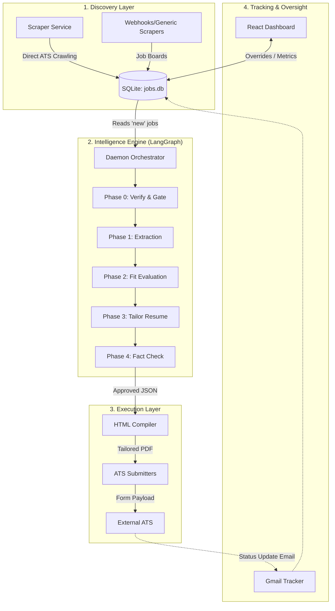
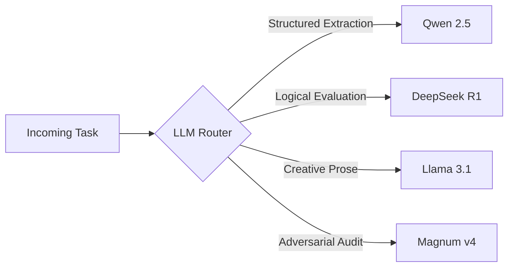
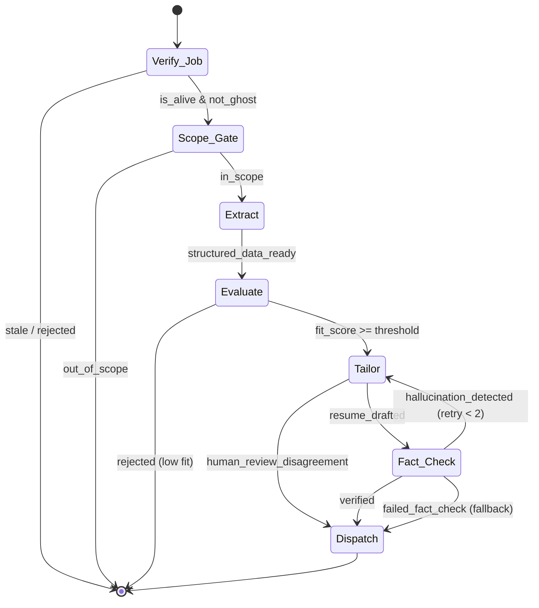
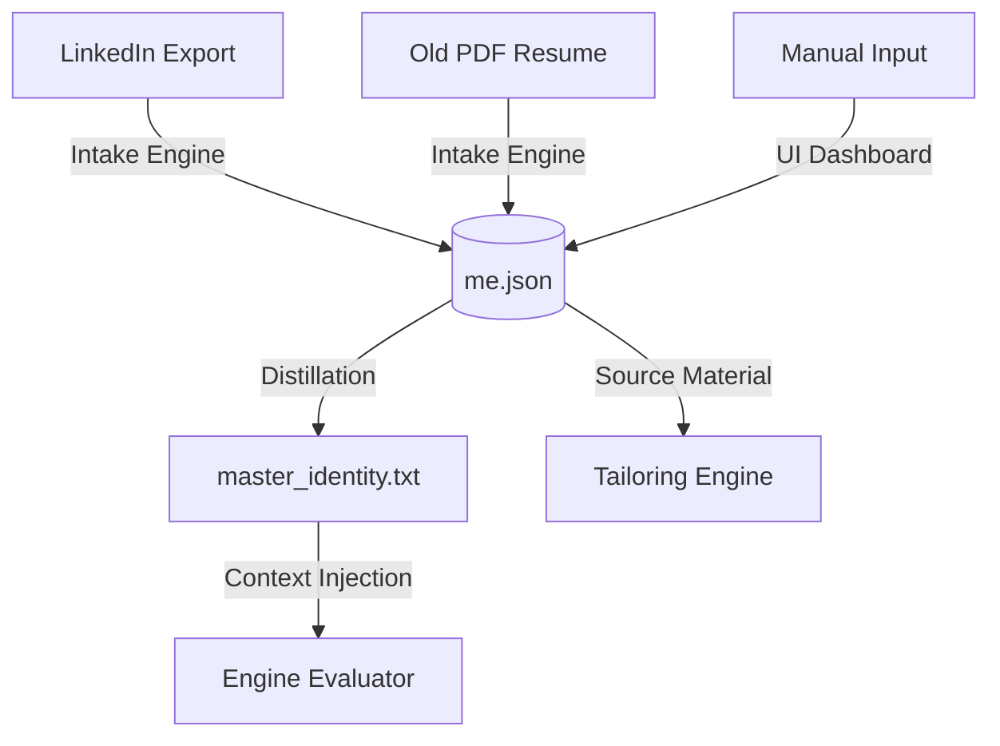

# SPrav Architecture

SPrav is a fully autonomous, local-first job application pipeline powered by a Mixture-of-Experts (MoE) LLM architecture. It is designed to act as an aggressive, highly targeted agent that discovers jobs, evaluates fit, tailors resumes, and circumvents ATS bot-detection to submit applications.

This document outlines the system's core architecture, data flows, and state machine transitions.

---

## 🏗️ High-Level System Design

The system is divided into four major macroscopic layers:

1. **Discovery & Ingestion**: Web scrapers and direct-to-ATS crawlers that find jobs and dump them into a local SQLite database.
2. **The Intelligence Engine**: A LangGraph-orchestrated state machine that handles reasoning, filtering, and content generation using local LLMs.
3. **Execution & Last-Mile**: Adapters that compile the PDF resume and programmatically submit it to Applicant Tracking Systems (ATS) utilizing anti-bot jitter mechanics.
4. **Command & Control**: A React-based dashboard for human oversight, manual overrides, and analytics tracking.

---

## 🧠 Mixture-of-Experts (MoE) Routing

Instead of relying on a single monolithic model (like GPT-4), SPrav routes different cognitive tasks to specialized local models to optimize for speed, reasoning capability, and factual accuracy. This is handled by `engine/llm_provider.py`.

- **Qwen2.5 (7B-Instruct)**: Used for high-speed, structured JSON extraction (e.g., pulling exact salary ranges and tech stacks from messy job descriptions).
- **DeepSeek-R1 (7B)**: The "Reasoning Engine". Used for the strict "Fit Evaluation" phase where deep logical deduction is required to determine if your canonical experience satisfies the job's hard requirements.
- **Llama-3.1 (8B)**: The "Prose Engine". Used during the Tailoring phase to rewrite your resume bullets for maximum ATS keyword density while maintaining a professional tone.
- **Magnum-v4 (9B)**: The "Auditor". Used for culture-fit analysis and adversarial fact-checking against hallucinations.

---

## ⚙️ The Pipeline State Machine (LangGraph)

The core `daemon.py` operates a continuous state machine. Once a job enters the system, it traverses the following strictly gated nodes. If a job fails at any node, it immediately exits the pipeline to save compute.

### Node Explanations:
1. **Verify**: Checks if the URL is still live, detects duplicate "repost" hashes, and runs NLP heuristics to detect scam/MLM/Ghost jobs.
2. **Scope Gate**: A zero-LLM deterministic gate checking the user's `scope.json` (Location, Role, Job Type, Experience Level).
3. **Extract**: Normalizes the job description into strict JSON parameters.
4. **Evaluate**: Computes a verified Years of Experience (YoE) score and asks DeepSeek-R1 to score the candidate's `me.json` against the job requirements.
5. **Tailor**: Rewrites the user's resume bullets to prioritize ATS keywords found in the extraction phase.
6. **Fact Check**: An adversarial model compares the tailored output against the original `me.json` line-by-line. If a metric is invented (e.g., claiming "increased revenue by 50%" when `me.json` says "20%"), the job is rejected back to Tailor.
7. **Dispatch**: Generates the PDF and routes to either `auto_apply_queue` or `human_review_queue`.

---

## 💾 Knowledge Architecture & Data Flow

The system heavily relies on a single source of truth to prevent LLM hallucinations from poisoning applications over time.

1. **Intake / Onboarding**: Legacy resumes (PDF/DOCX) and LinkedIn exports are parsed, deduplicated, and normalized into `knowledge_base/me.json`.
2. **`me.json`**: The immutable truth. Contains every role, project, and skill. Bullet points here are marked as either `verified` (with proof) or `self_reported`.
3. **Master Identity**: To save context window space, `me.json` is periodically distilled into a dense `master_identity.txt` which is injected into the prompt context for the LLM evaluation phases.

---

## 🚀 Deployment & Local Execution

This architecture is entirely self-hosted. 
- **Database**: SQLite3 (Local file `jobs.db`)
- **Vector Store**: ChromaDB (Local file in `sprav_memory/`)
- **LLM Inference**: Executed via Ollama / LM Studio locally.
- **Frontend**: React + Vite running on `localhost`.

Because all inference happens locally, the pipeline is bound only by hardware compute (tokens per second) and target ATS rate limits, with zero API costs for reasoning.
