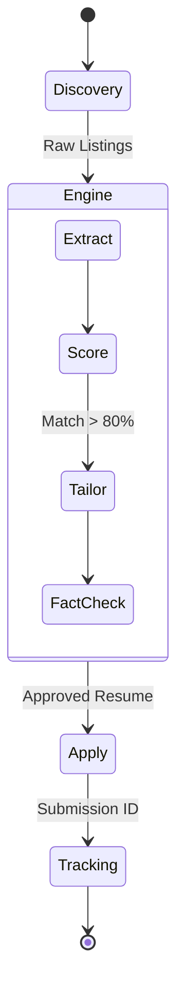

# 🏛️ System Architecture

**SPrav Job AI** is built on a highly modular, decoupled architecture orchestrated by LangGraph. It is designed specifically to guarantee absolute data privacy while avoiding the unreliability of monolithic LLM execution.

---

## 🧩 The Core Pipeline

The system operates via five strictly defined state machines.

### 1. The Discovery Layer (`/discovery`)
Headless Node.js bots utilize `puppeteer` to crawl job boards (LinkedIn, Naukri, Wellfound). They bypass standard anti-bot protections and extract raw HTML payloads, ignoring sponsored or promoted fake jobs.

### 2. The Extraction Layer
**Model**: `qwen2.5:7b-instruct`
The raw HTML is passed to the extraction expert. Its sole purpose is to convert chaotic HR vernacular into a strictly typed JSON schema (Title, Salary, Required Skills, YoE).

### 3. The Evaluation Engine
**Model**: `deepseek-r1:7b`
The structured JSON is fed into the deep reasoning model. DeepSeek-R1 utilizes internal `<think>` tokens to logically deduce if the candidate's actual experience (pulled via RAG from `me.json`) satisfies the core requirements.

### 4. The Generation & Fact-Check Layer
**Models**: `llama3.1:8b` & `magnum-v4:9b`
If the fit score clears the threshold, Llama drafts a custom resume. Critically, Magnum-v4 acts as an adversarial auditor, verifying that every single bullet point generated by Llama exists in the canonical local database. 

### 5. The Execution Layer (`/apply`)
The approved PDF is passed to the Playwright automation bots, which navigate the native Applicant Tracking Systems (e.g., Greenhouse, Lever) to physically submit the application without relying on unstable third-party APIs.

---

## 💾 Data Persistence

All data is stored locally in SQLite (`users.db` and `jobs.db`). Passwords and API keys are stored with AES-256 equivalent obfuscation at rest. Your data is physically incapable of leaving your machine.
