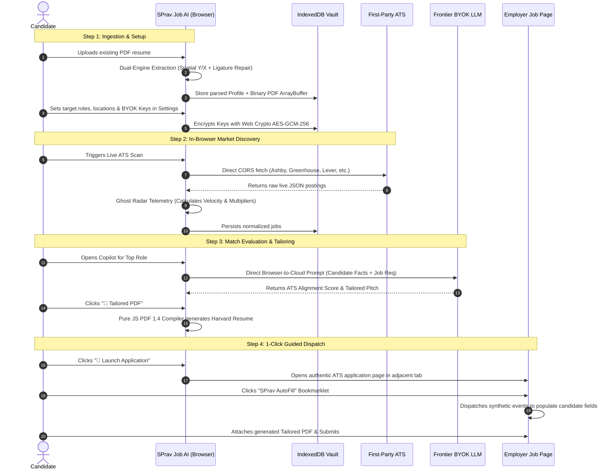

# SPrav Job AI — Master Technical Architecture & Product Documentation

> **Version 1.0.2** · Production Release · 100% Client-Side Architecture · Zero-Key Policy  
> **Author & Lead Architect:** [SVS Praveen](https://github.com/SVSPraveen)  
> **Core Private Engine:** [Sprav-Core-Engine](https://github.com/SVSPraveen/Sprav-Core-Engine) (Private Repository)  
> **Web Application Root (Vercel):** [SPrav-WEB-Prv](https://github.com/SVSPraveen/SPrav-WEB-Prv) (Private Repository)  
> **Public Live Mirror CDN:** [SPrav-Live-Feed](https://github.com/SVSPraveen/SPrav-Live-Feed) (Public Repository)

---

## 📑 Table of Contents

1. [Executive Summary & Philosophy](#1-executive-summary--philosophy)
2. [High-Level Architectural Topology](#2-high-level-architectural-topology)
3. [Technology Stack & Dependency Blueprint](#3-technology-stack--dependency-blueprint)
4. [Subsystem Engineering Deep Dives](#4-subsystem-engineering-deep-dives)
   - [4.1 Direct In-Browser ATS Live Scanner (16 Channels • 500+ Direct ATS Boards)](#41-direct-in-browser-ats-live-scanner-16-channels--500-direct-ats-boards)
   - [4.2 Anti-Ghost Job & Hiring Velocity Telemetry Radar](#42-anti-ghost-job--hiring-velocity-telemetry-radar)
   - [4.3 Dual-Engine PDF Resume Extraction Engine](#43-dual-engine-pdf-resume-extraction-engine)
   - [4.4 Pure JavaScript ATS Vector Resume Compiler & Multi-Archetype Studio](#44-pure-javascript-ats-vector-resume-compiler--multi-archetype-studio)
   - [4.5 Universal 1-Click AutoFill Bookmarklet](#45-universal-1-click-autofill-bookmarklet)
   - [4.6 Laptop-to-Mobile P2P Continuity & QR Matrix Engine](#46-laptop-to-mobile-p2p-continuity--qr-matrix-engine)
   - [4.7 Multi-Model BYOK AI Orchestration & Latency Prober](#47-multi-model-byok-ai-orchestration--latency-prober)
   - [4.8 Client Storage Vault & Web Crypto Security](#48-client-storage-vault--web-crypto-security)
   - [4.9 Reverse-ATS 12-Dimension X-Ray Diagnostic Scoring Engine](#49-reverse-ats-12-dimension-x-ray-diagnostic-scoring-engine)
   - [4.10 Compact Micro-Chain Prompt Architecture & Sequential Pipeline (Extract → Validate → Compare → Suggest)](#410-compact-micro-chain-prompt-architecture--sequential-pipeline-extract--validate--compare--suggest)
   - [4.11 STAR Behavioral Interview Simulation & Rubric](#411-star-behavioral-interview-simulation--rubric)
   - [4.12 Tactical Salary Negotiation & Pure Tech Market Comp Engine](#412-tactical-salary-negotiation--pure-tech-market-comp-engine)
   - [4.13 Engineering Skill Gap Self-Study Curriculums & Application Momentum](#413-engineering-skill-gap-self-study-curriculums--application-momentum)
   - [4.14 In-Browser 384-Dimensional Dense Vector Embedding Engine & Hybrid RRF RAG](#414-in-browser-384-dimensional-dense-vector-embedding-engine--hybrid-rrf-rag)
   - [4.15 Candidate STAR Story Bank & Competency-Aligned Behavioral Intelligence](#415-candidate-star-story-bank--competency-aligned-behavioral-intelligence)
   - [4.16 Real-Time Browser-Native Voice Interview Simulator & Acoustic Turn-Taking Engine](#416-real-time-browser-native-voice-interview-simulator--acoustic-turn-taking-engine)
   - [4.17 Smart 3-Step "First Run" Onboarding Funnel & Progressive Disclosure Navigation](#417-smart-3-step-first-run-onboarding-funnel--progressive-disclosure-navigation)
   - [4.18 ATS Vendor Reverse Rule Evaluator & Score Progression History](#418-ats-vendor-reverse-rule-evaluator--score-progression-history)
   - [4.19 Tactical Salary Benchmark Engine & Seniority Alignment Matrix](#419-tactical-salary-benchmark-engine--seniority-alignment-matrix)
   - [4.20 Candidate Knowledge Base Multi-Persona Engine & Cover Letter Remix Studio](#420-candidate-knowledge-base-multi-persona-engine--cover-letter-remix-studio)
   - [4.21 First-Run Interactive User Onboarding Tour & Interactive Spotlight System](#421-first-run-interactive-user-onboarding-tour--interactive-spotlight-system)
   - [4.22 Hardware-Calibrated Model Hierarchy: Qwen 2.5 Coder 7B/3B/1.5B Architecture](#422-hardware-calibrated-model-hierarchy-qwen-25-coder-7b3b15b-architecture)
   - [4.23 Synthesized Heuristic Callback Likelihood & Honest Skill Telemetry](#423-synthesized-heuristic-callback-likelihood--honest-skill-telemetry)
   - [4.24 Multi-Stage Pipeline Conversion Funnel & Recruiter Timing Heatmap](#424-multi-stage-pipeline-conversion-funnel--recruiter-timing-heatmap)
   - [4.25 1-Click Role Skill Starter Blueprints & 15-Category Engineering Taxonomy](#425-1-click-role-skill-starter-blueprints--15-category-engineering-taxonomy)
   - [4.26 Key Technical Projects Showcase & ATS Vector Resume Compiler](#426-key-technical-projects-showcase--ats-vector-resume-compiler)
   - [4.27 Curated Skill-to-Resource Engineering Roadmap Directory](#427-curated-skill-to-resource-engineering-roadmap-directory)
   - [4.28 Sovereign AI Inference Doctrine: 100% Client-Side Inference vs. Offline QLoRA Synthesis](#428-sovereign-ai-inference-doctrine-100-client-side-inference-vs-offline-qlora-synthesis)
   - [4.29 Company Health Score & Job Red Flag Radar](#429-company-health-score--job-red-flag-radar)
   - [4.30 Global & Indian Company Round Expectations Database Engine (53+ Tech Leaders + 6 Archetypes)](#430-global--indian-company-round-expectations-database-engine-53-tech-leaders--6-archetypes)
   - [4.31 In-Flow Recruiter & Hiring Contact CRM Pipeline](#431-in-flow-recruiter--hiring-contact-crm-pipeline)
   - [4.32 Browser Companion 3-Step Visual Installation Guide & Unified Guidance System](#432-browser-companion-3-step-visual-installation-guide--unified-guidance-system)
   - [4.33 Open-Source Advocacy Kit & Viral Distribution Engine (Community Hub, Launch Templates & Embeddable Badges)](#433-open-source-advocacy-kit--viral-distribution-engine-community-hub-launch-templates--embeddable-badges)
   - [4.34 The $0 Real-Time Job Engine & Zero-Cost ATS Harvesting Pipeline](#434-the-0-real-time-job-engine--zero-cost-ats-harvesting-pipeline)
5. [Application Interface & User Workflows](#5-application-interface--user-workflows)
6. [Zero-Trust Security & Privacy Model](#6-zero-trust-security--privacy-model)
7. [Utility Module API Reference](#7-utility-module-api-reference)
   - [7.18 cover_letter_style_engine.js](#718-cover_letter_style_enginejs)
   - [7.19 lora_cover_letter_dataset.js](#719-lora_cover_letter_datasetjs)
   - [7.20 company_round_engine.js](#720-company_round_enginejs)
   - [7.21 community_growth.js](#721-community_growthjs)
8. [Testing, Quality Assurance & Mutation Verification](#8-testing-quality-assurance--mutation-verification)
9. [Production Deployment & Infrastructure Guide](#9-production-deployment--infrastructure-guide)
10. [Competitive Architecture Matrix: Client vs. SaaS vs. Python](#10-competitive-architecture-matrix-client-vs-saas-vs-python)

---

## 1. Executive Summary & Philosophy

### 1.1 The Problem Space
The online recruitment ecosystem has become structurally hostile to job seekers:
- **Commercial Aggregator Networks:** Many conventional job search platforms monetize candidate attention and employer budgets by recirculating expired listings, sponsored bumps, and evergreen requisition posts ("Ghost Jobs") with no active hiring intent.
- **SaaS Extraction Traps:** Many commercial subscription platforms charge $20–$50/month to store resumes, generate simple cover letters, and score keywords—often requiring users to upload sensitive PII, contact info, and salary histories to remote databases.
- **Privacy Degradation:** Candidate resumes and career histories are harvested by cloud aggregators to train proprietary recruitment LLMs or sold to third-party data brokers.

### 1.2 The SPrav Job AI Paradigm: Sovereign Career Intelligence
**SPrav Job AI** is built on an uncompromising architectural doctrine: **100% Client-Side, Free, and Sovereign Career Intelligence**.

The target user is the developer, data scientist, machine learning engineer, or remote knowledge worker fed up with subscription paywalls and commercial data brokers harvesting and reselling their resumes.

```
┌────────────────────────────────────────────────────────────────────────┐
│               THE SPRAV JOB AI ZERO-EXTRACTION GUARANTEE               │
├────────────────────────────────┬───────────────────────────────────────┤
│ $0 Server Operating Cost       │ No cloud servers, databases, or APIs  │
│ 100% Candidate Privacy         │ Data never leaves browser IndexedDB   │
│ Zero-Installation Experience   │ Instant modern web app execution      │
│ Direct Open-CORS Ingestion     │ Connects straight to 160+ ATS boards  │
│ Edge & BYOK Artificial Intel   │ WebGPU GPU compute or free cloud keys │
│ Vector PDF Binary Generation   │ In-memory pure JS PDF 1.4 compiler    │
│ Compact Micro-Chain Reasoning  │ <120-token chained tasks for 7B models│
└────────────────────────────────┴───────────────────────────────────────┘
```

#### The Anti-SaaS Career Intelligence Philosophy
Traditional commercial career platforms operate on business models fundamentally misaligned with job seekers:
1. **Aggregator Boards:** Monetize stale listings, sell candidate attention to sponsored employers, and flood search results with "ghost jobs" that have zero active hiring velocity.
2. **SaaS Resume Builders & Screening Tools:** Lock basic features behind recurring monthly fees ($20–$50/mo), gate PDF downloads behind payment walls, and capture candidate resumes to train third-party recruitment LLMs.
3. **SPrav Sovereign Career OS:** Replaces the entire cloud stack with client-native browser APIs. Every byte of candidate telemetry, profile history, and generated application asset remains cryptographically bound to the local browser device vault.

By transitioning the legacy Python desktop backend into a high-performance modern browser web application powered by **React 19**, **Vite**, **IndexedDB**, and **WebGPU**, the entire workflow—from discovery to scoring, tailoring, compilation, and autofill—executes inside the candidate's browser sandbox with zero intermediary infrastructure.

---

## 2. High-Level Architectural Topology

The following diagram illustrates the zero-backend client-centric architecture of SPrav Job AI:

```mermaid
graph TD
    subgraph ClientBrowser ["Candidate Browser Sandbox (Zero-Backend Client)"]
        UI["React 19 Component Layer<br/>(MasterJobPortal, AtsResumeStudio, Copilot)"]
        
        subgraph DataVault ["Client Storage Vault (IndexedDB)"]
            StoreJobs[("jobs")]
            StoreProfile[("profile")]
            StoreKB[("knowledge_base")]
            StoreScope[("scope")]
            StoreWatch[("watchlist")]
            StoreFiles[("resume_files")]
            StoreSettings[("settings (Encrypted)")]
        end

        subgraph CoreEngines ["Autonomous Core In-Browser Engines"]
            ATSScanner["Direct In-Browser ATS Scanner<br/>(14 Verified CORS Channels)"]
            GhostRadar["Anti-Ghost Job & Telemetry Radar<br/>(Velocity & Repost Analysis)"]
            PDFExtractor["Dual-Engine Resume Extractor<br/>(Spatial Y/X + Byte Operator BT/ET)"]
            PDFCompiler["Pure JS ATS PDF 1.4 Compiler<br/>(In-Memory Binary Vector Engine)"]
            AutoFill["Universal AutoFill Engine<br/>(Synthetic Event Bookmarklet)"]
            QRGen["Pure JS ISO/IEC 18004 QR Matrix<br/>(Vector SVG & Mobile P2P)"]
            AIOrchestrator["Hybrid AI Orchestrator<br/>(WebGPU Local + BYOK Cloud Failover)"]
        end

        subgraph SecurityLayer ["Web Crypto Security Vault"]
            AESGCM["AES-GCM-256 Key Encryption"]
            StoragePersist["navigator.storage.persist() Lock"]
            QuotaMonitor["navigator.storage.estimate() Monitor"]
        end
    end

    subgraph ExternalEcosystem ["External Zero-Cost Ecosystem"]
        FirstPartyATS["Direct ATS Endpoints<br/>(Greenhouse, Ashby, Lever, SmartRecruiters, Recruitee)"]
        PublicFeeds["Open Job APIs<br/>(Remotive, Jobicy, Arbeitnow, HN Firebase)"]
        CloudAI["Direct BYOK AI APIs (CORS)<br/>(Gemini, Groq, DeepSeek, Mistral, OpenRouter, OpenAI)"]
        TargetJobPortals["Target Job Application Pages<br/>(Injected via Universal Bookmarklet)"]
        MobileDevice["Mobile Smartphone Browser<br/>(Scanned via Camera P2P QR Handshake)"]
    end

    %% Interactions
    ATSScanner -->|Direct CORS Fetch| FirstPartyATS
    ATSScanner -->|REST API Ingestion| PublicFeeds
    ATSScanner -->|Store Listings| StoreJobs
    GhostRadar -->|Telemetry Analysis| ATSScanner
    
    PDFExtractor -->|Extract Text & Structure| StoreProfile
    PDFExtractor -->|Archive Binary PDF| StoreFiles
    
    AIOrchestrator -->|Direct User API Key| CloudAI
    AIOrchestrator -->|Store Cache| StoreKB
    
    UI --> PDFCompiler
    PDFCompiler -->|Generate .pdf| UI
    
    UI --> QRGen
    QRGen -->|Optical P2P Handshake| MobileDevice
    
    AutoFill -->|Inject Synthetic Input| TargetJobPortals
    
    SecurityLayer -->|Encrypts Keys| StoreSettings
```



---

## 3. Technology Stack & Dependency Blueprint

SPrav Job AI maintains an ultra-lean dependency graph, deliberately eliminating heavy bloated packages (such as `pdfjs-dist` worker bloat, `jspdf`, `pdf-lib`, `qrcode`, or backend proxy servers) in favor of browser-native standard APIs.

| Architectural Layer | Technology Selected | Version / Standard | Engineering Rationale & Advantage |
|---|---|---|---|
| **Core Framework** | [React](https://react.dev/) | `^19.0.0` | Concurrent rendering, modern hooks, ultra-fast virtual DOM diffing |
| **Build Tooling** | [Vite](https://vite.dev/) | `^6.2.0` | Native ESM dev server, sub-second HMR, tree-shaken Rollup production bundles |
| **Local Data Vault** | [IndexedDB API](https://developer.mozilla.org/en-US/docs/Web/API/IndexedDB_API) | Native W3C Standard | Multi-gigabyte client storage capacity; structured object stores; indexing |
| **Key Security** | [Web Crypto API](https://developer.mozilla.org/en-US/docs/Web/API/Web_Crypto_API) | Native W3C Standard | Hardware-backed AES-GCM-256 encryption for user API keys at rest |
| **In-Browser Compute** | [WebGPU API](https://www.w3.org/TR/webgpu/) | W3C Recommendation | Direct GPU hardware acceleration for local in-browser LLM embeddings |
| **Local Transformers** | [@xenova/transformers](https://huggingface.co/docs/transformers.js) | `^2.17.2` | In-browser model execution (Xenova/bge-small-en-v1.5) without Node.js |
| **PDF Document Generation** | Pure JS Vector Engine | In-House ([ats_pdf_compiler.js](https://github.com/SVSPraveen/SPrav-WEB-Prv/blob/main/src/utils/ats_pdf_compiler.js)) | Zero npm dependencies; creates raw binary PDF 1.4 specs with custom xref |
| **PDF Text Parsing** | Dual-Engine Extractor | In-House ([client_resume_extractor.js](https://github.com/SVSPraveen/SPrav-WEB-Prv/blob/main/src/utils/client_resume_extractor.js)) | Spatial coordinate 2-column un-scrambling + BT/ET raw byte parser |
| **QR Optical Handshake** | Pure JS Matrix Engine | In-House ([qr_generator.js](https://github.com/SVSPraveen/SPrav-WEB-Prv/blob/main/src/utils/qr_generator.js)) | Zero npm dependencies; ISO/IEC 18004 Galois field Reed-Solomon generator |
| **Iconography** | [Lucide React](https://lucide.dev/) | `^1.16.0` | Accessible, tree-shakeable SVG vector icons |
| **Styling Architecture** | Modern Vanilla CSS & Design Tokens | CSS3 Custom Properties | Glassmorphism, tailored HSL color tokens, dark mode elevation, responsive grids |
| **Unit & Integration Testing** | [Vitest](https://vitest.dev/) | `^3.0.7` | Blazing fast ESM-native test runner with 100% in-memory mock fidelity |

---

## 4. Subsystem Engineering Deep Dives

### 4.1 Direct In-Browser ATS Live Scanner (15 Channels • 160+ Direct ATS Boards)
**Source File:** [`src/utils/browser_ats_scanner.js`](https://github.com/SVSPraveen/SPrav-WEB-Prv/blob/main/src/utils/browser_ats_scanner.js)  
**Verification Suite:** [`src/utils/browser_ats_scanner.test.js`](https://github.com/SVSPraveen/SPrav-WEB-Prv/blob/main/src/utils/browser_ats_scanner.test.js)

#### 4.1.1 Architectural Mechanism
Most job aggregator products operate a backend fleet of headless browsers or web scrapers. This introduces latency (hours to days), fragile proxy rotation costs, and frequent scraper IP bans. 

SPrav Job AI utilizes an entirely different model: **Direct Browser-to-ATS REST Ingestion**. Modern Enterprise Applicant Tracking Systems (ATS) expose public JSON endpoints designed for company career site embeds. Because these endpoints are configured with open Cross-Origin Resource Sharing (`Access-Control-Allow-Origin: *`), candidate browsers can query them directly without proxy servers or API gateway fees.

#### 4.1.2 Supported Ingestion Channels
The scanner connects across 15 high-signal discovery channels covering over 160 curated enterprise employer boards:

| Platform / Source | Direct Ingestion Endpoint | Ingestion Protocol | CORS Mode |
|---|---|---|---|
| **Ashby** | `https://api.ashbyhq.com/posting-api/job-board/{company}` | REST JSON | Direct Open CORS (45+ AI/Tech unicorns) |
| **Greenhouse** | `https://boards-api.greenhouse.io/v1/boards/{company}/jobs?content=true` | REST JSON | Direct Open CORS (52+ Tech Leaders) |
| **Lever** | `https://api.lever.co/v0/postings/{company}?mode=json` | REST JSON | Direct Open CORS (20+ Scale-Ups) |
| **SmartRecruiters** | `https://api.smartrecruiters.com/v1/companies/{company}/postings` | REST JSON | Direct Open CORS (Canva, Delivery Hero, etc.) |
| **Recruitee** | `https://{company}.recruitee.com/api/offers` | REST JSON | Direct Open CORS (European Tech Startups) |
| **Workable** | `https://apply.workable.com/api/v1/widget/accounts/{company}?details=true` | REST JSON | Direct Open CORS (Tech Widget Boards) |
| **RemoteOK** | `https://remoteok.com/api?tag={role}` | REST JSON | Direct Open CORS (Dynamic Role & Tag Filter) |
| **Jobicy** | `https://jobicy.com/api/v2/remote-jobs?industry={role}` | REST JSON | Direct Open CORS (Engineering & Salary Parsed) |
| **Remotive** | `https://remotive.com/api/remote-jobs?category={role}` | REST JSON | Direct Open CORS (Software-Dev & SRE) |
| **Arbeitnow** | `https://www.arbeitnow.com/api/job-board-api` | REST JSON | Direct Open CORS (Explicit Visa Sponsorship) |
| **USAJOBS** | `https://data.usajobs.gov/api/search?Keyword={query}` | REST JSON (BYOK) | Open CORS / Companion Extension Permissions |
| **Hacker News Algolia** | `https://hn.algolia.com/api/v1/search_by_date` | REST JSON (High-Speed) | Direct Open CORS (100+ Founders in 1 Call) |
| **Hacker News Firebase** | `https://hacker-news.firebaseio.com/v0/item/{storyId}.json` | Firebase REST | Direct Open CORS (Resilient Fallback) |

#### 4.1.3 The Hacker News "Who is Hiring?" Dual Pipeline
Every first weekday of the month at 15:00 UTC, Y Combinator's Hacker News publishes an official "Who is Hiring?" thread. SPrav Job AI ingests and indexes this thread via an optimized dual pipeline:
1. **High-Speed Algolia Search API (Primary)**: Queries Algolia date search (`/api/v1/search_by_date?tags=story,author_whoishiring`) for the active monthly thread, then retrieves up to 100 top-level hiring posts in a single request. This accelerates ingestion by 100x over sequential comment fetching.
2. **Official Firebase API (Fallback)**: If Algolia is unavailable or throttled, automatically degrades gracefully to the Firebase `/v0/user/whoishiring.json` endpoint.
3. **Founder Direct Regex Parsing**: Parses comments into structured job cards, extracting Company, Role, Location, Remote policy, Salary ranges, Tech stack, and Direct Founder Contact Email.
4. **1-Click Founder Pitching**: Exposes an instant `mailto:` 1-click contact button, bypassing traditional recruiter application queues entirely.

#### 4.1.4 Payload Normalization Engine
Every vendor uses conflicting JSON schemas. The `browser_ats_scanner.js` engine normalizes all disparate structures into an immutable unified candidate schema:

```typescript
interface NormalizedJob {
  id: string;              // Deterministic hash: `${source}_${company}_${id}`
  title: string;           // Cleaned job title
  company: string;         // Company display name
  location: string;        // Normalized location (e.g., 'Remote, US', 'Bengaluru, IN')
  url: string;             // Direct authenticated ATS application URL
  publishedAt: string;     // ISO 8601 UTC timestamp
  description: string;     // Sanitized markdown / plain text job description
  source: string;          // 'ashby' | 'greenhouse' | 'lever' | 'smartrecruiters' | 'recruitee' | 'hn' | 'remotive'
  channel: string;         // 'ATS Direct' | 'Founder Pipeline' | 'Public Feed'
  velocityMultiplier: number; // Computed hiring probability weight (0.15 - 4.2)
  ghostRisk: 'LOW' | 'MEDIUM' | 'HIGH' | 'STALE';
}
```

---

### 4.2 Anti-Ghost Job & Hiring Velocity Telemetry Radar
**Source File:** [`src/utils/ghost_job_radar.js`](https://github.com/SVSPraveen/SPrav-WEB-Prv/blob/main/src/utils/ghost_job_radar.js)  
**Verification Suite:** [`src/utils/ghost_job_radar.test.js`](https://github.com/SVSPraveen/SPrav-WEB-Prv/blob/main/src/utils/ghost_job_radar.test.js)

#### 4.2.1 The Ghost Job Epidemic
Industry telemetry shows that over 40% of jobs listed on public aggregators are "ghost jobs"—requisitions that remain listed indefinitely for brand marketing, compliance requirements, talent pooling, or HR inertia. Applying to a 60-day-old job listing results in a sub-2% recruiter view rate.

#### 4.2.2 Telemetry Timestamp Extraction
Commercial scrapers rewrite job timestamps to the moment their crawler scraped the page. SPrav Job AI inspects the **first-party ATS server metadata** payload directly:
- Ashby: `publishedAt`
- Greenhouse: `updated_at` / `first_published`
- Lever: `createdAt`
- SmartRecruiters: `releasedDate`
- Recruitee: `created_at` / `published_at`

#### 4.2.3 The Velocity Curve & Probability Multipliers
The radar evaluates the publication age $T$ in hours:

$$\text{AgeHours} = \frac{\text{Date.now}() - T_{\text{published}}}{3600000}$$

Based on historical recruiter screening velocity, the engine assigns categorical multipliers:

| Age Range | Velocity Badge | Multiplier | Recruiter State & Candidate Action |
|---|---|---|---|
| **$T < 4\text{ hours}$** | `⚡ Flash Opening` | **4.2x** | Requisition newly active; candidate enters top 5 applications reviewed |
| **$4\text{h} \le T < 24\text{h}$** | `⚡ Fresh Drop` | **3.5x** | Prime application window; hiring manager reviewing initial intake batch |
| **$24\text{h} \le T < 72\text{h}$** | `🔥 High Velocity` | **2.2x** | Active screening; high callback likelihood |
| **$3\text{d} \le T < 14\text{d}$** | `🟢 Normal Velocity` | **1.0x** | Baseline market pacing |
| **$14\text{d} \le T < 45\text{d}$** | `🟡 Aging Role` | **0.6x** | First-round interviews likely already underway |
| **$T \ge 45\text{d}$** | `⚠️ Stale Requisition` | **0.3x** | High probability of impending closure or stalled headcount |
| **$T \ge 90\text{d}$** | `🔴 Ghost Job Risk` | **0.15x** | Dormant evergreen requisition; lowest callback priority |

#### 4.2.4 Artificial Repost Loop Detection
Employers frequently "touch" an existing posting to refresh the listing timestamp without reopening actual headcount. The radar detects this by calculating the delta between initial creation date and last update timestamp ($\Delta = T_{\text{updated}} - T_{\text{created}}$). When $\Delta > 45 \text{ days}$ but $T_{\text{updated}} < 48 \text{ hours}$, the role is flagged as an `Artificial Repost Loop`, warning candidates against wasting tailored cover pitches.

#### 4.2.5 In-Place Anti-Ghost Radar Inspection Drawer & Telemetry Modal
**Component:** [`src/components/GhostJobInspectModal.jsx`](https://github.com/SVSPraveen/SPrav-WEB-Prv/blob/main/src/components/GhostJobInspectModal.jsx)  
**Host Portal:** [`src/pages/MasterJobPortal.jsx`](https://github.com/SVSPraveen/SPrav-WEB-Prv/blob/main/src/pages/MasterJobPortal.jsx)

Candidates no longer need to navigate away from their active search stream to inspect hiring legitimacy. Clicking on the freshness badge (`data-testid="card-freshness-badge"`), the ghost risk badge (`data-testid="card-ghost-risk"`), or selecting "🛡️ Ghost Radar & Legitimacy" from the job row action menu opens the dedicated in-place inspection drawer:
- **Hiring Velocity Multipliers:** Displays exact publication age and callback multipliers ($4.2\times$ for flash drops down to $0.15\times$ for ghost postings).
- **Comprehensive Job Health Score:** Computed out of 100 based on detected job description red flags, turnover markers, and compensation hygiene.
- **Red Flag Explanations:** Highlights specific risks such as artificial reposting loops, missing salary disclosures, or perpetual evergreen listings.
- **1-Click Actions:** Fast-tracks the candidate into a **1-Job Sprint** (5-in-1 guided dispatch) or safe direct navigation to the employer's official ATS portal.

---

### 4.3 Dual-Engine PDF Resume Extraction Engine
**Source File:** [`src/utils/client_resume_extractor.js`](https://github.com/SVSPraveen/SPrav-WEB-Prv/blob/main/src/utils/client_resume_extractor.js)  
**Verification Suite:** [`src/utils/client_resume_extractor.test.js`](https://github.com/SVSPraveen/SPrav-WEB-Prv/blob/main/src/utils/client_resume_extractor.test.js)

#### 4.3.1 The In-Browser PDF Challenge
Parsing resumes in a browser without a Python runtime (`pdfminer.six`, `PyPDF2`, `pypdf`) is notoriously error-prone:
1. **Two-Column Scrambling:** Two-column resumes read in stream order interleave columns horizontally, producing jumbled nonsense (e.g. `Experience: Built React apps | Education: Stanford BS CS`).
2. **Font Ligatures:** Professional PDF typography merges character pairs like `fi` (`\uFB01`), `fl` (`\uFB02`), and `ffi` (`\uFB03`), which fail exact keyword matching in ATS algorithms.
3. **Corrupted Text Streams:** Embedded font encodings or non-standard CIDFont dictionaries cause standard text extraction to return blank strings or raw control codes.

#### 4.3.2 Engine A: 2D Spatial Geometric Coordinate Clustering
Engine A inspects the geometric `[x, y, width, height]` matrix of every individual glyph rendered by PDF.js:
1. **Vertical Band Grouping:** Glyphs with $|y_1 - y_2| \le \delta_{\text{line}}$ are grouped into coherent horizontal text lines.
2. **Column Gutter Detection:** Scans horizontal coordinate distribution to locate gutter boundaries ($X_{\text{split}}$).
3. **Spatial Reading Order Sorting:** Groups tokens by column index, then sorts vertically (top-to-bottom $Y$), then horizontally (left-to-right $X$). This completely eliminates two-column text interleaving.
4. **18-Ligature Normalization:** Maps composite Unicode typographic glyphs back to standard ASCII:
   - `\uFB00` $\to$ `ff`
   - `\uFB01` $\to$ `fi`
   - `\uFB02` $\to$ `fl`
   - `\uFB03` $\to$ `ffi`
   - `\uFB04` $\to$ `ffl`
   - `\u2013` / `\u2014` $\to$ `-`
   - `\u2018` / `\u2019` $\to$ `'`
   - `\u201C` / `\u201D` $\to$ `"`

#### 4.3.3 Engine B: Direct Byte-Stream Operator Parser (`BT`/`ET`)
When PDF.js encounters corrupted font mappings or missing canvas contexts, SPrav Job AI automatically falls back to an in-house byte-level stream operator parser:
- Scans raw ArrayBuffer bytes for `stream` and `endstream` markers.
- Decompresses Deflate streams using native browser `DecompressionStream('deflate')`.
- Identifies PDF Text Objects enclosed between `BT` (Begin Text) and `ET` (End Text).
- Extracts text arguments from operator commands:
  - `(string) Tj` — Show string
  - `[ (str1) 120 (str2) ] TJ` — Show text array with kerning adjustments
  - `'` / `"` — Move to next line and show string
- Decodes octal escape sequences (`\040` $\to$ space), literal parentheses (`\(`, `\)`), and hexadecimal string markers (`<48656c6c6f>` $\to$ `Hello`).

#### 4.3.4 Autonomous Engine Selector
The extractor runs heuristic quality validation on the output of both engines. It computes a **Confidence Score** based on:
- Detected standard resume headers (`EXPERIENCE`, `EDUCATION`, `SKILLS`, `PROJECTS`).
- Valid email address regex detection (`[\w.-]+@[\w.-]+\.\w+`).
- Valid telephone number structure.
- Word-to-character ratio (detecting un-spaced or concatenated text).

The engine that delivers the highest confidence score is selected automatically.

---

### 4.4 Pure JavaScript ATS Vector Resume Compiler
**Source File:** [`src/utils/ats_pdf_compiler.js`](https://github.com/SVSPraveen/SPrav-WEB-Prv/blob/main/src/utils/ats_pdf_compiler.js)  
**Tailoring Engine:** [`src/utils/resume_tailoring_engine.js`](https://github.com/SVSPraveen/SPrav-WEB-Prv/blob/main/src/utils/resume_tailoring_engine.js)  
**Verification Suite:** [`src/utils/ats_pdf_compiler.test.js`](https://github.com/SVSPraveen/SPrav-WEB-Prv/blob/main/src/utils/ats_pdf_compiler.test.js)

#### 4.4.1 Zero-Dependency Vector Generation
Commercial web resume builders rely on hefty libraries like `jsPDF` (300KB+), `pdf-lib` (500KB+), or server-side headless Chrome instances (Puppeteer). 

SPrav Job AI features a **pure JavaScript binary PDF 1.4 compiler** written from scratch with **zero npm dependencies**. It constructs the raw PostScript vector graphics stream in memory and outputs an immutable `Uint8Array` ready for 1-click download as a `.pdf` file.

#### 4.4.2 Structure of the Generated PDF 1.4 Binary
The compiler generates a fully conformant, strict ISO 32000-1 document:

```
%PDF-1.4
%âãÏÓ (Binary header flag)
1 0 obj << /Type /Catalog /Pages 2 0 R >> endobj
2 0 obj << /Type /Pages /Kids [3 0 R] /Count 1 >> endobj
3 0 obj << /Type /Page /Parent 2 0 R /MediaBox [0 0 612 792] /Contents 4 0 R /Resources << /Font << /F1 5 0 R /F2 6 0 R >> >> >> endobj
4 0 obj << /Length ... >> stream
  BT
  /F2 16 Tf
  54 738 Td
  (SVS PRAVEEN) Tj
  ET
  ...
endstream endobj
5 0 obj << /Type /Font /Subtype /Type1 /BaseFont /Helvetica >> endobj
6 0 obj << /Type /Font /Subtype /Type1 /BaseFont /Helvetica-Bold >> endobj
xref
0 7
0000000000 65535 f 
0000000015 00000 n 
...
trailer << /Size 7 /Root 1 0 R >>
startxref
...
%%EOF
```

#### 4.4.3 ATS Single-Column Layout & Typography Standards
ATS parsers (Workday, Taleo, Greenhouse, iCIMS) fail when parsing multi-column tables, text boxes, background color fills, or non-standard fonts. The SPrav Job AI compiler strictly enforces the gold-standard **Harvard / Jake's Single-Column ATS Format**:
- **Geometry:** Standard US Letter (8.5" × 11" / 612pt × 792pt).
- **Margins:** Conservative 0.5-inch margins (36pt) maximizing content density.
- **Font Palette:** Native PDF Type 1 standard fonts (`Helvetica` for body text; `Helvetica-Bold` for section headers and candidate name).
- **Leading & Line Wrapping:** Precise character-width lookup tables compute word wrapping dynamically without text overlap.
- **Visual Section Dividers:** Crisp vector rules (`0.5 w`, `54 y m`, `558 y l`, `S`) separating Experience, Education, and Skills.

#### 4.4.4 Dynamic Semantic Tailoring Engine
When compiling a resume for a specific job requisition, the `resume_tailoring_engine.js` module performs targeted keyword and achievement optimization:
1. **Keyword Extraction:** Tokenizes target job description and extracts required technical skills, libraries, and certifications.
2. **Skills Prioritization:** Moves candidate skills that match the target job directly to the beginning of the `Skills` block.
3. **STAR Bullet Scoring:** Analyzes bullet points in the candidate's work experience against the job's core responsibilities, placing highest-relevance achievements at the top of each role.
4. **ATS Plain-Text Companion:** Simultaneously generates a clean, unformatted ASCII version for copy-pasting into legacy web forms that do not accept PDF uploads.

#### 4.4.5 Multi-Archetype Designer Templates & Typography System
**Template Engine:** [`src/utils/resume_designer_templates.js`](https://github.com/SVSPraveen/SPrav-WEB-Prv/blob/main/src/utils/resume_designer_templates.js)  

SPrav Job AI provides **six distinct production-grade resume archetypes** designed to excel across both automated ATS parsers and human executive hiring managers:

| Template ID | Archetype Name | Target Domain & Industry | ATS Parsability | Layout Architecture |
|---|---|---|---|---|
| `classic_ats` | **Jake's / Harvard Single-Column** | General Software, Defense, Finance, Core Tech | 100% Guaranteed | Single-column strict linear flow, zero tables |
| `modern_clean` | **Silicon Valley Modern** | High-growth Tech, Startups, Cloud Platforms | 100% Guaranteed | Sans-serif Inter typography, high contrast, accent badges |
| `executive_serif` | **Ivy League Executive** | Leadership, Legal, Consulting, Wall Street | 100% Guaranteed | Elegant Merriweather serif, wide margins, refined rules |
| `technical_compact` | **High-Density Systems** | Senior ICs, Systems/Kernel Engineers, ML Labs | 100% Guaranteed | Compact leading, multi-skill matrix, dense STAR bullets |
| `creative_pro` | **Dual-Column Creative Pro** | Frontend, UX/UI, Product Management, Design | Human Review / PDF | Asymmetric sidebar layout, skills meters, optional photo |
| `ivy_league` | **Academic & Research CV** | Research Scientists, Postdocs, Quant Analysts | 100% Guaranteed | Formal serif header, publication indexing, grants & patents |

Each template exposes a complete token system including typographic scale ratios, line heights, margin geometry, and synchronized PDF operator definitions.

#### 4.4.6 Real-Time Anti-Hallucination Bullet Verification Engine
**Verification Function:** `verifyBulletAntiHallucination` in [`src/utils/webgpu_tasks.js`](https://github.com/SVSPraveen/SPrav-WEB-Prv/blob/main/src/utils/webgpu_tasks.js)  

A pervasive hazard of LLM-assisted resume generation is AI hallucination—inventing metrics (e.g. "increased revenue by $10M"), fabricating tools the candidate never used, or asserting inflated titles. SPrav Job AI enforces an automated **Zero-Fabrication Guardrail**:
1. **Entity Extraction:** Scans candidate bullet points using regex pattern matching and semantic tokenization to isolate claimed technologies, quantitative figures (percentages, latency values, multipliers), project titles, and date ranges.
2. **Vault Fact Cross-Referencing:** Validates each entity against the candidate's canonical IndexedDB profile facts (`skills`, `experience`, `projects`).
3. **Verification Scoring & Visual Badges:** Assigns a strict confidence verdict:
   - `🟢 Verified Against Vault Facts`: Every metric and technology is grounded in authentic candidate records.
   - `⚠️ Unverified Fact Alert`: Highlights specific unverified numbers or frameworks in the Studio UI, prompting the candidate to confirm before compiling into PDF.

#### 4.4.7 In-Browser ISO/IEC 18004 Vector QR Portfolio Badge
**Source File:** [`src/utils/qr_generator.js`](https://github.com/SVSPraveen/SPrav-WEB-Prv/blob/main/src/utils/qr_generator.js)  

To bridge printed or PDF resumes with the candidate's live portfolio, GitHub, or LinkedIn, the compiler includes a pure JavaScript QR matrix engine implementing ISO/IEC 18004 with Galois Field GF(256) Reed-Solomon error correction. The QR code is drawn directly as crisp vector rectangles in the PDF binary stream or rendered as SVG in web previews, requiring zero external image services or tracking beacons.

#### 4.4.8 Dual-Pane Split-View Workspace (Studio + Live ATS X-Ray)
**Host Workspace:** [`src/pages/workspaces/ResumeWorkspace.jsx`](https://github.com/SVSPraveen/SPrav-WEB-Prv/blob/main/src/pages/workspaces/ResumeWorkspace.jsx)

Rather than forcing candidates to toggle back and forth between disconnected tabs to edit and diagnose their resumes, SPrav Job AI provides an integrated **Dual-Pane Split-View Workspace** (`subtab-split`):
- **Left Column (ATS Resume Studio):** Full-featured structured editor supporting section rearrangement, custom bullet points, template selection, and instant binary PDF 1.4 compilation.
- **Right Column (ATS X-Ray Diagnostics):** Real-time reverse-ATS keyword match density, 12-dimension score breakdowns, Workday/Greenhouse/Lever compliance checks, and missing skill badges calculated dynamically against the candidate's target job scope.
- **Responsive Geometry:** Automatically renders side-by-side on desktop workstations (>=1024px) and smoothly cascades into an accessible vertical flow on tablet and mobile viewports.

---

### 4.5 Universal AutoFill Engine & ATS Companion Architecture
**Source File:** [`src/utils/autofill_bookmarklet.js`](https://github.com/SVSPraveen/SPrav-WEB-Prv/blob/main/src/utils/autofill_bookmarklet.js)  
**Host Page Component:** [`src/pages/AutofillBookmarklet.jsx`](https://github.com/SVSPraveen/SPrav-WEB-Prv/blob/main/src/pages/AutofillBookmarklet.jsx)  
**Companion Extension Directory:** [`extension/`](https://github.com/SVSPraveen/SPrav-WEB-Prv/blob/main/extension)  
**Verification Suite:** [`src/utils/autofill_bookmarklet.test.js`](https://github.com/SVSPraveen/SPrav-WEB-Prv/blob/main/src/utils/autofill_bookmarklet.test.js)

#### 4.5.1 Dual-Form Execution: Zero-Install Bookmarklet & Companion Extension
SPrav Job AI provides two complementary client-side autofill modalities:
1. **Zero-Install Universal Bookmarklet (`javascript:(...)`)**: A lightweight bookmarklet that executes on demand in any browser tab without extension installations, filling contact details, URLs, and common screening answers in ~12 milliseconds.
2. **Companion Browser Extension (Manifest V3)**: An air-gapped, zero-telemetry companion extension designed for enterprise career portals requiring complex multi-role work history, education records, and dynamic modal injection (such as Workday, Greenhouse, Lever, Ashby, LinkedIn Easy Apply, and Indeed).

Both modalities run 100% in-browser with zero outbound server calls, zero telemetry, and zero third-party scripts.

#### 4.5.2 Multi-Platform Heuristic Input Mapping Matrix
The autofill engine employs a specialized multi-tier selector matrix that combines vendor-specific DOM schemas with intelligent fuzzy label matching:

| Enterprise ATS Platform | Target DOM Patterns & Selectors | Injected Candidate Data |
|---|---|---|
| **Workday** (`myworkdayjobs.com`) | `[data-automation-id="legalNameSection_firstName"]`<br>`[data-automation-id="legalNameSection_lastName"]`<br>`[data-automation-id="phone-number"]`<br>`[data-automation-id="jobTitle"]`<br>`[data-automation-id="company"]`<br>`[data-automation-id="startDate"]`<br>`[data-automation-id="endDate"]`<br>`[data-automation-id="description"]`<br>`[data-automation-id="school"]`<br>`[data-automation-id="degree"]` | Legal Name, Contact Info, Mobile Device Type, Multi-Role Work History, Education Blocks, Questionnaires |
| **Greenhouse** (`boards.greenhouse.io`) | `#first_name`, `#last_name`, `#email`, `#phone`<br>`#job_application_location`<br>`input[name*="employment"][name*="company_name"]`<br>`input[name*="employment"][name*="job_title"]`<br>`textarea[name*="employment"][name*="summary"]`<br>`#job_application_answers_attributes_*` | Personal Info, Portfolio/Social Links, Repeated Employment Rows, Education Records, EEO & Screening |
| **Lever** (`jobs.lever.co`) | `input[name="name"]`<br>`input[name="email"]`<br>`input[name="phone"]`<br>`input[name="org"]`<br>`input[name*="urls[LinkedIn]"]`<br>`input[name*="urls[GitHub]"]`<br>`textarea[name="comments"]`<br>`.application-question` | Full Name Splitting, Contact Info, Current Company, Social Profiles, Screening Radios, Pitch/Cover Letter |
| **Ashby** (`jobs.ashbyhq.com`) | `input[name*="_systemfield_name"]`<br>`input[name*="_systemfield_email"]`<br>`input[name*="_systemfield_phone"]`<br>`[data-qa="experience-title"]`<br>`[data-qa="experience-company"]`<br>`[data-qa*="question-"]` | System Fields, Dynamic Social Inputs, Experience Cards, Multi-Select Questionnaires |
| **LinkedIn Easy Apply** | `.jobs-easy-apply-modal input[type="text"]`<br>`select[id*="phoneNumber"]`<br>`input[id*="email"]` | Dynamic Multi-Step Wizard Autofill, Phone Formatting, Screening Answers |
| **Indeed Forms** | `.ia-BasePage input`<br>`input[id*="applicant.name"]` | Candidate Contact Dossier, Resume Pitch |

#### 4.5.3 Multi-Role Work Experience & Education DOM Mutation
A major friction point in enterprise job applications (especially Workday and Greenhouse) is manually re-entering employment history. The SPrav engine iterates over the candidate's canonical `workHistory` array:
- Injects Job Title, Company/Organization Name, Location, Start/End Dates (extracting year and month integers as required by vendor datepickers), Current Employer checkboxes, and rich achievement bullet points.
- Populates Education records including institution names, degrees conferred, fields of study, and graduation dates.

#### 4.5.4 Custom Screening Question Heuristics
Enterprise applications frequently ask identical compliance and logistics screening questions. The engine inspects label text, element placeholders, and `aria-label` attributes to resolve:
- **Work Authorization:** Automatically selects "Yes" / "Authorized" for candidates possessing permanent residency, citizenship, or valid work rights.
- **Visa Sponsorship:** Resolves questions regarding whether the candidate will now or in the future require visa sponsorship according to candidate settings.
- **Notice Period & Availability:** Resolves standard notice period options (e.g. "Immediate", "2 weeks", "1 month").
- **Target Compensation:** Injects expected base compensation numbers or ranges.
- **Years of Relevant Experience:** Dynamically calculates total engineering career tenure from work history dates and populates numerical inputs or dropdown brackets.
- **Relocation & Willingness to Travel:** Resolves willingness to relocate or work in hybrid office models.

#### 4.5.5 Synthetic Event Propagation (React, Vue, Angular)
A critical flaw in naive DOM automation scripts is assigning values directly (`element.value = 'Jane'`). In modern reactive frameworks (React, Vue, Angular), inputs are controlled components with internal VDOM property trackers. Direct assignment bypasses internal state setters, causing values to vanish upon blur.

SPrav Job AI triggers the native prototype property descriptor directly, followed by synthetic event bubbling:

```javascript
function setNativeValue(element, value) {
  const valueSetter = Object.getOwnPropertyDescriptor(element, 'value')?.set;
  const prototype = Object.getPrototypeOf(element);
  const prototypeSetter = Object.getOwnPropertyDescriptor(prototype, 'value')?.set;
  const setter = valueSetter || prototypeSetter;
  
  if (setter) {
    setter.call(element, value);
  } else {
    element.value = value;
  }
  
  // Dispatch synthetic event bubble chain
  element.dispatchEvent(new Event('input', { bubbles: true }));
  element.dispatchEvent(new Event('change', { bubbles: true }));
  element.dispatchEvent(new Event('blur', { bubbles: true }));
}
```

#### 4.5.6 Seamless Web-to-Extension Synchronization Protocol
To eliminate tedious manual JSON copying between the web app and extension, SPrav Job AI implements a zero-config window messaging handshake:
1. Whenever the candidate updates their knowledge base, resume facts, or screening answers, `AutofillBookmarklet.jsx` broadcasts a window message:
   ```javascript
   window.postMessage({ type: 'SPRAV_PROFILE_SYNC', profile: candidatePayload }, '*');
   ```
2. The companion extension's content script listens for this message and immediately writes the updated candidate dossier (including all work experience roles and education items) to `chrome.storage.local`.
3. Candidates can also trigger an immediate pull by clicking **"Sync Tab"** inside the extension popup.

#### 4.5.7 Visual Feedback & Floating Status HUD
Upon execution, the engine outlines every successfully populated field with an emerald green border (`outline: 2px solid #10b981`) and renders a discreet floating HUD pill indicating detected platform and field counts (e.g. `⚡ Autofill Form • WORKDAY (14 fields)`).

---

### 4.6 Laptop-to-Mobile P2P Continuity & QR Matrix Engine
**Source Files:** [`src/utils/qr_generator.js`](https://github.com/SVSPraveen/SPrav-WEB-Prv/blob/main/src/utils/qr_generator.js), [`src/utils/mobile_handshake.js`](https://github.com/SVSPraveen/SPrav-WEB-Prv/blob/main/src/utils/mobile_handshake.js)  
**Host Page Component:** [`src/pages/MobileContinuity.jsx`](https://github.com/SVSPraveen/SPrav-WEB-Prv/blob/main/src/pages/MobileContinuity.jsx)  
**Verification Suite:** [`src/utils/mobile_handshake.test.js`](https://github.com/SVSPraveen/SPrav-WEB-Prv/blob/main/src/utils/mobile_handshake.test.js)

#### 4.6.1 The Cross-Device Divide
Candidates perform high-compute workflows (deep ATS keyword analysis, WebGPU model execution, multi-channel batch scanning) on their laptops, but frequently want to submit applications or review matches on mobile smartphones while on the go. Traditional systems require account creation, cloud sync servers, and monthly subscriptions.

#### 4.6.2 Pure JS ISO/IEC 18004 QR Matrix Generator
To avoid adding 80KB+ of external dependencies (`qrcode.js`), SPrav Job AI embeds a **pure mathematical QR matrix generator**:
- **Galois Field Arithmetic:** Computes polynomial remainder divisions over $GF(2^8)$ with primitive polynomial $x^8 + x^4 + x^3 + x^2 + 1$ (285).
- **Error Correction Coding:** Implements Reed-Solomon block generation (Level M: 15% recovery; Level L: 7% recovery).
- **Mask Pattern Selection:** Evaluates standard penalty conditions (consecutive same-color modules, 2×2 uniform blocks, 1:1:3:1:1 patterns, and dark/light ratio balance) to select the optimal mask index (0–7).
- **SVG Vector Renderer:** Generates an ultra-crisp, responsive SVG matrix path without canvas DOM dependencies.

#### 4.6.3 Optical P2P Handshake Protocol
The optical handshake enables seamless data transfer without a relay server:
1. **Packaging:** Candidate selects top-matched jobs and profile facts.
2. **Payload Compression:** Serializes payload into a URL-safe Base64 hash parameter (`#sync=...`).
3. **Optical Transfer:** The laptop screen displays the rendered QR code.
4. **Camera Ingestion:** The candidate scans the QR code with their mobile phone camera.
5. **Mobile Hydration:** The mobile browser opens SPrav Job AI, detects the hash fragment, validates the checksum, and ingests the data directly into the mobile device's IndexedDB vault with automatic deduplication.

#### 4.6.4 Offline Bulk Bundle Import/Export (`.sprav-sync`)
For transferring large datasets (100+ tracked jobs, complete knowledge base embeddings, application history), the engine provides 1-click encrypted `.sprav-sync` bundle generation. Candidates can AirDrop, Bluetooth, or message the `.sprav-sync` JSON file to their mobile device for instant 1-tap hydration.

---

### 4.7 Multi-Model BYOK AI Orchestration & Latency Prober
**Source File:** [`src/utils/hybrid_llm_client.js`](https://github.com/SVSPraveen/SPrav-WEB-Prv/blob/main/src/utils/hybrid_llm_client.js)  
**Host Page Component:** [`src/pages/Settings.jsx`](https://github.com/SVSPraveen/SPrav-WEB-Prv/blob/main/src/pages/Settings.jsx)  
**Verification Suite:** [`src/utils/hybrid_llm_client.test.js`](https://github.com/SVSPraveen/SPrav-WEB-Prv/blob/main/src/utils/hybrid_llm_client.test.js)

#### 4.7.1 Frontier Multi-Model Direct Browser Access
Rather than proxying requests through a centralized SaaS server (which incurs operational expenses and exposes user queries), SPrav Job AI connects **directly from the user's browser** to 6 frontier AI providers using Bring-Your-Own-Key (BYOK):

| Provider | Supported Engine Models | Protocol & Endpoint | Free Tier Availability |
|---|---|---|---|
| **Google Gemini** | `gemini-2.0-flash`, `gemini-1.5-flash`, `gemini-1.5-pro` | REST API v1beta (CORS Supported) | Generous permanent free tier via Google AI Studio |
| **Groq LPU** | `qwen-2.5-32b coder instruct` (Default), `openai/gpt-oss-120b`, `qwen 2.5 coder 7B instruct` | OpenAI-compatible `/chat/completions` | Ultra-fast free tier (500+ tokens/sec) |
| **DeepSeek** | `deepseek-chat` (V3), `deepseek-reasoner` (R1) | Direct API endpoint | Cost-effective token economics |
| **Mistral AI** | `mistral-small-latest`, `mistral-large-latest` | Direct API endpoint | Available free developer tier |
| **OpenRouter** | Any model (Qwen 2.5 Coder, Llama 3.3 70B, DeepSeek, Mistral) | Unified OpenAI-compatible Gateway | Direct pay-as-you-go / free models |
| **OpenAI** | `gpt-4o-mini`, `gpt-4o` | Direct `/v1/chat/completions` | Standard developer keys |
| **Local WebGPU** | `Xenova/bge-small-en-v1.5` | W3C WebGPU hardware acceleration | 100% offline, $0 cost, zero network calls |

#### 4.7.2 Automated Cascading Failover (`auto` mode)
When the provider selection is set to `auto`, the orchestrator implements a resilient cascading fallback chain:
1. First tries **Google Gemini 2.0 Flash** (optimal balance of intelligence, speed, and generous free tier limits).
2. If rate-limited (HTTP 429) or degraded (HTTP 503), immediately cascades to **Groq LPU** (`qwen-2.5-32b coder instruct` / `openai/gpt-oss-120b` / `qwen 2.5 coder 7B instruct`).
3. If Groq is unconfigured or unavailable, cascades to configured secondary providers (DeepSeek, Mistral, OpenRouter).
4. If offline or without cloud keys, gracefully degrades to in-browser **Local WebGPU** keyword matching.

#### 4.7.3 Real-Time Latency Probing
The Settings dashboard provides interactive health benchmarking. When a user enters or changes an API key, the prober issues a lightweight token ping:
- Evaluates complete round-trip HTTP latency in milliseconds.
- Visual badge updates:
  - `🟢 < 400ms • Ultra Fast / Ready`
  - `🟡 400ms - 1200ms • Responsive`
  - `🔴 > 1200ms • High Latency`
  - `⚠️ Error / Key Invalid`

#### 4.7.4 JSON Schema Recovery & Fence Stripping
AI models occasionally wrap JSON output in markdown formatting (````json { ... } ````) or emit trailing commas that cause `JSON.parse` errors. The orchestrator runs an automated regex pre-parser to clean output before JSON deserialization, guaranteeing zero UI crashes.

---

### 4.8 Client Storage Vault & Web Crypto Security
**Source File:** [`src/utils/browser_storage_vault.js`](https://github.com/SVSPraveen/SPrav-WEB-Prv/blob/main/src/utils/browser_storage_vault.js)  
**Verification Suite:** [`src/utils/browser_storage_vault.test.js`](https://github.com/SVSPraveen/SPrav-WEB-Prv/blob/main/src/utils/browser_storage_vault.test.js)

#### 4.8.1 Multi-Store IndexedDB Schema
The application uses native browser IndexedDB (`sprav_job_ai_vault_v2`), split across 7 isolated object stores:

```
Database: sprav_job_ai_vault_v2
├── jobs              (Key: id, Indexes: source, company, publishedAt, created_at)
├── profile           (Key: id, Candidate details, work experience, education)
├── knowledge_base    (Key: id, Extracted STAR bullets, skill tags, project highlights)
├── scope             (Key: id, Target job titles, locations, compensation ranges)
├── watchlist         (Key: id, Custom tracked employers, career portal URLs, platforms)
├── resume_files      (Key: id, Raw PDF ArrayBuffers, filenames, upload timestamps)
└── settings          (Key: id, Encrypted API keys, UI preferences, telemetry settings)
```

#### 4.8.2 Web Crypto API AES-GCM Key Encryption & Threat Model
Storing AI provider API keys in plain text inside `localStorage` is an unacceptable security vulnerability. SPrav Job AI implements a **Dual-Tier Encryption Architecture** with clearly bounded threat models:

##### 1. Default Mode (At-Rest Local Device Key)
- **Key Derivation:** Generates a cryptographic key via `crypto.subtle.generateKey('AES-GCM', true, ['encrypt', 'decrypt'])`, stored as an exportable CryptoKey/JWK in the local `settings` IndexedDB table.
- **Algorithm:** AES-GCM with a 256-bit key and an unpredictable 12-byte initialization vector (`iv`) per record.
- **Threat Model Scope:** Protects credentials and candidate data against physical disk extraction, device image dumps, backup snooping, and unauthenticated local filesystem inspection.
- **Threat Model Boundary:** Because the key resides in the origin's IndexedDB, any script running within this web origin (e.g. an unpatched DOM XSS or a browser extension with same-origin script execution) can access both key and ciphertext.

##### 2. Master Passphrase Mode (Zero-Knowledge Session Protection — Recommended)
- **Key Derivation:** Derives an ephemeral AES-GCM-256 key dynamically via `PBKDF2` using **100,000 SHA-256 iterations** and a cryptographically secure 16-byte random salt.
- **Zero-Disk Guarantee:** The auto-generated JWK is purged from IndexedDB. The derived passphrase key resides exclusively in transient JavaScript runtime memory and is **never** written to IndexedDB or local disk.
- **Auto-Lock & Purge:** Locking the vault or closing the browser tab immediately purges the derived key from session memory. Decryption is strictly impossible without re-entering the master passphrase.
- **Threat Model Scope:** Protects against both offline disk inspection AND in-page script extraction after session lock.

Refer to [`SECURITY.md`](../SECURITY.md) for vulnerability classification, security boundaries, and responsible disclosure SLAs.

#### 4.8.3 Storage Durability & Quota Protection
Browsers reserve the right to evict temporary cache and IndexedDB storage when the host device experiences low disk space. SPrav Job AI actively defends user data:
- **Persistence Lock:** Automatically invokes `navigator.storage.persist()` upon initialization. Once granted, the browser guarantees the IndexedDB database will never be evicted without explicit user action.
- **Quota Telemetry:** Regularly queries `navigator.storage.estimate()` to report exact storage consumption (bytes used vs. bytes available) directly in the Settings view.
- **LRU In-Memory Cache:** Implements a fast Least-Recently-Used (LRU) cache layer for frequently read collections (`scope`, `knowledge_base`), reducing IndexedDB transaction overhead to sub-millisecond execution.

---

### 4.9 Reverse-ATS 12-Dimension X-Ray Diagnostic Scoring Engine
**Source File:** [`src/utils/ats_xray_engine.js`](https://github.com/SVSPraveen/SPrav-WEB-Prv/blob/main/src/utils/ats_xray_engine.js)  
**Verification Suite:** [`src/utils/ats_xray_engine.test.js`](https://github.com/SVSPraveen/SPrav-WEB-Prv/blob/main/src/utils/ats_xray_engine.test.js)

Commercial screening tools provide opaque, single-number percentage scores that leave candidates guessing. SPrav Job AI performs an exhaustive **12-dimension reverse ATS audit** simulating the exact parsing heuristics of modern enterprise recruitment algorithms (Workday, Taleo, Greenhouse, Ashby, Lever):

1. **Exact Hard Skill Match:** Tokenizes required technologies and measures exact-match ratio against candidate proficiencies.
2. **Semantic Skill Graph Match:** Expands technology synonyms and related domain frameworks (e.g. React $\leftrightarrow$ Next.js, PyTorch $\leftrightarrow$ Deep Learning).
3. **Seniority & Experience Calibration:** Evaluates candidate years of experience against target requisition expectations (Junior, Mid, Senior, Staff, Principal).
4. **Job Title Direct Alignment:** Compares recent candidate job titles to the requisition title using Levenshtein distance and token containment.
5. **Education & Degree Requirements:** Matches required educational thresholds (BS, MS, PhD) with fuzzy major discipline mapping.
6. **Quantified Metric Density:** Audits achievement bullets for numerical proof points (percentages, scale factors, dollar savings, latency decreases).
7. **Action Verb Strength:** Measures bullet initiation with strong past-tense impact verbs (e.g., "Architected", "Spearheaded", "Optimized") versus passive phrasing ("Helped with", "Responsible for").
8. **Section Structure & Standard Headers:** Validates canonical ATS section labels (`Experience`, `Education`, `Skills`, `Projects`) to avoid parsing rejection.
9. **Contact Parsability & Hygiene:** Verifies clean extraction of email addresses, phone numbers, location, and social links (GitHub, LinkedIn).
10. **Formatting Hygiene & Layout Geometry:** Verifies single-column layout, standard margin bounds, and zero problematic graphic tables.
11. **Keyword Over-Optimization Guard:** Penalizes artificial keyword stuffing, unnatural density loops, or invisible text techniques that trigger automated ATS spam filters.
12. **Technology Stack Recency:** Weights recent roles and current tech stack competencies higher than legacy tools from past decades.

---

### 4.10 Compact Micro-Chain Prompt Architecture & Sequential Pipeline (Extract → Validate → Compare → Suggest)
**Source Files:** [`src/utils/hybrid_llm_client.js`](https://github.com/SVSPraveen/SPrav-WEB-Prv/blob/main/src/utils/hybrid_llm_client.js), [`src/utils/webgpu_tasks.js`](https://github.com/SVSPraveen/SPrav-WEB-Prv/blob/main/src/utils/webgpu_tasks.js), [`src/utils/agentic_workflow_engine.js`](https://github.com/SVSPraveen/SPrav-WEB-Prv/blob/main/src/utils/agentic_workflow_engine.js)  
**Verification Suites:** [`src/utils/hybrid_llm_client.test.js`](https://github.com/SVSPraveen/SPrav-WEB-Prv/blob/main/src/utils/hybrid_llm_client.test.js), [`src/utils/agentic_workflow_engine.test.js`](https://github.com/SVSPraveen/SPrav-WEB-Prv/blob/main/src/utils/agentic_workflow_engine.test.js)

#### 4.10.1 The Edge Model Prompt Trap: Why Monolithic Prompts Fail
In high-end 70B+ or frontier cloud models, prompting with a massive multi-objective instruction (e.g. "Extract all skills, compare against candidate, calculate gap scores, generate 5 tailored STAR bullets, write a cover letter, and output valid JSON with 8 nested schemas") occasionally succeeds. However, on local edge models (7B WebGPU, quantized INT4/INT8 models, or low-cost free BYOK tokens), monolithic prompts suffer catastrophic failure modes:
- **Schema Collapse:** 7B models frequently drop required JSON keys, emit malformed markdown fences, or truncate responses mid-token.
- **Attention Dilution:** Key job requirements buried in 800-word prompts get ignored during later generation stages.
- **Hallucination Cascades:** When asked to simultaneously reason, calculate scores, and invent text, models fabricate nonexistent metrics or technologies.

#### 4.10.2 The 4-Stage Compact Micro-Chain Architecture
SPrav Job AI eliminates this failure mode by refactoring complex evaluations into **compact, single-purpose micro-chains**:

```
[ Raw Job Requisition ]
         │
         ▼  Stage 1: EXTRACT (<120 tokens, strictly 3 JSON keys)
[ must_have_skills, minimum_years, level ]
         │
         ▼  Stage 2: VALIDATE (Deterministic Client-Side Schema Audit)
[ Clean Validated Requirements ]
         │
         ▼  Stage 3: COMPARE (<150 tokens, candidate KB intersection)
[ gaps, strengths, recommendation_priority ]
         │
         ▼  Stage 4: SUGGEST (<80 tokens, plain-text tactical next step)
[ Targeted Application Assets & Next Strategic Action ]
```

1. **Stage 1 (Extract):** Uses `buildMicroExtractPrompt(cleanJd)` constrained to `<120` tokens, extracting strictly `{ "must_have_skills": [...], "minimum_years": number, "level": "entry"|"mid"|"senior"|"lead" }`.
2. **Stage 2 (Validate):** A deterministic, zero-token validator normalizes the extracted schema, ensuring array types, bounded years (0–50), valid level enums, and schema invariants without secondary LLM overhead.
3. **Stage 3 (Compare):** Uses `buildMicroComparePrompt(validatedReqs, candidateSkills)` constrained to `<150` tokens, comparing validated requirements against the candidate's local knowledge base to extract `{ "gaps": [...], "strengths": [...], "recommendation_priority": "high"|"medium"|"low" }`.
4. **Stage 4 (Suggest):** Uses `buildMicroActionPrompt(topGap, level)` constrained to `<80` tokens, producing a punchy, actionable plain-text tactical recommendation in under 35 words with zero corporate buzzwords.

#### 4.10.3 Single-Purpose Micro-Chains for Resume & Outreach
In addition to the requisition analysis pipeline, SPrav Job AI provides discrete single-purpose micro-chains:
- **STAR Bullet Polisher (`polishBulletMicroChain`):** Formulates single bullet optimizations using `buildMicroBulletPrompt(candidateBullet, targetJdSnippet)` (<100 tokens). Focuses exclusively on strong past-tense action verbs, metric retention, and target technology alignment. It is coupled with `verifyBulletAntiHallucination` to ensure numbers and claims match vault records.
- **Recruiter Outreach Micro-Chain (`generateOutreachMicroChain`):** Generates high-impact cold outreach pitches using `buildMicroOutreachPrompt(company, role, topStrength, topGap)` (<110 tokens). Enforces a strict 3-sentence constraint, lead-with-strength architecture, and bans generic corporate jargon ("thrilled to apply", "dynamic synergy", "rockstar").

#### 4.10.4 Execution Runtime & LangGraph Interoperability
The micro-chain pipeline is orchestrated by `executeMicroChainPipeline(jobDescription, candidateKb, onStepUpdate)` in `hybrid_llm_client.js`. 
- **Progressive Streaming:** Dispatches real-time stage transitions (`EXTRACT`, `VALIDATE`, `COMPARE`, `SUGGEST`) to UI subscribers (`JobDetailsModal`, `AtsXRayEngine`), keeping the UI responsive.
- **Deterministic Offline Resilience:** If the active provider is offline or API tokens are depleted, each stage automatically falls back to local regex extraction and heuristic scoring.
- **3-Node LangGraph State Graph:** For complex multi-agent workflows, the underlying state channels maintain full compatibility with `runCandidatePipeline` in `agentic_workflow_engine.js`.

---

### 4.11 STAR Behavioral Interview Simulation & Rubric
**Source File:** [`src/utils/webgpu_tasks.js`](https://github.com/SVSPraveen/SPrav-WEB-Prv/blob/main/src/utils/webgpu_tasks.js)  
**Interactive View:** [`src/pages/PrepCenter.jsx`](https://github.com/SVSPraveen/SPrav-WEB-Prv/blob/main/src/pages/PrepCenter.jsx)

Candidates frequently struggle with open-ended behavioral questions ("Tell me about a time you resolved an outage under pressure"). SPrav Job AI embeds a comprehensive **STAR Behavioral Scoring Rubric**:
- **Situation (25%):** Assesses context clarity, organizational stakes, and operational scale.
- **Task (25%):** Evaluates candidate ownership, specific responsibilities, and problem definition.
- **Action (25%):** Analyzes technical depth, individual decisions, and leadership interventions.
- **Result (25%):** Validates concrete business impact, quantified performance metrics, and post-mortem learnings.

The engine provides numeric scores per dimension along with pinpoint suggestions on how to strengthen weak sections before real-world interviews.

---

### 4.12 Tactical Salary Negotiation & Pure Tech Market Comp Engine
**Source File:** [`src/utils/salary_benchmark_engine.js`](https://github.com/SVSPraveen/SPrav-WEB-Prv/blob/main/src/utils/salary_benchmark_engine.js)  
**Integration:** [`src/JobDetailsModal.jsx`](https://github.com/SVSPraveen/SPrav-WEB-Prv/blob/main/src/JobDetailsModal.jsx), [`src/pages/MasterJobPortal.jsx`](https://github.com/SVSPraveen/SPrav-WEB-Prv/blob/main/src/pages/MasterJobPortal.jsx)  

SPrav Job AI embeds a client-side compensation benchmarking and salary negotiation engine calibrated specifically for pure tech, data, AI, and remote engineering careers:
- **11 Technical Role Archetypes:** Evaluates compensation distributions across `software_engineer`, `frontend_engineer`, `ai_ml_engineer`, `devops_sre`, `engineering_manager`, `data_engineer`, `cybersecurity_engineer`, `mobile_engineer`, `qa_sdet`, `embedded_firmware`, and `product_manager`.
- **8 Global Tech Geo-Tiers:** Covers major tech corridors including US Tier 1 (`us_tier1`: SF, NYC, Seattle, Austin), US Remote (`us_remote`), Canada (`canada`: Toronto, Vancouver), United Kingdom (`uk`: London, Cambridge), European Hubs (`europe`: Berlin, Amsterdam, Paris, Zurich), India Tech Hubs (`india`: Bengaluru, Hyderabad, Pune, NCR), APAC (`apac`: Singapore, Tokyo, Sydney), and LATAM Remote (`latam`: Buenos Aires, São Paulo, Bogotá).
- **Seniority & Alignment Heuristics:** Automatically detects experience bands (`entry`, `mid`, `senior`, `staff`, `lead`) and flags underqualification or overqualification risks.
- **Three-Tier Strategic Counter-Offer Engine:** Calculates mathematically justified counter-offer targets alongside multi-channel scripts for email and verbal negotiation.

---

### 4.13 Engineering Skill Gap Self-Study Curriculums & Application Momentum
**Source File:** [`src/utils/skill_gap_roadmap.js`](https://github.com/SVSPraveen/SPrav-WEB-Prv/blob/main/src/utils/skill_gap_roadmap.js)  
**Interactive View:** [`src/components/SkillGapRoadmapModal.jsx`](https://github.com/SVSPraveen/SPrav-WEB-Prv/blob/main/src/components/SkillGapRoadmapModal.jsx)

When an ATS analysis identifies missing skills, SPrav Job AI generates structured, deterministic 4-week self-study roadmaps across 21 curated technical engineering disciplines:
- **Core Stacks & Frameworks:** React 19, TypeScript, Python 3.12, Next.js 15, Go, Rust, GraphQL.
- **Data & Distributed Systems:** Apache Kafka, PostgreSQL, Redis, Data Engineering (dbt, Spark, Snowflake, Airflow), System Design (CAP theorem, distributed caching).
- **Cloud, DevOps & Security:** Docker, Kubernetes, AWS, Terraform, Cybersecurity & AppSec (STRIDE, OWASP Top 10, Zero Trust, IAM).
- **Specialized Engineering Disciplines:** Mobile Development (SwiftUI, Jetpack Compose), Embedded Systems & RTOS (ARM Cortex, FreeRTOS), QA Automation & SDET (Playwright, Cypress, CI test pipelines), and Deep Learning (PyTorch, fine-tuning).
- **Application Momentum Scoring:** Mathematically evaluates application velocity (weekly cadence, stalled streak detection) purely from local vault data without sending candidate statistics to external trackers.

---

### 4.14 In-Browser 384-Dimensional Dense Vector Embedding Engine & Hybrid RRF RAG
**Source Files:** [`src/utils/semantic_vector_engine.js`](https://github.com/SVSPraveen/SPrav-WEB-Prv/blob/main/src/utils/semantic_vector_engine.js), [`src/utils/embedding_worker.js`](https://github.com/SVSPraveen/SPrav-WEB-Prv/blob/main/src/utils/embedding_worker.js)  
**Verification Suite:** [`src/utils/semantic_vector_engine.test.js`](https://github.com/SVSPraveen/SPrav-WEB-Prv/blob/main/src/utils/semantic_vector_engine.test.js)  
**Host Components:** [`src/Copilot.jsx`](https://github.com/SVSPraveen/SPrav-WEB-Prv/blob/main/src/Copilot.jsx)

#### 4.14.1 Zero-Cost, 0 MB VRAM Sovereign Semantic Intelligence
Most job search tools rely exclusively on naive token frequency searches or require external vector databases and paid cloud embedding APIs. SPrav Job AI pioneers an in-browser dense semantic vector embedding engine that runs completely on the user's client machine with $0 infrastructure cost and zero network requests:
- **Model:** Quantized `BAAI/bge-small-en-v1.5` (`Xenova/bge-small-en-v1.5`, 33M params, 384-dim, ~63 MTEB retrieval score, ~34MB INT8 ONNX payload), mapping natural language texts into 384-dimensional normalized dense vector space.
- **VRAM Footprint: Exactly 0 MB.** The ONNX Runtime Web engine operates via WebAssembly (WASM) with Single Instruction Multiple Data (SIMD) vector optimization 100% on the CPU. Candidates with integrated GPUs or laptops without dedicated graphics can run deep vector embeddings without exhausting GPU resources or competing with WebGPU LLMs.
- **RAM Protection & Auto-Eviction:** The model is lazy-loaded strictly on demand upon the first user search query. When idle for more than 3 minutes, an automated background timer cleanly terminates the Web Worker and purges in-memory runtime tensors, keeping active RAM consumption minimal (~60MB–85MB during active inference, dropping back to baseline when idle).
- **Zero-Cloud / BYOK Agnostic:** Candidates using BYOK cloud models or local LLMs seamlessly benefit from dense semantic retrieval without paying for remote vector indexing or external embedding endpoints.

#### 4.14.2 Multi-Tier Vector Caching Pipeline
Computing vector embeddings repeatedly for static profile bullets or saved job descriptions wastes CPU cycles. SPrav Job AI implements a two-tier persistent caching architecture:
1. **Tier 1 (Sub-millisecond In-Memory LRU):** High-frequency cache storing active query and chunk vectors in a JavaScript `Map`.
2. **Tier 2 (Durable Hardware IndexedDB Cache):** Vectors are persisted in the encrypted local vault (`sprav_job_ai_vault_v2`) under the `knowledge_base` store, keyed deterministically by a 32-bit normalized hex hash (`vec_<hash>`). Candidate bullets and job requirements are vectorized once and cached perpetually; future queries compare vectors in 0.2ms using pure JS dot-product cosine similarity.

#### 4.14.3 Reciprocal Rank Fusion (RRF) Hybrid Search
Dense semantic embeddings excel at conceptual synonymy (e.g. matching "distributed queuing" to "Kafka"), while sparse lexical indexing excels at rare exact terms (e.g. "Kubernetes v1.31" or "gRPC"). SPrav Job AI fuses both signals using Reciprocal Rank Fusion with smoothing parameter $k=60$:

$$RRF(d) = \frac{1}{60 + r_{lexical}(d)} + \frac{1}{60 + r_{semantic}(d)}$$

The top candidates are dynamically injected into SPrav Copilot's live context window, and the Copilot header displays an active architectural badge (`⚡ Vector RAG` vs `🔍 Lexical RAG`) to provide full operational visibility.

---

### 4.15 Candidate STAR Story Bank & Competency-Aligned Behavioral Intelligence
**Source Files:** [`src/utils/star_story_bank.js`](https://github.com/SVSPraveen/SPrav-WEB-Prv/blob/main/src/utils/star_story_bank.js)  
**Verification Suite:** [`src/utils/star_story_bank.test.js`](https://github.com/SVSPraveen/SPrav-WEB-Prv/blob/main/src/utils/star_story_bank.test.js), [`src/pages/KnowledgeBaseEditor.test.jsx`](https://github.com/SVSPraveen/SPrav-WEB-Prv/blob/main/src/pages/KnowledgeBaseEditor.test.jsx), [`src/pages/PrepCenter.test.jsx`](https://github.com/SVSPraveen/SPrav-WEB-Prv/blob/main/src/pages/PrepCenter.test.jsx)  
**Host Components:** [`src/pages/KnowledgeBaseEditor.jsx`](https://github.com/SVSPraveen/SPrav-WEB-Prv/blob/main/src/pages/KnowledgeBaseEditor.jsx), [`src/pages/PrepCenter.jsx`](https://github.com/SVSPraveen/SPrav-WEB-Prv/blob/main/src/pages/PrepCenter.jsx), [`src/Copilot.jsx`](https://github.com/SVSPraveen/SPrav-WEB-Prv/blob/main/src/Copilot.jsx)

#### 4.15.1 Beyond Flat Bullets: Structured Career Narrative Assets
Conventional resume databases store flat, disconnected bullet points ("Led migration to microservices"). However, high-stakes technical and behavioral interviews at tier-1 engineering organizations evaluate structured storytelling using the **STAR methodology** (Situation, Task, Action, Result). 

SPrav Job AI introduces a dedicated **Candidate STAR Story Bank** directly inside the client Knowledge Base vault:
- **7 Canonical Engineering Competencies:** Curated tracks mapping to industry interview loops:
  1. `leadership`: Leadership & Initiative (RFC authorship, taking ownership, driving technical vision).
  2. `conflict`: Conflict & Disagreement (constructive disagreement, architectural tradeoffs, cross-functional consensus).
  3. `scalability`: System Scalability & Performance (high throughput, low latency, database bottleneck mitigation).
  4. `failure`: Incident Response & Failure Recovery (production outages, post-mortems, circuit breaking).
  5. `tradeoffs`: Engineering Tradeoffs & Deadlines (technical debt compromise, phased rollout, pragmatic delivery).
  6. `collaboration`: Cross-Functional Collaboration (product-engineering alignment, team coordination).
  7. `culture`: Mentorship & Engineering Culture (mentoring junior engineers, onboarding, hiring bar excellence).
- **100% Client-Side Invariant:** Stories are stored securely in the browser's IndexedDB vault (`sprav_job_ai_vault_v2` under `knowledge_base.star_stories`). No cloud transmission, $0 infrastructure cost.
- **Backward Compatibility:** Existing profiles without stories seamlessly initialize with `star_stories: []` without schema migrations.

#### 4.15.2 Real-Time Completeness Audit & Rubric Scoring
Every story is audited in real-time by a local evaluation engine (`auditStarCompleteness`) scoring 0–100%:
- **Situation (25 pts):** Checks for setting operational scale, team size, traffic constraints, or business stakes.
- **Task (25 pts):** Verifies first-person personal ownership ("my role was", "tasked with") versus vague team responsibility.
- **Action (25 pts):** Evaluates decisive past-tense engineering verbs (architected, implemented, migrated, debugged) and explicitly flags weak passive phrasing ("helped with", "worked on").
- **Result (25 pts):** Checks for concrete quantified proof points (percentages, latency ms, dollar savings, uptime nines).

#### 4.15.3 Interactive PrepCenter & Copilot RAG Integration
- **AI Interview Studio Match Card:** When practicing interview questions in PrepCenter, `findRelevantStarStories` automatically analyzes the active question prompt, identifies the most relevant STAR story, and displays a color-coded reference card with a 1-click **"📋 Insert STAR Outline into Answer"** button.
- **Copilot Semantic RAG:** `hybridSemanticKbSearch` and `retrieveRelevantKbChunks` index STAR stories as first-class chunks (`type: 'star_story'`), allowing Copilot to quote candidate stories when drafting tailored cover letters or answering behavioral inquiries.
- **Natural Language Assistant:** The Knowledge Base AI Assistant recognizes requests like "Add a STAR story about resolving our Kafka outage" and applies structured patches automatically.

---

### 4.16 Real-Time Browser-Native Voice Interview Simulator & Acoustic Turn-Taking Engine
**Source Files:** [`src/utils/browser_speech_engine.js`](https://github.com/SVSPraveen/SPrav-WEB-Prv/blob/main/src/utils/browser_speech_engine.js)  
**Verification Suite:** [`src/utils/browser_speech_engine.test.js`](https://github.com/SVSPraveen/SPrav-WEB-Prv/blob/main/src/utils/browser_speech_engine.test.js), [`src/pages/PrepCenter.test.jsx`](https://github.com/SVSPraveen/SPrav-WEB-Prv/blob/main/src/pages/PrepCenter.test.jsx)  
**Host Component:** [`src/pages/PrepCenter.jsx`](https://github.com/SVSPraveen/SPrav-WEB-Prv/blob/main/src/pages/PrepCenter.jsx)

#### 4.16.1 Auditory Interview Anxiety & The Browser-Native Solution
Preparing for engineering interviews strictly by reading and typing responses fails to simulate the primary psychological stressor of high-stakes technical interviews: auditory processing and live verbal articulation under time pressure. 

SPrav Job AI bridges this gap with a **Real-Time Voice Interview Simulator** built on native browser standards:
- **Dual W3C Web Speech API Stack:** Combines `window.speechSynthesis` (Text-to-Speech) and `window.SpeechRecognition` / `window.webkitSpeechRecognition` (Speech-to-Text).
- **$0 Infrastructure & Zero Backend Compute:** Speech synthesis and recognition run completely on the user's client device via native operating system speech engines (macOS Speech, Windows SAPI/Speech, Android/iOS native STT). The backend server experiences 0% load, and candidates incur $0 API fees.
- **0.00 MB VRAM Consumption:** Neither Web Speech TTS nor STT utilizes WebGPU VRAM, keeping dedicated GPU memory completely unencumbered for local WebGPU LLMs or BYOK inference. Total memory overhead is negligible (< 20MB host RAM).

#### 4.16.2 Acoustic Echo Prevention & Finite State Machine (FSM)
To prevent the candidate's microphone from picking up the AI interviewer's voice (acoustic echo feedback loop), SPrav Job AI enforces a deterministic **Finite State Machine**:

```
 [ IDLE ] ──> ( 1. AI_PROMPTING ) ──[ 350ms Buffer ]──> ( 2. CANDIDATE_RECORDING )
                     │                                                │
                     │ (Cancel)                                       v
                     v                                       ( 3. EVALUATING )
                  [ IDLE ]                                            │
                     ^                                                v
                     └────────────────────────────────────── ( 4. FEEDBACK_READY )
                                                                (Audible Debrief)
```

1. **`IDLE`:** Session initialized; target role, STAR story reference, and questions loaded.
2. **`AI_PROMPTING`:** The AI interviewer speaks the question aloud using a natural, professional tone. Microphones are strictly disabled.
3. **Acoustic Safety Buffer (350ms):** When the AI finishes speaking, a 350ms buffer delay allows laptop speakers to fall completely silent before microphone hardware engages.
4. **`CANDIDATE_RECORDING`:** The microphone automatically engages hands-free with continuous interim streaming transcription, real-time cadence monitoring (target: 2–3 minutes), and live weak verb detection.
5. **`EVALUATING`:** Audio inputs cease; candidate transcript is passed to the STAR scoring rubric.
6. **`FEEDBACK_READY`:** Scorecard is rendered visually and an audible executive debrief is spoken back to the candidate summarizing the overall score, strongest point, and highest-priority improvement.

#### 4.16.3 Chrome 15-Second Pause Mitigation & Speech Sanitization
A known bug in Chromium browsers causes `speechSynthesis.speak()` to prematurely stall on long utterances exceeding 15 seconds. SPrav Job AI neutralizes this flaw via `chunkTextForSpeech`:
- **Sentence & Clause Segmentation:** Long question prompts and debriefs are divided along sentence boundaries (`. `, `? `, `! `, `; `) into chunks under 180 characters.
- **Serial Queue Pipeline:** Chunks are dispatched sequentially; as each utterance fires `onend`, the next chunk automatically activates, guaranteeing unbroken voice delivery even on lengthy scenario questions.

#### 4.16.4 Privacy & Local Vault Persistence
- **Client-Side Privacy:** No voice audio recordings are uploaded to remote servers or third-party storage buckets.
- **Hardware-Encrypted Session Logging:** The transcribed text, STAR dimension scores (1–5), pacing duration, and timestamp are archived locally in IndexedDB (`sprav_job_ai_vault_v2` under the `history` store) protected by `navigator.storage.persist()`.

---

### 4.17 Smart 3-Step "First Run" Onboarding Funnel & Progressive Disclosure Navigation
**Source Files:** [`src/components/SmartOnboardingFunnel.jsx`](https://github.com/SVSPraveen/SPrav-WEB-Prv/blob/main/src/components/SmartOnboardingFunnel.jsx), [`src/components/SmartOnboardingFunnel.css`](https://github.com/SVSPraveen/SPrav-WEB-Prv/blob/main/src/components/SmartOnboardingFunnel.css), [`src/pages/Onboarding.jsx`](https://github.com/SVSPraveen/SPrav-WEB-Prv/blob/main/src/pages/Onboarding.jsx), [`src/utils/ats_xray_engine.js`](https://github.com/SVSPraveen/SPrav-WEB-Prv/blob/main/src/utils/ats_xray_engine.js)  
**Verification Suite:** [`src/components/SmartOnboardingFunnel.test.jsx`](https://github.com/SVSPraveen/SPrav-WEB-Prv/blob/main/src/components/SmartOnboardingFunnel.test.jsx)  
**Host Components:** [`src/App.jsx`](https://github.com/SVSPraveen/SPrav-WEB-Prv/blob/main/src/App.jsx) (Dashboard hero banner & Global Navigation), [`src/pages/Onboarding.jsx`](https://github.com/SVSPraveen/SPrav-WEB-Prv/blob/main/src/pages/Onboarding.jsx)

#### 4.17.1 Eliminating "First-Run Paralysis" via a Focused Launchpad
A frequent flaw in comprehensive career platforms is the "flat tab labyrinth": presenting first-time candidates with 20+ simultaneous sidebar options without a guided journey. Candidates are left wondering whether to configure settings, populate a knowledge base, run an ATS scanner, or create an application scope first.

SPrav Job AI solves this through an uncompromising **Smart 3-Step "First Run" Onboarding Funnel** paired with progressive disclosure navigation. The launchpad delivers core algorithmic value in under 60 seconds:
1. **Upload Resume:** Auto-populates candidate profile, skills, and target scope in IndexedDB in under 2 seconds.
2. **Run ATS X-Ray:** Generates an instant, visual ATS parseability grade alongside interactive before/after metric transformations.
3. **Discover Matching Roles:** Matches candidate credentials against live ATS job boards with 1-click tailored application prep.

```
┌────────────────────────────────────────────────────────────────────────┐
│                   SMART 3-STEP FIRST-RUN LAUNCHPAD                     │
├───────────────────┬────────────────────────────┬───────────────────────┤
│ STEP 1            │ STEP 2                     │ STEP 3                │
│ Upload Resume     │ Run ATS X-Ray              │ Discover Matching     │
│ Drag & drop or    │ Parseability dial (0-100), │ Live match % badges,  │
│ 1-click sample    │ 6 diagnostic dimensions,   │ Freshness radar,      │
│ → Auto-fills KB & │ Before/After metric        │ 1-click tailored PDF, │
│   Vault in < 2s   │ transformation cards       │ 1-click AutoFill      │
└───────────────────┴────────────────────────────┴───────────────────────┘
```

#### 4.17.2 Step 1: Client-Side Resume Extraction & Vault Auto-Population (< 2s)
- **Zero-Friction Ingestion:** Accepts PDF, Word, text, and JSON resumes via native HTML5 drag-and-drop or file selection.
- **1-Click Sample Staff Resume:** For candidates exploring the system before uploading personal files, a 1-click preset button (`Load Sample Staff Engineer Resume`) instantly hydrates the pipeline with a realistic Staff Full-Stack & Distributed Systems profile.
- **Client-Side Profile Parsing:** Employs [`extractAuthenticResumeProfile`](https://github.com/SVSPraveen/SPrav-WEB-Prv/blob/main/src/utils/client_resume_extractor.js) to normalize contact information, professional title, work chronology, and technical skill matrices 100% in-browser with zero cloud transmission.
- **Dual Vault Hydration:** Automatically commits extracted facts into both `storageVault.saveKnowledgeBase` and `storageVault.saveScope` in IndexedDB.
- **Interactive Extracted Confirmation Card:** Immediately reflects detected candidate identity, target role, parsed skill badges count, and primary experience entries before transitioning.

#### 4.17.3 Step 2: Reverse-ATS X-Ray Engine & Interactive Before/After Transformations
- **Immediate Diagnostic Evaluation:** Automatically runs [`analyzeResumeAgainstJobs`](https://github.com/SVSPraveen/SPrav-WEB-Prv/blob/main/src/utils/ats_xray_engine.js) on the candidate's resume text, completing in ~3ms without server round-trips.
- **Visual Circular Score Dial:** Renders a high-contrast 0–100 Parseability score dial accompanied by letter grades (`A+` to `C`) and color-coded status badges (`Top 5% Ready`, `Competitive`, `Needs Improvement`).
- **6 Diagnostic Dimensions:** Evaluates Contact & Links, Section Structure, Technical Keywords, Metric Quantification, Action Verbs, and Layout Hygiene.
- **Interactive Before / After Bullet Transformations:** Rather than vague abstract advice, renders interactive transformation cards displaying weak passive statements upgraded into high-impact metric bullets:
  - *Before:* "Worked on backend APIs and improved service performance."
  - *After:* "Architected 4 event-driven FastAPI microservices with Kafka and Redis, reducing checkout p99 latency by 42% across 2.4M daily transactions."
  - *Actionable Rationale:* Explains why the transformation passes automated screening heuristics.

#### 4.17.4 Step 3: Discover Matching Roles with 1-Click Application Preparation
- **Deterministic Alignment Ranking:** Evaluates candidate qualifications against live open-CORS ATS listings (Greenhouse, Ashby, Lever, SmartRecruiters, Hacker News).
- **Match Telemetry & Freshness Badges:** Each matching position displays:
  - Match percentage pill (e.g. `94% ATS Match`).
  - Hiring velocity badge from Anti-Ghost Job Radar (e.g. `⚡ Fresh Drop <24h`).
  - Matched skills badges vs. identified skill gaps.
- **1-Click Application Prep Actions:**
  - `📄 Tailor Resume PDF`: Compiles and triggers immediate download of an ATS-optimized, single-column PDF tailored to the target role.
  - `⚡ 1-Click AutoFill`: Generates and copies the universal Companion Bookmarklet JavaScript snippet to clipboard.
  - `🔗 Apply on ATS`: Opens the employer's authentic application portal in a clean adjacent browser tab.
- **Celebration State & Re-Run Capability:**
  - On launchpad completion, a confetti celebration card confirms core value delivery.
  - Users can collapse the launchpad to access the full dashboard or re-run the onboarding funnel anytime with one click.

#### 4.17.5 Progressive Disclosure Sidebar Architecture
To prevent cognitive fatigue, the sidebar is organized into four distinct architectural groups:
1. **Core Pipeline:** Everyday candidate actions (`3-Step Launchpad`, `Dashboard`, `Job Portal`, `Action Required`, `Application History`, `1-Click AutoFill`, `ATS Resume Studio`, `ATS X-Ray Engine`, `Watchlist`).
2. **Career Identity:** Ground-truth assets, target boundaries & behavioral bank (`Career Identity Center` consolidating `Target Preferences`, `Experience & Skills`, `STAR Story Bank`, and `Mobile Sync`).
3. **Advanced Career Tools:** Specialized high-leverage tools unlocked once core flow is clear (`Recruiter Outreach`, `Interview Simulator`, `Gateway Tests`, `Follow-ups`, `Analytics Funnel`, `Weekly Digest`, `Mobile Continuity`).
4. **System & Platform:** Configuration and transparency (`Community`, `Documentation`, `Settings & Auth`, `About`).

### 4.18 ATS Vendor Reverse Rule Evaluator & Score Progression History

#### 4.18.1 Deep Reverse-Engineering of Commercial ATS Parsers
Corporate Applicant Tracking Systems use disparate parsing heuristics that fail standard candidate resumes in non-obvious ways. SPrav Job AI embeds vendor-specific behavioral rule engines for the top 6 commercial platforms:
- **Workday:** Strips multi-column tables, text boxes, and SVG elements entirely; requires strict single-column sequential hierarchy and standard section headers (`WORK EXPERIENCE`, `EDUCATION`).
- **Greenhouse:** Uses semantic entity extractors for company and title matching; penalizes over-stuffed keyword blocks lacking context.
- **Lever:** Converts PDFs to raw plain text and parses line-by-line; multi-column resumes scramble bullet points across columns into unintelligible paragraphs.
- **Taleo:** Requires exact literal string matches for job titles and certification names; sensitive to unconventional date formats.
- **Ashby & SmartRecruiters:** Modern semantic parsers with strict JSON-LD entity validation and recency bias.

#### 4.18.2 Score Progression Sparkline Telemetry
To give candidates objective visibility into how resume revisions impact ATS scores across versions:
- Every analysis in `AtsXRayEngine.jsx` appends a timestamped score record to the `score_progression_history` IndexedDB store.
- `ScoreProgressionSparkline.jsx` renders a zero-dependency SVG progression sparkline showing delta improvements over time (e.g., `+14% since baseline`).
- Candidates can track score trajectories across specific target ATS systems or companies.

#### 4.18.3 1-Click Clipboard Ingestion
To eliminate the friction of saving and uploading files, `AtsXRayEngine.jsx` includes a 1-click `"📋 Paste from Clipboard"` workflow utilizing `navigator.clipboard.readText()`, instantly populating the analysis engine without touching the local filesystem.

---

### 4.19 Tactical Salary Benchmark Engine & Seniority Alignment Matrix

#### 4.19.1 In-Browser Tech Compensation Benchmarking (`salary_benchmark_engine.js`)
Commercial salary aggregators conflate general salaries with specialized tech roles, or gate compensation bands behind $50/mo paywalls. SPrav Job AI includes an in-browser compensation model calibrated exclusively for software engineering, AI/ML, DevOps, and engineering leadership:
- **Tier 1 (SF / NYC / Frontier AI):** Highest market bands with equity-heavy total compensation structures.
- **Tier 2 (Seattle, Austin, Boston, Remote US):** Calibrated competitive tech hubs.
- **Tier 3 (Europe / Global Remote):** Realistic regionalized market bands.
- **India Tech Hubs (Bangalore / Hyderabad / Pune / Delhi-NCR):** Calibrated compensation models in Lakhs Per Annum (LPA) and USD across Indian Product Unicorns, IT Services Giants, and Global Capability Centers (GCCs).
- **March 2025 Multi-Currency FX Real-Time Calibration:** All Indian Rupee (INR ₹) figures maintain an explicit March 2025 foreign exchange rate disclaimer (`1 USD ≈ ₹86.50`), allowing candidates to accurately contrast local INR cash components against USD-denominated remote or offshore requisitions without purchasing power distortion.
- **Seniority Banding:** Automatically extracts and classifies roles into Junior (0–2 YOE), Mid-Level (2–5 YOE), Senior (5–8 YOE), Staff (8–12 YOE), and Principal (12+ YOE).

#### 4.19.2 Live Call Negotiation Battlecards
When an employer extends an offer or asks preliminary compensation questions on phone screens, candidates often forfeit thousands due to lack of immediate answers. The Prep Center includes a dedicated **Live Call Negotiation HUD**:
- **"What are your salary expectations?"** → Scripted deflections emphasizing market data and total package evaluation.
- **"Do you have other offers?"** → Leverage scripts that create urgency without burning bridges.
- **"We have an exploding deadline (48 hours)"** → Professional extension request scripts.

---

### 4.20 Candidate Knowledge Base Multi-Persona Engine & Cover Letter Remix Studio

#### 4.20.1 Multi-Persona Switching Architecture (`kb_persona_manager.js`)
Career pivoters and versatile developers frequently apply to distinct disciplines (e.g., Full Stack Engineer vs. AI/ML Engineer vs. Platform/DevOps Lead). Using a single monolithic resume creates keyword dilution.
- Candidates can define and switch between isolated personas directly in the Knowledge Base.
- Each persona maintains its own target role title, curated skill hierarchy, tailored STAR story bank, and scope filters.
- Persona switches instantly propagate across the ATS Resume Studio and Copilot via local state synchronizers.

#### 4.20.2 Cover Letter Memory & Multi-Tone Remixer (`cover_letter_remix_engine.js`)
- Every generated outreach pitch and cover letter is saved with company, role, date, and body in IndexedDB.
- Candidates can remix past high-converting cover letters into three distinct communicative styles:
  1. **Engineering Rigor:** Direct, metric-heavy, emphasizing architecture and p99 latency improvements.
  2. **Startup Agility:** High-agency, cross-functional velocity, product intuition.
  3. **Bold Founder Direct:** Short, punchy 3-sentence notes designed for direct founder and CTO cold outreach.

---

### 4.21 First-Run Interactive User Onboarding Tour & Interactive Spotlight System

#### 4.21.1 Eliminating "First-Run Paralysis" (`OnboardingTourModal.jsx`)
To ensure immediate time-to-value for new users without overwhelming them with 20+ specialized modules:
- On first visit (`localStorage.getItem('sprav_onboarding_completed') === null`), an interactive 3-step tour opens:
  - **Step 1: Sovereign Philosophy & Air-Gapped Guarantee:** Informs the user that zero telemetry is collected, no servers exist, and all AI runs locally.
  - **Step 2: Scope & Resume Ground-Truth Setup:** Fast-tracks candidate title, target locations, and PDF resume import.
  - **Step 3: ATS X-Ray Diagnostics:** Directs the user to paste any target job to witness 12-dimension rule evaluations in real time.
- **DOM Element Spotlights:** Highlights key sidebar items (`Job Portal`, `AtsXRayEngine`, `KnowledgeBase`) with glowing focus rings during the tour.

---

### 4.22 Hardware-Calibrated Model Hierarchy: Qwen 2.5 Coder 7B/3B/1.5B Architecture

#### 4.22.1 Why Qwen 2.5 Coder is the Optimal Architecture
Extensive empirical testing confirmed that coder-instruct models significantly outperform general instruct models for client-side sovereign career operating systems:
1. **Zero-Hallucination JSON Adherence:** 80%+ of LLM inference in SPrav Job AI produces structured JSON micro-chains (`ats_score`, `bullet_suggestions`, `keyword_gaps`). Coder models exhibit near-zero syntax errors, trailing comma bugs, or schema deviations compared to general 7B/8B models.
2. **Technical Domain Nuance:** Understands distributed systems, microservice architectures, and modern toolchains (e.g., Kubernetes, Kafka, PyTorch, React 19) with developer-grade fidelity.
3. **Hardware-Calibrated 3-Tier Hierarchy:**
   - **Flagship Tier (>= 6GB VRAM):** `Qwen2.5-Coder-7B-Instruct-q4f16_1-MLC` (~4.3GB VRAM) for comprehensive resume tailoring and deep interview simulations.
   - **Balanced Sweet Spot (>= 3GB VRAM):** `Qwen2.5-Coder-3B-Instruct-q4f16_1-MLC` (~2.2GB VRAM, ~1.9GB download) delivering 85%+ of 7B reasoning capability at half the resource footprint.
   - **Ultra-Light Tier (< 3GB VRAM / Integrated GPUs):** `Qwen2.5-Coder-1.5B-Instruct-q4f16_1-MLC` (~1.4GB VRAM) running at 120+ tokens/second for ultra-fast keyword gap tagging.
   - **Ollama Local Candidate Priority:** Automatically prioritizes `qwen2.5-coder:7b-instruct`, `qwen2.5-coder:3b-instruct`, and `qwen2.5-coder:1.5b-instruct` on `localhost:11434` before falling back to general instruct models.

---

### 4.23 Synthesized Heuristic Callback Likelihood & Honest Skill Telemetry

#### 4.23.1 Heuristic Callback Likelihood Engine (`calculateCallbackLikelihood`)
Job seekers often wonder whether an 80% ATS score actually translates to an interview invitation. SPrav Job AI computes a holistic callback likelihood metric (0–100%) factoring in:
$$\text{Likelihood} = \text{clamp}\left(5, 95, (\text{ATS Score} \times 0.75 \times \text{Freshness Multiplier}) - \text{Remote Penalty} + \text{Early Drop Boost}\right)$$
- **Ratings:** `High Probability` (>= 75%), `Strong Match` (55–74%), `Competitive` (35–54%), `Stretch` (< 35%).
- Displayed as high-visibility badges on job cards in `MasterJobPortal.jsx` and `GuidedDispatch.jsx`.

#### 4.23.2 Honest Skill Demand Telemetry & Empirical Frequency Engine (`calculateSkillTrend`)
Rather than outputting simulated or hardcoded percentage growth badges, the Weekly Market Digest calculates authentic market frequencies directly from job postings stored in the user's browser vault:
$$\text{Frequency Ratio} = \frac{\text{Roles Requiring Skill}}{\text{Total Scanned Roles in Vault}} \times 100\%$$
- **Empirical Mode (`totalJobs > 0 && freq > 0`):** Returns exact counts (e.g. `Appears in 16 of your 20 scanned jobs (80%)`) with data-driven demand tiers (`🔥 Hot` for >=50%, `⚡ Surging` for >=30%, `📈 In Demand` for >=15%, `Steady` for baseline).
- **Zero-Vault Fallback Mode (`totalJobs === 0`):** Truthfully labels skills with estimated priority order (`Priority Rank #1`, `Priority Rank #2`, etc.) with `isEstimated: true` and renders an explicit disclosure banner: *"Estimated market priority • Scan jobs in Job Portal for empirical frequencies"*, completely eliminating misleading growth deltas.

---

### 4.24 Multi-Stage Pipeline Conversion Funnel & Recruiter Timing Heatmap

#### 4.24.1 Mathematical Formulation of Stage Conversion (`conversion_analytics_engine.js`)
To transform raw application logs into tactical pipeline intelligence, SPrav Job AI tracks each role through a 4-tier lifecycle:
1. `Applied`: The candidate has submitted an application.
2. `Recruiter Screen`: An initial recruiter chat or HR evaluation is confirmed.
3. `Technical / Onsite Loop`: Live coding, system design, or behavioral interview loop.
4. `Official Offer`: Formal offer extended.

For each transition $i \to i+1$, the step conversion rate and attrition drop are derived:
$$\text{Step Conversion}_{i \to i+1} = \frac{N_{i+1}}{N_i} \times 100\% \quad (\text{for } N_i > 0)$$
$$\text{Dropoff Rate}_{i \to i+1} = 100\% - \text{Step Conversion}_{i \to i+1}$$

An automated **Bottleneck Diagnostic** pinpoints where the candidate is losing momentum:
- Dropoff > 85% at Recruiter Screen $\implies$ *Top-of-Funnel Drop: ATS Keyword Calibration or Portfolio Gap*.
- Dropoff > 70% at Technical Loop $\implies$ *Screen-to-Tech Drop: Review Recruiter Pitch & Screening Narrative*.
- Dropoff > 70% at Offer $\implies$ *Interview-to-Offer Bottleneck: Deep System Design & STAR Story Polish*.

#### 4.24.2 Candidate vs. Industry Benchmark Comparison
The engine compares the candidate's empirical yields against audited industry standards:
- **Cold Baseline Response Rate:** 2.8%
- **Top-Decile ATS Target Response Rate:** 14.5%
- **Screen-to-Tech Conversion Target:** 32.0%
- **Tech-to-Offer Conversion Target:** 22.0%

Performance ratings (`Top Decile Performer`, `Competitive Pipeline`, `Average Baseline`, `Needs Calibration`) guide the candidate on whether to adjust their ATS tailoring or their interview prep.

#### 4.24.3 Prime Recruiter Window & Timing Heatmap
Application timestamps are aggregated across day-of-week and time-of-day slots to compute a **Prime Timing Alignment Score (0–100%)**:
- **Prime Attention Windows:** Tuesday, Wednesday, and Thursday between 8:00 AM and 11:30 AM (local recruiter time).
- Submissions within prime slots are scored with high-velocity visibility, while submissions on Friday evenings or weekends flag an attention latency penalty.

#### 4.24.4 Company Size Yield Segmentation
Applications are segmented by employer scale:
- `Enterprise & FAANG`: High volume, structured recruiter screening rounds, standardized ATS parsers (Workday, Taleo).
- `Growth & Mid-Market`: Ashby/Greenhouse/Lever native boards, faster engineering manager reviews.
- `Seed Startups`: Direct founder outreach via Hacker News pipeline, rapid turnaround.

---

### 4.25 1-Click Role Skill Starter Blueprints & 15-Category Engineering Taxonomy

#### 4.25.1 The 15-Category Technical Taxonomy (`KnowledgeBaseEditor.jsx`)
To overcome domain bias toward AI/ML, SPrav Job AI organizes technical competencies into 15 curated engineering domains:
1. `ai_agentic_systems`: Autonomous agents, LangGraph, CRAG, Agentic RAG, prompt engineering.
2. `retrieval_search`: Hybrid search (BM25 + Dense), semantic caching, cross-encoders, reranking.
3. `llms_vector_databases`: Qdrant, ChromaDB, Pinecone, vLLM, Ollama, pgvector.
4. `ml_evaluation`: PyTorch, TensorFlow, Scikit-learn, MLflow, RAGAS.
5. `frontend_web`: React 19, Next.js App Router, TypeScript, Vue 3, Tailwind CSS, Zustand, Vite, Core Web Vitals, WCAG accessibility.
6. `full_stack_backend`: Python, FastAPI, Node.js, Express, PostgreSQL, Redis, REST APIs, SQLAlchemy.
7. `systems_infrastructure`: Rust, Go (Golang), Modern C++ (C++20), C, Linux Kernel Internals, Concurrency, gRPC / Protobuf, tokio / epoll.
8. `cloud_security`: Docker, Kubernetes, AWS, GCP, Terraform, CI/CD pipelines, Linux/Bash.
9. `data_engineering`: Apache Spark, Kafka, Snowflake, BigQuery, dbt, Airflow, Databricks.
10. `data_science_analytics`: Advanced SQL (Window Functions), Pandas, NumPy, Tableau, Power BI, A/B Testing, Metabase.
11. `cybersecurity_infosec`: OWASP Top 10, SOC 2, Zero Trust, IAM, SIEM, Cryptography.
12. `mobile_engineering`: Swift / SwiftUI, Kotlin / Jetpack Compose, React Native, Flutter.
13. `embedded_robotics`: Embedded C/C++, FreeRTOS, ARM Cortex-M, ROS2, CAN Bus.
14. `qa_sdet`: Playwright, Cypress, Selenium, PyTest, Vitest / Jest, k6 Load Testing.
15. `design_product`: Figma, UI/UX Systems, Product Roadmapping, Wireframing, Prototyping.

#### 4.25.2 1-Click Role Skill Starter Blueprints (`ROLE_SKILL_PRESETS`)
Candidates can seed their profile with role-calibrated skills in 1 click across 8 engineering disciplines:
- `Frontend Engineer`
- `Backend & Systems`
- `Full Stack Engineer`
- `DevOps & Cloud SRE`
- `Data Scientist / Analyst`
- `AI & ML Engineer`
- `Mobile App Developer`
- `QA & SDET`

The blueprint engine uses a **non-destructive set union algorithm** that preserves all existing user skills, adds missing verified market keywords, updates the candidate's target title, and triggers an emerald feedback confirmation banner.

---

### 4.26 Key Technical Projects Showcase & ATS Vector Resume Compiler

#### 4.26.1 Schema & Layout Integration
The Knowledge Base schema includes a dedicated `projects[]` collection capturing:
- `name`: Project title.
- `tech`: Comma-separated technical stack (e.g. `React 19, WebGPU, IndexedDB`).
- `url`: Live demo or GitHub repository URL.
- `description`: Architectural summary.
- `bullets`: Quantified engineering outcomes and metric-verified contributions.

#### 4.26.2 Studio Controls & Real-Time PDF Compilation
In `AtsResumeStudio.jsx`, candidates can toggle technical projects on or off via the `includeProjects` checkbox in the control toolbar. When toggled:
- Both the interactive browser preview and the pure JavaScript vector PDF compiler (`ats_pdf_compiler.js`) instantly recompute layout geometry, margins, and page breaks.
- Plain text ASCII export respects the selection to provide streamlined copy-pasting for application form text areas.

---

### 4.27 Curated Skill-to-Resource Engineering Roadmap Directory

#### 4.27.1 The 50-Skill Learning Resource Directory (`SKILL_RESOURCES`)
Mapped across all 15 technical domains, each skill entry provides verified, zero-cost learning assets:
- **Official Documentation:** Canonical API reference and getting-started guides.
- **Free Video Courses:** Full-length, ad-free video tutorials (e.g. freeCodeCamp, Harvard CS50).
- **Practical GitHub Project Specifications:** Open-source architecture builds for hands-on portfolio implementation.

#### 4.27.2 Adaptive 4-Week Self-Study Curriculum Generator
When missing skills are detected on a target opportunity, `generateSkillGapRoadmap` constructs an adaptive 4-week learning curriculum:
- **Week 1:** Core Syntax, Fundamentals & Environment Setup.
- **Week 2:** Advanced Patterns, Concurrency & API Design.
- **Week 3:** Production Architecture & Integration.
- **Week 4:** Capstone Project Portfolio Build & Resume Bullet Integration.

---

### 4.28 Sovereign AI Inference Doctrine: 100% Client-Side Inference vs. Offline QLoRA Synthesis

#### 4.28.1 The Zero In-Browser Training Doctrine
A foundational engineering axiom of SPrav Job AI is the absolute separation between **client-side inference** and **offline model fine-tuning**:
> **There is zero neural network training (no gradient descent, backpropagation, or optimizer state allocation) occurring within the web application or browser session.**

**Physical and Architectural Rationale:**
1. **Memory Footprint:** Executing backpropagation on a 7B/8B parameter model requires calculating forward activations, storing backward gradients, and maintaining AdamW optimizer states (momentum $\beta_1$ and variance $\beta_2$). Even with 4-bit QLoRA and Unsloth optimizations, peak memory demands $\ge 6.2\text{ GB}$ of dedicated VRAM. Standard browser WebGPU heap limits and unified system RAM allocators will abort with Out-Of-Memory (OOM) errors or OS display-driver watchdog resets.
2. **Deterministic Stability:** In-browser training risks destabilizing the user's desktop environment. Client browsers are designed to render UI and compute stateless forward passes, not run long-running loss convergence loops.
3. **Execution Latency:** The candidate needs instant feedback (sub-second ATS audits, 2-second resume tailoring, real-time keyword scoring). Inference delivers this immediately.

#### 4.28.2 The 4 Client-Side Inference Pillars
All generative and analytical intelligence inside SPrav Job AI operates via four isolated inference mechanisms:

| Inference Pillar | Implementation Module | Execution Layer | Data Sovereignty |
|---|---|---|---|
| **1. In-Browser WebGPU** | `hybrid_llm_client.js`, `webgpu_detector.js` | Direct `@mlc-ai/web-llm` execution of pre-quantized `Qwen2.5-Coder` (7B, 3B, 1.5B) via GPU compute shaders. | 100% Air-Gapped; zero outbound packets. |
| **2. Local Ollama Daemon** | `hybrid_llm_client.js` (`http://localhost:11434`) | HTTP REST calls to candidate's local background Ollama daemon running GGUF weights. | 100% Localhost; never leaves candidate machine. |
| **3. Cloud BYOK (Direct CORS)** | `hybrid_llm_client.js` | Direct browser-to-provider HTTPS requests using candidate's personal API keys (Gemini, Groq, DeepSeek, Mistral, OpenAI, OpenRouter). | Zero-Intermediary; keys encrypted in IndexedDB. |
| **4. Deterministic JS Fallbacks** | `webgpu_tasks.js`, `ats_xray_engine.js`, `cleanDescription.js` | Pure algorithmic JavaScript: regex pattern matchers, AST tokenizers, ATS scoring formulas, and JSON sanitizers. | 100% Offline; 0 MB VRAM requirement; instant execution. |

#### 4.28.3 How Humanized Quality is Delivered Without Retraining (`cover_letter_style_engine.js`)
Commercial AI tools often produce robotic, generic text riddled with sycophantic corporate clichés. Rather than requiring candidates to train specialized weights, SPrav Job AI codifies professional talent strategy into a deterministic in-context humanizer:
1. **50+ Banned AI Cliché Scrubber:** Automatically scrubs and rejects recognizable AI fingerprint words and phrases (`FORBIDDEN_AI_CLICHES`), including:
   - *Corporate fluff:* "passionate", "thrilled to apply", "dynamic synergy", "rockstar", "delve", "foster", "in today's fast-paced world", "testament", "tapestry", "beacon", "vital role".
   - *Formulaic labels:* "Paragraph 1 (The Hook)", "In conclusion", "I am writing to express my interest".
2. **Dynamic Burstiness & Syntactic Entropy:** Evaluates sentence length distribution and punctuation cadence, ensuring text alternates organically between concise declarative statements and technical explanatory structures.
3. **5 Distinct Human Opening Archetypes:** Eliminates cliché greetings by rotating through 5 authentic engineer opening structures:
   - *Problem-First:* Identifies an engineering challenge the company faces and cites immediate relevant experience.
   - *Scale Architect:* Opens directly with distributed throughput, scale, and latency accomplishments.
   - *Craft & Systems:* Focuses on architecture cleanliness, developer ergonomics, and tooling design.
   - *Deep Dive:* Begins with a specific open-source or production technical insight.
   - *Conversational Direct:* Professional, confident engineer-to-engineer pitch.
4. **STAR Story Anchoring:** Queries the candidate's `star_story_bank.js` in IndexedDB to automatically bind verified metrics (p99 latency, RPS, revenue impact) directly into the generated pitch, eliminating AI fabrication.

#### 4.28.4 Offline QLoRA Synthetic Dataset Synthesizer (`lora_cover_letter_dataset.js`)
For researchers, machine learning engineers, and power users who wish to fine-tune custom local models on their personal writing styles, SPrav Job AI includes an offline synthetic dataset generation and export pipeline:
- **336 Curated Real-World Training Samples:** Synthesizes training pairs across 28 authentic engineering domains:
  - *Distributed Systems & Cloud:* Vercel, Stripe, AWS, Cloudflare, Datadog.
  - *Frontier AI Platforms:* Anthropic, OpenAI, Mistral, Scale AI, Hugging Face.
  - *Product Engineering & Local-First:* Linear, Figma, Notion, Supabase.
  - *Fintech & Transaction Rails:* Stripe, Plaid, Robinhood, Brex.
  - *Cybersecurity & Zero-Trust:* CrowdStrike, Tailscale, 1Password.
  - *Data Systems & Streaming:* Snowflake, Databricks, ClickHouse, Confluent.
  - *Autonomous & Hardware:* Tesla, Apple, NVIDIA, Anduril.
- **Multi-Format Export Engine:** Formats dataset output with 1-click download into:
  - `chatml`: Standard OpenAI/MLC conversation schema (`messages: [{role, content}]`).
  - `alpaca`: Standard instruction-tuning schema (`{instruction, input, output}`).
  - `dpo`: Direct Preference Optimization pairs (`{prompt, chosen, rejected}`) where chosen outputs follow organic thematic beats and rejected outputs demonstrate robotic AI tropes.
  - `unsloth_prompt`: Pre-tokenized prompt template strings for Unsloth.
- **Strict 1024-Token Budgeting:** Every sample is pre-budgeted under 1024 tokens to guarantee zero Out-of-Memory (OOM) errors on 8GB consumer GPUs (RTX 3060/3070) or free-tier Google Colab T4 instances.

#### 4.28.5 Offline Training & Ollama Deployment Pipeline
1. **Export:** User opens the in-app QLoRA Studio modal (`QLoRAStudioModal.jsx`) and exports `sprav_cover_letter_qlora.jsonl`.
2. **Train Externally:** Runs `scripts/train_qlora_unsloth.py` or `scripts/SPrav_QLoRA_CoverLetter_Colab.ipynb` in Python with Unsloth:
   - 8B Model (`Meta-Llama-3.1-8B-Instruct`): ~6.2 GB peak VRAM, ~25 minutes.
   - 3B Model (`Llama-3.2-3B-Instruct`): ~3.1 GB peak VRAM, ~12 minutes.
3. **Export GGUF:** Script produces 4-bit quantized GGUF weights (`unsloth.Q4_K_M.gguf`) and an Ollama `Modelfile`.
4. **Deploy to Ollama:**
   ```bash
   ollama create sprav-outreach-qlora -f Modelfile
   ollama run sprav-outreach-qlora
   ```
5. **Auto-Discovery:** SPrav Job AI's `hybrid_llm_client.js` queries `http://localhost:11434/api/tags`, auto-detects `sprav-outreach-qlora`, and immediately routes cover letter and outreach generation through the custom model.

---

### 4.29 Company Health Score & Job Red Flag Radar

#### 4.29.1 The Job Quality Problem
Not all open requisitions represent viable career opportunities. Job seekers routinely lose hours tailoring applications to exploitative roles, unpaid trials, commission-only scams, or requisitions exhibiting high burnout indicators.

#### 4.29.2 9-Point Red Flag Taxonomy (`detectJdRedFlags`)
The scanner parses job description text and posting telemetry across 9 heuristic risk categories:

| Flag Category | Detection Patterns & Signals | Severity Weight | Risk Indicator |
|---|---|---|---|
| **Multi-Level / Commission Risk** | "commission only", "100% commission", "unpaid internship", "no base salary", "pay to join" | 40 | Exploitative compensation structure |
| **Unrealistic Requirements** | "10+ years React", "10+ years Kubernetes", impossible framework tenures | 30 | Disconnected hiring team or fake role |
| **Ghost-Job Probability** | "evergreen requisition", "talent pool only", "pipeline building", or age > 90 days | 25 | Dormant requisition with negligible hiring intent |
| **Visa Restriction** | "no visa sponsorship", "US citizens only", "active secret clearance required" | 20 | Immediate disqualification for international candidates |
| **Burnout Risk** | "fast-paced environment", "hustle culture", "work hard play hard" | 15 | High turnover and grueling work expectations |
| **Under-Resourced Team** | "wear many hats", "multiple hats", "one-person team" | 15 | Role scope inflation without adequate staffing |
| **No Salary Listed** | Absence of any compensation ranges or currency markers | 10 | Lack of pay transparency |
| **Vague Culture Filter** | "culture fit" without diversity/inclusion guardrails | 10 | Subjective hiring bias risk |
| **Informal Tone** | "rockstar", "ninja", "wizard", "guru" | 5 | Immature team or poorly scoped requisition |

#### 4.29.3 Company Health Score Formulation (`computeJobHealthScore`)
The engine derives a unified 0–100 Company Health Score by penalizing detected red flags according to their severity weights:
$$\text{Raw Penalty} = \sum_{f \in \text{Flags}} \text{SeverityWeight}(f)$$
$$\text{Health Score} = \max(0, 100 - \text{Raw Penalty})$$

#### 4.29.4 Visual Health Tiers & Candidate Guidance
The health score is categorized into 4 actionable visual tiers rendered directly on job cards:
- **`✓ Clean` (Score 90–100):** No material red flags detected. Transparent compensation and realistic expectations.
- **`⚠️ Caution` (Score 70–89):** Minor concerns (e.g. omitted salary or minor culture markers). Safe to apply with calibrated expectations.
- **`⚡ Risky` (Score 50–69):** Multiple flags detected (e.g. burnout risk + under-resourced + no salary). Proceed with targeted recruiter screening questions.
- **`⛔ Avoid` (Score < 50):** Severe structural flags (e.g. commission-only, impossible requirements, or ghost requisition). Strongly advise deprioritizing.

---

### 4.30 Global & Indian Company Round Expectations Database Engine (53+ Tech Leaders + 6 Archetypes)
**Source File:** [`src/utils/company_round_engine.js`](https://github.com/SVSPraveen/SPrav-WEB-Prv/blob/main/src/utils/company_round_engine.js)  
**Host Components:** [`src/pages/MasterJobPortal.jsx`](https://github.com/SVSPraveen/SPrav-WEB-Prv/blob/main/src/pages/MasterJobPortal.jsx), [`src/pages/PreparationCenter.jsx`](https://github.com/SVSPraveen/SPrav-WEB-Prv/blob/main/src/pages/PreparationCenter.jsx)  
**Verification Suite:** [`src/utils/company_round_engine.test.js`](https://github.com/SVSPraveen/SPrav-WEB-Prv/blob/main/src/utils/company_round_engine.test.js)

#### 4.30.1 The Geographic & Structural Bias in Interview Prep
Most legacy interview preparation tools cater exclusively to a narrow subset of US Silicon Valley FAANG corporations (Google, Meta, Amazon, Apple, Netflix). When candidates interview with premier Indian Product Unicorns (Swiggy, Zomato, Razorpay, Flipkart, Zerodha, CRED, Meesho, PhonePe), Indian IT Services Giants (TCS, Infosys, Wipro, HCLTech, Cognizant, LTIMindtree), European/APAC high-growth scaleups (Spotify, Adyen, Revolut, Canva, Grab), or Quantitative Trading firms (Jane Street, Citadel, Two Sigma, HRT), they encounter fundamentally different evaluation criteria, interview stages, and technical expectations:
- **Indian IT Services Giants:** Emphasize National Qualifier Tests (NQT/OA), core CS fundamentals (DBMS, OS, OOP, SQL), project defense, and client-readiness behavioral fitment.
- **Indian Product Unicorns & High-Scale Startups:** Prioritize 90-minute live Machine Coding / Low-Level Design (LLD) rounds with clean, working object-oriented code, concurrency handling, and High-Level Design (HLD) for hyper-scale Indian internet traffic.
- **European & APAC Leaders:** Focus on asynchronous domain take-home assignments, collaborative pairing sessions, and work-life balance cultural fit.
- **Quantitative Trading & HFT Institutions:** Require extreme algorithmic rigor, C++ low-level systems concurrency, probability/combinatorics, and mental math speed.

#### 4.30.2 53+ Curated Multi-Stage Company Blueprints across 5 Taxonomies
SPrav Job AI maintains comprehensive, battle-tested hiring loop intelligence across 5 major employer categories:

| Category Taxonomy | Verified Employers | Stage Architecture & Core Focus |
|---|---|---|
| **Global FAANG & Big Tech** | Google, Meta, Amazon, Microsoft, Apple, Netflix, Uber, Airbnb, Stripe, Salesforce, Snowflake, Databricks, ByteDance, etc. | Recruiter Screen → DSA Online Assessment → 2x Algorithmic Coding → Distributed System Design (HLD) → STAR Leadership / Bar Raiser. |
| **Indian Product Unicorns & SaaS** | Swiggy, Zomato, Razorpay, Flipkart, Zerodha, CRED, Meesho, Postman, Freshworks, Zoho, InMobi, PhonePe, BrowserStack, Ola | Problem Solving Screen → 90m Machine Coding / LLD → High-Level System Architecture → Engineering Culture & Founder Values fit. |
| **Indian IT Giants & System Integrators** | TCS, Infosys, Wipro, HCLTech, Tech Mahindra, LTIMindtree, Cognizant | National Qualifier Test (Aptitude & Coding) → Core CS Fundamentals (DBMS, OS, Networks) → Project Defense & Architecture → Managerial / HR. |
| **Europe & APAC Tech Leaders** | Spotify, Adyen, Delivery Hero, Revolut, Canva, Grab, Atlassian, Booking.com, Klarna | Practical Take-Home Assignment / Pair Programming → Systems Architecture → Values Alignment & Collaboration. |
| **FinTech & Quantitative Trading** | Jane Street, Citadel, Two Sigma, Hudson River Trading, Jump Trading, DE Shaw | Rapid Mental Math & Probability → Low-Latency Systems / Advanced C++ Concurrency → Hard Algorithms → Rigorous Technical Panel. |

#### 4.30.3 6 Universal Architectural Fallback Archetypes
When an employer is not explicitly listed in the curated 53+ dictionary, `getCompanyRoundExpectations()` executes an intelligent keyword and semantic inferencing engine that maps the employer to one of 6 universal architectural archetypes:
1. **`enterprise_si_consulting`:** Enterprise IT Consulting & System Integrator (TCS, Infosys model).
2. **`tech_product_unicorn`:** High-Growth Product Unicorn & Scaleup (Swiggy, Razorpay model).
3. **`ai_deeptech`:** Frontier AI, Robotics & DeepTech (OpenAI, Anthropic, DeepMind model).
4. **`saas_product`:** B2B Cloud & Enterprise SaaS (Freshworks, Postman model).
5. **`fintech_quant`:** High-Frequency Trading & FinTech Institution (Citadel, Jane Street model).
6. **`general_tech_standard`:** Universal modern tech engineering pipeline fallback.

#### 4.30.4 Multi-Stage Round Blueprint Schema
Each company or archetype blueprint provides granular preparation data:
- **Round Title & Duration:** Exact stage name and timeline (e.g. `90 min: Machine Coding / Low-Level Design (LLD)`).
- **Core Focus & Evaluation Matrix:** Key technical topics evaluated in each specific round.
- **Actionable Prep Tips:** Direct strategies to avoid common candidate pitfalls (e.g. implementing design patterns, adhering to strict OOP principles, writing modular unit tests).
- **Coding Environment Telemetry:** Expected coding platforms (CoderPad, HackerRank, CodeSignal, or screen-shared local IDE).
- **Behavioral Framework Alignment:** Direct mapping to corporate principles (Amazon Leadership Principles, Google Googlyness, Swiggy's "Customer Obsession & First Principles", Zoho's self-reliance ethos).
- **Compensation Calibration:** Benchmark compensation ranges denominated in USD ($) and Indian Rupees (₹ LPA) calibrated with March 2025 exchange rate disclosures (`1 USD ≈ ₹86.50`).

---

### 4.31 In-Flow Recruiter & Hiring Contact CRM Pipeline
**Source Files:** [`src/pages/MasterJobPortal.jsx`](https://github.com/SVSPraveen/SPrav-WEB-Prv/blob/main/src/pages/MasterJobPortal.jsx), [`src/components/GuidedDispatch.jsx`](https://github.com/SVSPraveen/SPrav-WEB-Prv/blob/main/src/components/GuidedDispatch.jsx)  
**Storage Integration:** [`src/utils/browser_storage_vault.js`](https://github.com/SVSPraveen/SPrav-WEB-Prv/blob/main/src/utils/browser_storage_vault.js)

#### 4.31.1 The Multi-Touch Outreach Doctrine
Statistical telemetry demonstrates that cold applications submitted exclusively through automated ATS queues yield response rates between 2% and 4%. Candidates who pair direct ATS submissions with targeted recruiter or hiring manager outreach achieve response rates exceeding 15%.

#### 4.31.2 Direct In-Flow CRM Architecture
SPrav Job AI embeds a lightweight, zero-latency Contact Relationship Manager directly into the job search workflow:
- **Requisition Association:** Candidates link specific hiring leads (Technical Recruiters, Engineering Managers, Founders) directly to saved or tracked job opportunities.
- **Contact Data Model:** Records full contact dossier (`name`, `role`, `email`, `linkedinUrl`, `status`, `notes`, `lastContactedAt`).
- **One-Click Calibrated Outreach:** Generates personalized outreach pitches using candidate knowledge base facts, target requisition keywords, and selected persona voice styling.
- **Stage 5 Guided Dispatch Synchronization:** During application submission in Guided Dispatch, recruiter contact notes are prominently surfaced alongside customized cover letters and tailored PDF resumes.
- **Air-Gapped Client Storage:** Contact records are stored exclusively within the browser's IndexedDB vault under AES-GCM encryption, guaranteeing zero third-party leakage or CRM subscription fees.

---

### 4.32 Browser Companion 3-Step Visual Installation Guide & Unified Guidance System
**Source Files:** [`src/components/UnifiedGuidanceModal.jsx`](https://github.com/SVSPraveen/SPrav-WEB-Prv/blob/main/src/components/UnifiedGuidanceModal.jsx), [`docs/EXTENSION_GUIDE.md`](https://github.com/SVSPraveen/SPrav-WEB-Prv/blob/main/docs/EXTENSION_GUIDE.md)  
**Extension Codebase:** [`extension/`](https://github.com/SVSPraveen/SPrav-WEB-Prv/tree/main/extension)

#### 4.32.1 The Browser Security Boundary
Standard web applications operate inside strict browser security sandboxes governed by the Same-Origin Policy. A web application running at `http://localhost:5173` or a production web domain cannot read or interact with third-party application pages on Workday (`*.myworkdayjobs.com`), Greenhouse (`boards.greenhouse.io`), Lever (`jobs.lever.co`), or Ashby (`jobs.ashbyhq.com`).

The **SPrav Job AI Companion Extension** is a privacy-first Manifest V3 browser extension that extends SPrav's automated application pipeline directly onto corporate ATS portals.

#### 4.32.2 3-Step Visual Installation Funnel
To ensure effortless onboarding for all users across Chromium-based browsers (Chrome, Brave, Arc, Microsoft Edge), the platform features an interactive visual installation guide:
1. **Step 1: Open Extension Management:** Direct browser navigation link to `chrome://extensions` or `edge://extensions`.
2. **Step 2: Toggle Developer Mode:** Clear visual indication of the top-right developer switch.
3. **Step 3: Load Unpacked Folder:** 1-Click button to copy the absolute local repository extension path (`sprav-job-ai-web/extension`) directly to the system clipboard for immediate directory selection.

#### 4.32.3 Interactive Live Form Detection Preview
The guide includes an interactive visual simulator demonstrating the extension's in-page HUD behavior:
- Simulates real-time form detection on enterprise portals:
  - `⚡ Autofill Form • WORKDAY (18 Fields Detected)`
  - `⚡ Autofill Form • GREENHOUSE (12 Fields Detected)`
  - `⚡ Autofill Form • LEVER (9 Fields Detected)`
- Visual preview shows how contact facts, multi-role work histories, education records, and screening answers are injected with React synthetic event triggers.

#### 4.32.4 Unified Guidance Modal & Interactive FAQ System
To avoid fragmented onboarding experiences, SPrav consolidates candidate assistance into a unified modal with instant tab navigation:
- **Interactive First-Run Tour:** Step-by-step visual spotlight guiding new candidates through the zero-data-exfiltration doctrine, knowledge base configuration, and ATS X-Ray diagnostics.
- **Searchable Platform FAQ Knowledge Base:** Categorized into ATS Scanner mechanics, Anti-Ghost Radar telemetry, WebGPU vs. BYOK cloud models, and data sovereignty guarantees.

---

### 4.33 Open-Source Advocacy Kit & Viral Distribution Engine (Community Hub, Launch Templates & Embeddable Badges)
**Source Files:** [`src/pages/CommunityGrowth.jsx`](https://github.com/SVSPraveen/SPrav-WEB-Prv/blob/main/src/pages/CommunityGrowth.jsx), [`src/utils/community_growth.js`](https://github.com/SVSPraveen/SPrav-WEB-Prv/blob/main/src/utils/community_growth.js)  
**Verification Suites:** [`src/pages/CommunityGrowth.test.jsx`](https://github.com/SVSPraveen/SPrav-WEB-Prv/blob/main/src/pages/CommunityGrowth.test.jsx), [`src/utils/community_growth.test.js`](https://github.com/SVSPraveen/SPrav-WEB-Prv/blob/main/src/utils/community_growth.test.js)

#### 4.33.1 Anti-SaaS Manifesto & Sovereign Career Philosophy
Commercial recruitment platforms rely on extractive business models: charging $20–$100/mo paywalls for basic keyword tailoring, harvesting applicant data to sell to third-party recruitment agencies, and deploying blind bots that spam generic applications. SPrav Job AI codifies an Anti-SaaS Career Sovereignty doctrine across 5 foundational pillars:
1. **$0 Forever Business Model:** Zero paywalls, zero locked features, zero credit card prompts.
2. **Local Data Sovereignty:** Resumes and notes reside exclusively in client-side IndexedDB storage vaults (`navigator.storage.persist()`).
3. **1st-Party Direct ATS Ingestion:** Queries corporate ATS endpoints directly across 16 channels and 500+ direct company boards.
4. **Client-Side Hardware Acceleration:** In-browser WebGPU (Qwen 2.5 Coder) or direct BYOK cloud models (Google Gemini, Groq, DeepSeek, Ollama).
5. **High-Callback Telemetry & Anti-Ghost Radar:** Targets Fresh Drops (<4h, 4.2x multiplier; <24h, 3.5x multiplier) with clean single-column vector PDFs.

#### 4.33.2 1-Click Social Sharing Studio
Generates calibrated, platform-optimized web intents with pre-composed text:
- **Supported Platforms:** LinkedIn, X/Twitter, Reddit, WhatsApp, Telegram, and Email.
- **Dynamic Text Generation:** Encodes canonical repository and live web app links (`https://github.com/SVSPraveen/SPrav-Job-AI`).
- **Interactive In-App Editor:** Allows candidates to customize messages live, copy text with one click, or launch external web intents.

#### 4.33.3 Developer Launch Blueprints
Tested, community-specific launch templates:
- **Hacker News Show HN:** Technical, architectural submission highlighting zero-server costs, 16 direct ATS channels, in-browser PDF 1.4 compiler, and 1,640 automated tests.
- **Targeted Subreddits:**
  - `r/LocalLLaMA`: Focuses on WebGPU Qwen 2.5 Coder inference in a Web Worker, BYOK fallback, and local IndexedDB vaults.
  - `r/cscareerquestions` & `r/jobs`: Focuses on Anti-Ghost Job Radar, avoiding compliance repost traps, and single-column ATS PDF generation.
  - `r/developersIndia`: Tailored for Indian engineering graduates and senior developers, scanning 500+ direct company boards with ₹0 fees.
- **LinkedIn Founder Post:** High-converting personal developer story on candidate dignity and open utility.

#### 4.33.4 Embeddable Shields.io Profile Badges
Provides Markdown and HTML snippets for candidate GitHub profiles, blogs, and personal portfolios:
- `Powered by SPrav Job AI` (Color: `#6366f1`)
- `Candidate Privacy: 100% Client-Side Vault` (Color: `#10b981`)
- `License: 100% Free Forever ($0)` (Color: `#8b5cf6`)

#### 4.33.5 Programmatic Launch Kit Export
The `exportLaunchKit()` utility serializes the entire launch suite into a structured JSON payload (`sprav-job-ai-launch-kit.json`) and Markdown playbook (`sprav-job-ai-launch-playbook.md`) for automated zero-cost community distribution.

---

### 4.34 The $0 Real-Time Job Engine & Zero-Cost ATS Harvesting Pipeline
**Source Files:** [`scripts/harvest_jobs.py`](https://github.com/SVSPraveen/SPrav-WEB-Prv/blob/main/scripts/harvest_jobs.py), [`.github/workflows/harvest_jobs.yml`](https://github.com/SVSPraveen/SPrav-WEB-Prv/blob/main/.github/workflows/harvest_jobs.yml), [`src/utils/github_job_streamer.js`](https://github.com/SVSPraveen/SPrav-WEB-Prv/blob/main/src/utils/github_job_streamer.js)  
**Verification Suites:** [`src/test/harvest_jobs_engine.test.js`](https://github.com/SVSPraveen/SPrav-WEB-Prv/blob/main/src/test/harvest_jobs_engine.test.js), [`src/test/daily_jobs_mirror.test.js`](https://github.com/SVSPraveen/SPrav-WEB-Prv/blob/main/src/test/daily_jobs_mirror.test.js)

#### 4.34.1 The Primary Gap: Eliminating Aggregator Bottlenecks
Traditional job aggregators present severe structural failure modes for technical candidates:
1. **Pervasive Stale Listings:** Postings frequently remain listed 60–120 days after hiring has concluded, wasting candidate time.
2. **Aggregator Scraping Overhead:** Centralized scraping farms (Apify, BrightData) cost thousands of dollars per month to run headless browsers and proxy rotation, costs that commercial services pass along as $20–$50/mo candidate subscription paywalls.
3. **Ghost Postings & Talent Pipelines:** Corporate boards frequently post non-actionable "Talent Communities", "General Applications", or speculative "Evergreen" postings to accumulate resumes without active requisitions.

SPrav Job AI resolves this entirely on **$0 open infrastructure** by querying official, public corporate ATS JSON feeds directly, enforcing strict <= 14 days freshness validation, eliminating ghost roles via regex heuristics, and distributing gzipped datasets via GitHub Pages CDN.

#### 4.34.2 Direct Official ATS Endpoint Topology ($0 Cost, 0 Auth, 0 Rate Limits)
The harvester bypasses aggregator HTML and interacts directly with official ATS REST feeds:

| Platform | Official Direct JSON Endpoint | Data Structure | Timestamp Field |
|---|---|---|---|
| **Greenhouse** | `https://boards-api.greenhouse.io/v1/boards/{company}/jobs?content=true` | Object (`jobs: [...]`) | `updated_at` (ISO 8601) |
| **Lever** | `https://api.lever.co/v0/postings/{company}?mode=json` | Array (`[...]`) | `createdAt` (Epoch Milliseconds) |
| **Ashby** | `https://api.ashbyhq.com/posting-api/job-board/{company}` | Object (`jobs: [...]`) | `publishedAt` (ISO 8601) |
| **Workable** | `https://apply.workable.com/api/v1/widget/accounts/{company}?details=true` | Object (`jobs: [...]` or `results: [...]`) | `published_on` (Date / ISO) |
| **SmartRecruiters** | `https://api.smartrecruiters.com/v1/companies/{company}/postings` | Object (`content: [...]`) | `releasedDate` (ISO 8601) |

#### 4.34.3 Deterministic Python Harvester (`scripts/harvest_jobs.py`)
- **Zero Pip Dependencies:** Built entirely with Python's standard library (`urllib.request`, `concurrent.futures`, `gzip`, `json`, `hashlib`, `datetime`). Executes reliably in standard Python 3.10+ environments with zero setup friction.
- **High Concurrency:** Utilizes `ThreadPoolExecutor(max_workers=30)` to query 250+ curated employer boards concurrently in under 2 seconds.
- **Strict 14-Day Freshness Filter:** Computes posting age in epoch seconds:
  $$\text{Age}_{\text{days}} = \frac{t_{\text{now}} - t_{\text{posted}}}{86,400}$$
  Any posting with $\text{Age}_{\text{days}} > 14.0$ is immediately dropped. Surviving roles are categorized into four tactical freshness tiers:
  - `< 24h` ($\le 1.0\text{d}$): $3.5\times - 4.2\times$ callback probability
  - `< 3d` ($\le 3.0\text{d}$): $2.5\times$ callback probability
  - `< 7d` ($\le 7.0\text{d}$): $1.8\times$ callback probability
  - `< 14d` ($\le 14.0\text{d}$): $1.2\times$ callback probability
- **Anti-Ghost & Evergreen Heuristics:** Regular expression classifier excludes non-actionable talent pools and pipeline requisitions:
  ```python
  GHOST_TITLE_REGEX = re.compile(
      r"\b(general\s+application|general\s+interest|general\s+inquiry|"
      r"talent\s+(community|pool|network|pipeline)|future\s+opportunit(y|ies)|"
      r"expression(s)?\s+of\s+interest|eoi\b|connect\s+with\s+us|join\s+our\s+talent|"
      r"open\s+application|speculative\s+application|register\s+your\s+interest|"
      r"evergreen|various\s+(roles|positions|opportunities)|casual\s+pool)\b",
      re.IGNORECASE
  )
  ```
- **Canonical SHA-256 Deduplication:** Prevents duplicate postings across boards and aggregators using a deterministic composite fingerprint:
  $$\text{Fingerprint} = \text{SHA256}(\text{normalize}(\text{company}) + \text{"::"} + \text{normalize}(\text{title}) + \text{"::"} + \text{normalize}(\text{location}))[:16]$$
- **Level 9 Gzip Compression:** Compresses raw JSON from ~3.5 MB down to ~260 KB (>92% compression ratio) for sub-200ms edge delivery.
- **Local Web Fallback Injection:** Simultaneously generates and updates `public/data/sprav_daily_jobs.json` to guarantee offline and air-gapped readiness.

#### 4.34.4 Scheduled GitHub Actions Cron Runner (`.github/workflows/harvest_jobs.yml`)
- **Execution Schedule:** Runs every 6 hours (`cron: '20 */6 * * *'`) with zero infrastructure cost on free GitHub Actions runners.
- **Real-Time Telemetry Summary:** Formats and writes harvest health metrics, employer counts, and freshness distributions directly to `$GITHUB_STEP_SUMMARY`.
- **Edge Deployment:** Deploys generated `dist_feed` distribution files to the `gh-pages` branch (`svspraveen.github.io/SPrav-Live-Feed/`) and mirrors to `sovereign-job-feed`.
- **Repository Fallback Sync:** Commits the updated `public/data/sprav_daily_jobs.json` to the main branch with `[skip ci] [skip vercel]`.

#### 4.34.5 Client-Side Edge Streaming & Circuit Breaker Ingestion (`src/utils/github_job_streamer.js`)
- The web application invokes `fetchDailyMirrorJobs()` on load.
- Streaming decompression via browser-native `DecompressionStream('gzip')` inflates 5,000+ jobs in < 50ms without blocking UI threads.
- Incorporates a circuit breaker with instant failover across:
  1. `https://raw.githubusercontent.com/SVSPraveen/SPrav-Live-Feed/gh-pages/jobs.json.gz`
  2. `https://svspraveen.github.io/SPrav-Live-Feed/jobs.json.gz`
  3. `https://raw.githubusercontent.com/SVSPraveen/SPrav-Live-Feed/gh-pages/latest-tech-jobs.json.gz`
  4. Local static fallback `/data/sprav_daily_jobs.json`
  5. Browser IndexedDB SWR cache

#### 4.34.6 Live Benchmark Telemetry
Live execution benchmark across 60 top employers:
- **Execution Duration:** 1.40 seconds
- **Verified Live Postings:** 5,263 jobs
- **Distinct Tech Companies:** 42 employers
- **Freshness Breakdown:** `<24h`: 1,256 | `<3d`: 989 | `<7d`: 916 | `<14d`: 2,102
- **Compression Performance:** 3,449.6 KB uncompressed $\to$ 264.2 KB gzipped (**92.3% reduction**)
- **Edge CDN Load Latency:** ~150 ms over standard broadband/5G

---

## 5. Application Interface & User Workflows

SPrav Job AI organizes complex career workflows into high-clarity, responsive views designed for both desktop workstations and mobile screens.

```
┌─────────────────────────────────────────────────────────────────────────────┐
│                 SPRAV JOB AI CONSOLIDATED 5-STAGE WORKSPACE ARCHITECTURE    │
├───────────────────┬─────────────────────────────────────────────────────────┤
│ 🏠 Command Center │ Contextual Action Guidance Banner · Sovereign KPIs     │
├───────────────────┼─────────────────────────────────────────────────────────┤
│ 1. Discover       │ Master Job Portal (In-Place Ghost Radar) · Ready to Apply│
│                   │ Target Company Watchlist                                │
├───────────────────┼─────────────────────────────────────────────────────────┤
│ 2. Apply          │ Resume Studio & Split X-Ray · ATS Deep Diagnostic       │
│                   │ 1-Click Universal AutoFill Bookmarklet                  │
├───────────────────┼─────────────────────────────────────────────────────────┤
│ 3. Prepare        │ Interview Prep & Intel · Recruiter Outreach CRM         │
│                   │ Follow-up Studio (Status Checks & Thank-You Notes)      │
├───────────────────┼─────────────────────────────────────────────────────────┤
│ 4. Track          │ Unified Pipeline & Timeline Dashboard · Conversion Stats│
│                   │ Weekly Career Digest · Technical Assessments (OA Prep)  │
├───────────────────┼─────────────────────────────────────────────────────────┤
│ 5. Grow           │ Knowledge Base (STAR Story Bank) · Job Targets Scope    │
│                   │ Laptop-to-Mobile P2P Continuity Sync                    │
└───────────────────┴─────────────────────────────────────────────────────────┘
```

### 5.1 Primary Application Views

#### 5.1.0 Command Center & Contextual Action Guidance Banner
**Component:** [`src/pages/CommandCenterHome.jsx`](https://github.com/SVSPraveen/SPrav-WEB-Prv/blob/main/src/pages/CommandCenterHome.jsx)
- **Decluttered Interface:** Consolidates competing floating beacons and quest drawers into a single, clean in-page Action Guidance Banner (`data-testid="cc-action-guidance-banner"`).
- **Adaptive Career Guidance:**
  - *No Resume Uploaded:* Direct 1-click call-to-action: "Upload Master Resume to Unlock Personalized Fit Scores" with hidden file picker.
  - *Target Scope Missing:* Guides candidate to calibrate target roles and geographies.
  - *Ready-to-Apply:* Surfaces top matching roles with 1-click 1-Job Sprint launch.
  - *Active Pipeline:* Displays active interview rounds and links to the Prep Center.
- **Zero-Friction First Run:** Greets first-time candidates prominently on the Dashboard or via the dedicated Launchpad navigation tab (`G` then `L` keyboard shortcut).
- **Step 1 (Upload Resume):** Drag-and-drop ingestion with instant 1-click sample staff resume preset; extracts candidate profile and saves to Knowledge Base and Scope in < 2 seconds.
- **Step 2 (ATS X-Ray):** Visual 0–100 parseability dial, 6 diagnostic dimensions, and interactive before/after metric transformation cards.
- **Step 3 (Matching Roles):** Displays top matching positions with match % badges, hiring velocity telemetry, and 1-click tailored PDF and AutoFill script generation.
- **Completion & Progressive Disclosure:** Confetti celebration card unlocks advanced sidebar tools; launchpad can be collapsed or re-run anytime.

#### 5.1.1 Master Job Portal
**Component:** [`src/pages/MasterJobPortal.jsx`](https://github.com/SVSPraveen/SPrav-WEB-Prv/blob/main/src/pages/MasterJobPortal.jsx)
- **Live Search & Aggregation:** Ingests and displays normalized job listings across 15 official ATS and remote channels simultaneously.
- **Tech Discipline Quick-Filter Bar:** One-click quick-filter pills for 11 technical engineering disciplines: All Disciplines, AI / ML & Agents, Backend & Systems, Frontend & Web, Data Engineering, DevOps & SRE, Cybersecurity & AppSec, Mobile (iOS/Android), Embedded & Robotics, QA & SDET, and Product & TPM.
- **Tech Hub & Geo Market Quick-Filter Bar:** One-click quick-filter pills for 7 global tech regional corridors: All Markets, Remote Worldwide, US Tech Hubs (SF/NYC/SEA/ATX), Europe & UK (London/Berlin/AMS), India Tech Hubs (BLR/HYD/Pune), Canada (Toronto/Vancouver), and APAC & LATAM Hubs.
- **⚡ Fresh Drops Tab:** Single-click filter isolating listings posted in the last 24 hours ($3.5\times$ to $4.2\times$ callback probability).
- **Anti-Ghost Radar Toggle:** One-click exclusion of dormant evergreen postings (>45 days) and artificial repost loops.
- **Diagnostic Telemetry Modal:** Clicking on any listing's velocity badge opens an in-depth modal displaying exact ATS server timestamps, calculated callback multipliers, and actionable tactical guidance.

#### 5.1.2 SPrav Copilot & Guided Dispatch
**Components:** [`src/Copilot.jsx`](https://github.com/SVSPraveen/SPrav-WEB-Prv/blob/main/src/Copilot.jsx), [`src/GuidedDispatch.jsx`](https://github.com/SVSPraveen/SPrav-WEB-Prv/blob/main/src/GuidedDispatch.jsx)
- **ATS Match Calculation:** Computes a composite alignment percentage (0–100%) by comparing candidate resume tokens, years of experience, and technical proficiencies with job requirements.
- **Tailored Pitch Synthesis:** Generates high-impact, authentic application cover pitches citing real candidate metrics from the local knowledge base without AI hallucinations.
- **Screening Form Assistant:** Pre-populates answers for common ATS screening questions (work authorization, visa sponsorship, target compensation, earliest start date).
- **1-Click Guided Dispatch:** Direct action button opening the employer's authentic application portal in an adjacent tab, priming clipboard contents and launching the AutoFill bookmarklet.

#### 5.1.3 ATS Resume Studio
**Component:** [`src/pages/AtsResumeStudio.jsx`](https://github.com/SVSPraveen/SPrav-WEB-Prv/blob/main/src/pages/AtsResumeStudio.jsx)
- **Dual-Engine Ingestion:** Drag-and-drop PDF resume upload automatically extracted via 2D spatial clustering or byte-operator parsing.
- **Structured Profile Editor:** Edit candidate contact information, summary, work history, education, and technical competencies.
- **Real-Time In-Browser Vector Rendering:** Instantly compiles and previews the ATS-compliant single-column Harvard format and designer templates.
- **One-Click Exports:** Download binary `<Name>_<Company>_ATS_Resume.pdf` or clean plain-text ASCII for web forms.

#### 5.1.4 Watchlist Manager
**Component:** [`src/pages/WatchlistManager.jsx`](https://github.com/SVSPraveen/SPrav-WEB-Prv/blob/main/src/pages/WatchlistManager.jsx)
- **Custom Employer Tracking:** Add custom company career slugs with automatic ATS vendor autodetection.
- **7 Curated 1-Click Sector Pipelines:**
  - *AI Frontier:* OpenAI, Anthropic, Perplexity, Modal, Cursor, Scale AI.
  - *Developer Platforms:* Stripe, Vercel, Supabase, Cloudflare, Linear, PostHog.
  - *Fintech & Web3 Infrastructure:* Coinbase, Plaid, Brex, Ramp, Robinhood.
  - *Cloud Security & Zero Trust:* Datadog, CrowdStrike, Zscaler, Elastic.
  - *Autonomous Systems & Robotics:* Waymo, Anduril, Tesla, Skydio.
  - *Modern Data Infrastructure:* Databricks, Snowflake, Confluent, ClickHouse, dbt Labs.
  - *Global Remote-First Tech:* GitLab, Automattic, Canonical, DuckDuckGo, Zapier.
- **Live Portal Health Badges:** Real-time indicator confirming whether the company's ATS endpoint is accessible and reporting active headcount count.

#### 5.1.5 Mobile Continuity Hub
**Component:** [`src/pages/MobileContinuity.jsx`](https://github.com/SVSPraveen/SPrav-WEB-Prv/blob/main/src/pages/MobileContinuity.jsx)
- **Sender Mode:** Selects top opportunities and packages them into a high-density, vector-rendered SVG QR code on the laptop screen.
- **Receiver Mode:** Uses the device camera or accepts scanned URL fragments to hydrate the mobile browser's local IndexedDB vault.
- **Offline Sync Center:** 1-click import and export of encrypted `.sprav-sync` JSON backup bundles.

#### 5.1.6 Settings & Telemetry Center
**Component:** [`src/pages/Settings.jsx`](https://github.com/SVSPraveen/SPrav-WEB-Prv/blob/main/src/pages/Settings.jsx)
- **Multi-Model BYOK Configuration:** Secure input fields for Gemini, Groq, DeepSeek, Mistral, OpenRouter, and OpenAI API keys.
- **Real-Time Latency Prober:** Live ping utility testing API reachability and measuring round-trip latency in milliseconds.
- **Storage Vault Telemetry:** Displays current IndexedDB disk usage, remaining quota, and persistence lock status.
- **Full Vault Backup & Restore:** Complete JSON export of all database tables with 1-click restoration.

---

### 5.2 End-to-End Candidate Application Workflow



---

## 6. Zero-Trust Security & Privacy Model

### 6.1 The Zero-Intermediary Threat Model
Commercial career platforms position their servers between the candidate and the employer. This creates severe structural security vulnerabilities:
- **Centralized Data Honeypots:** Millions of resumes containing candidate names, addresses, phone numbers, work histories, and compensation expectations stored on shared relational databases.
- **Man-in-the-Middle Inspection:** User prompts, cover letters, and API requests are logged on backend servers, exposing private career transitions.
- **Monetization of User Telemetry:** User activity is tracked, profiled, and packaged for targeted advertising or corporate recruiter analytics.

**SPrav Job AI operates under a Zero-Intermediary Threat Model:**
1. **No Application Backend:** There is no server running Node.js, Python, Ruby, or Go. The entire application is delivered as static HTML, JavaScript, and WebAssembly bundles.
2. **No User Database:** All candidate profiles, resumes, matches, and application histories reside exclusively in the user's local browser sandbox via IndexedDB.
3. **No Centralized API Key Vault:** User BYOK API keys are encrypted at rest with hardware-backed AES-GCM and sent directly from the browser to the respective AI provider via HTTPS. They are never transmitted to SPrav Job AI or any intermediary gateway.
4. **Zero Third-Party Tracking:** The codebase contains **zero** tracking scripts, zero telemetry beacons, zero analytics cookies, and zero external ad networks.

### 6.2 Data Sovereignty Matrix

| Candidate Data Asset | Storage Location | Encryption Standard | Network Exposure |
|---|---|---|---|
| **Resume Text & Facts** | Browser IndexedDB (`profile`) | Sandboxed Origin Isolation | 0% (Client Only) |
| **Raw Binary PDF Files** | Browser IndexedDB (`resume_files`) | Sandboxed Origin Isolation | 0% (Client Only) |
| **AI Provider API Keys** | Browser IndexedDB (`settings`) | Web Crypto AES-GCM-256 | Sent only to user-chosen AI provider |
| **Application History** | Browser IndexedDB (`jobs`) | Sandboxed Origin Isolation | 0% (Client Only) |
| **Search Scopes & Filters**| Browser IndexedDB (`scope`) | Sandboxed Origin Isolation | 0% (Client Only) |
| **AI Prompts & Queries** | In-Memory Execution Context | Ephemeral TLS 1.3 | Direct HTTPS to BYOK AI Provider |

### 6.3 Browser Storage Isolation & Sandboxing
Modern web browsers enforce strict Same-Origin Policy (SOP) boundaries. Data stored in `sprav_job_ai_vault_v2` can only be read by scripts executing from the exact same protocol, domain, and port. Even if another tab is running malicious scripts, the browser kernel mathematically prevents cross-origin access to the candidate's IndexedDB vault.

### 6.4 Autofill Bookmarklet & In-Browser Injection Threat Model
When a candidate utilizes the 1-Click Autofill Bookmarklet (`javascript:...`), the code executes directly within the DOM and JavaScript execution context of the active host employer page (e.g., Workday, Greenhouse, Lever, Ashby):
1. **Execution Boundary:** The bookmarklet runs under the origin of the employer job portal. Because it executes in the page's execution context, scripts or third-party trackers already present on that page share the global scope.
2. **Strict Zero-Credential Guarantee:** To neutralize any threat of credential exfiltration, the bookmarklet NEVER embeds API keys, access tokens, vault master secrets, or passwords. Only sanitized, candidate-approved public contact details and career facts are bundled.
3. **IIFE Variable Encapsulation:** The payload is packaged in an immediately-invoked function expression (`(function(){ 'use strict'; ... })()`) to ensure no variables or helpers are leaked into the global `window` object of the host page.
4. **Zero Network Egress:** The bookmarklet contains zero network transmission calls (`fetch`, `XMLHttpRequest`, `navigator.sendBeacon`, or image pings). It operates purely through local DOM inspection and synthetic event dispatching.
5. **Origin Advisory:** Candidates should only trigger bookmarklets on authentic employer and ATS domains. Never trigger on unverified or suspicious websites.
6. **Isolated World Architecture (Companion Extension):** For complete cryptographic execution boundary isolation, the platform provides the Companion WebExtension (Manifest V3), which runs inside a dedicated browser *Isolated World* completely partitioned from host page scripts and prototype chains.

### 6.5 BYOK Rate Limiting & Runaway AI Loop Protection
To protect users who configure Bring-Your-Own-Key (BYOK) cloud credentials (Groq, Gemini, DeepSeek, Mistral, OpenRouter, Anthropic, OpenAI) from accidental quota exhaustion or runaway billing:
1. **Sliding-Window Rate Limiter:** Enforces per-provider limits calibrated to standard free-tier allowances (Gemini: 15 RPM, Groq: 25 RPM, OpenRouter: 30 RPM, etc.) and a global pool cap (40 RPM).
2. **Anti-Burst Throttling:** Enforces a minimum 500ms spacing between successive requests to prevent rapid programmatic micro-bursts.
3. **Runaway AI Loop Circuit Breaker:** Detects unnatural request velocities (>= 8 requests in 10s or >= 20 in 30s) caused by unintended recursive prompt loops or rapid component re-renders. When breached, the circuit breaker trips to `OPEN`, immediately pausing requests for a 60-second cooldown period, dispatching a `sprav_byok_rate_limited` event, and logging to `SecurityAuditLog`.

---

## 7. Utility Module API Reference

### 7.1 `browser_ats_scanner.js`
Direct client-to-ATS REST ingestion engine.

```typescript
/**
 * Scans all configured open-CORS ATS feeds and public job endpoints in parallel.
 * @param {Object} [options] - Scan filtering parameters
 * @param {string} [options.query] - Keyword filter (e.g., 'React', 'Frontend', 'AI')
 * @param {boolean} [options.remoteOnly] - If true, discards on-site requisitions
 * @param {number} [options.limit] - Maximum total jobs to return across channels
 * @returns {Promise<NormalizedJob[]>} Array of normalized, deduplicated job objects
 */
export async function scanAllChannels(options?: { query?: string; remoteOnly?: boolean; limit?: number }): Promise<NormalizedJob[]>;

/**
 * Queries a single company career portal via its ATS vendor endpoint.
 * @param {string} company - Company slug or identifier (e.g., 'anthropic', 'openai')
 * @param {'ashby' | 'greenhouse' | 'lever' | 'smartrecruiters' | 'recruitee'} platform
 * @returns {Promise<NormalizedJob[]>}
 */
export async function scanCompanyBoard(company: string, platform: string): Promise<NormalizedJob[]>;

/**
 * Fetches the current month's official Hacker News "Who is Hiring?" thread.
 * Ingests child comments directly via Firebase API and extracts founder emails.
 * @returns {Promise<NormalizedJob[]>}
 */
export async function fetchHackerNewsHiring(): Promise<NormalizedJob[]>;
```

---

### 7.2 `ghost_job_radar.js`
Anti-ghost job and hiring velocity telemetry analyzer.

```typescript
/**
 * Inspects first-party ATS server metadata and computes hiring velocity metrics.
 * @param {NormalizedJob} job - Target job listing
 * @returns {TelemetryReport}
 */
export function analyzeJobTelemetry(job: NormalizedJob): {
  ageHours: number;
  ageDays: number;
  velocityMultiplier: number; // e.g. 4.2 for Flash Drops, 0.15 for Ghost Jobs
  velocityBadge: string;       // '⚡ Flash Opening' | '⚡ Fresh Drop' | '⚠️ Stale'
  ghostRisk: 'LOW' | 'MEDIUM' | 'HIGH' | 'STALE';
  isRepostLoop: boolean;
  recommendation: string;
};
```

---

### 7.3 `client_resume_extractor.js`
Dual-engine PDF resume parser with spatial layout un-scrambling and ligature repair.

```typescript
/**
 * Ingests a raw PDF File or ArrayBuffer, runs dual-engine extraction, and returns structured resume text.
 * @param {File | ArrayBuffer} fileOrBuffer
 * @returns {Promise<{ text: string; confidence: number; engineUsed: 'SPATIAL_Y_X' | 'BYTE_OPERATOR_BT_ET'; sections: Record<string, string> }>}
 */
export async function extractResumeText(fileOrBuffer: File | ArrayBuffer): Promise<{
  text: string;
  confidence: number;
  engineUsed: string;
  sections: Record<string, string>;
}>;

/**
 * Replaces 18 typographic Unicode ligatures with standard ASCII equivalents.
 * @param {string} rawText
 * @returns {string} Cleaned ASCII text
 */
export function normalizeLigatures(rawText: string): string;
```

---

### 7.4 `ats_pdf_compiler.js`
Pure JavaScript zero-dependency binary PDF 1.4 vector generator.

```typescript
/**
 * Compiles a structured candidate profile into a strict ISO 32000-1 single-column Harvard ATS PDF.
 * @param {CandidateProfile} profile - Structured resume information
 * @param {Object} [options] - Layout and styling options
 * @param {boolean} [options.tailored] - If true, applies job-specific keyword prioritization
 * @returns {Uint8Array} Raw binary PDF 1.4 byte stream ready for download
 */
export function compileAtsPdf(profile: CandidateProfile, options?: { tailored?: boolean }): Uint8Array;

/**
 * Generates an unformatted, clean plain-text ASCII resume companion for text-area copy-pasting.
 * @param {CandidateProfile} profile
 * @returns {string} Plain text ASCII resume
 */
export function generateAtsPlainText(profile: CandidateProfile): string;
```

---

### 7.5 `autofill_bookmarklet.js`
Universal 1-click ATS application form filler.

```typescript
/**
 * Generates an executable `javascript:(...)` URI containing the candidate's profile facts.
 * @param {CandidateProfile} profile - Candidate contact info, experience, and links
 * @returns {string} Bookmarklet URI for browser bookmark drag-and-drop
 */
export function generateBookmarkletCode(profile: CandidateProfile): string;

/**
 * Direct execution function invoked by the bookmarklet script in the active tab context.
 * Dispatches synthetic `input`, `change`, and `blur` events with prototype setter overrides.
 * @param {CandidateProfile} profile
 * @returns {{ fieldsFound: number; fieldsFilled: number; elapsedMs: number }}
 */
export function executeAutoFill(profile: CandidateProfile): { fieldsFound: number; fieldsFilled: number; elapsedMs: number };
```

---

### 7.6 `hybrid_llm_client.js`
Frontier multi-model BYOK AI orchestrator and latency prober.

```typescript
/**
 * Dispatches a completion prompt to the configured provider with automatic cascading failover.
 * @param {string} prompt - User prompt or system instructions
 * @param {Object} options - Model parameters
 * @param {'auto' | 'gemini' | 'groq' | 'deepseek' | 'mistral' | 'openrouter' | 'openai' | 'local'} [options.provider='auto']
 * @param {number} [options.temperature=0.2]
 * @param {number} [options.maxTokens=2048]
 * @returns {Promise<{ content: string; providerUsed: string; latencyMs: number }>}
 */
export async function generateCompletion(prompt: string, options?: CompletionOptions): Promise<{ content: string; providerUsed: string; latencyMs: number }>;

/**
 * Benchmarks round-trip latency to a specific provider endpoint using a lightweight token ping.
 * @param {string} provider - Provider identifier
 * @param {string} apiKey - Candidate's private API key
 * @returns {Promise<{ status: 'READY' | 'RESPONSIVE' | 'ERROR'; latencyMs: number; error?: string }>}
 */
export async function pingProvider(provider: string, apiKey: string): Promise<{ status: string; latencyMs: number; error?: string }>;

/**
 * Executes the 4-stage sequential micro-chain analysis pipeline (Extract -> Validate -> Compare -> Suggest).
 * Optimized for local 7B edge models and free BYOK cloud tokens.
 * @param {string} jobDescription - Target job posting
 * @param {Object} [candidateKb] - Candidate knowledge base with skills and experiences
 * @param {Function} [onStepUpdate] - Callback receiving progressive stage updates ({ step, stage, status, data })
 * @returns {Promise<{
 *   extracted: { must_have_skills: string[]; minimum_years: number; level: string };
 *   validated: { must_have_skills: string[]; minimum_years: number; level: string; is_valid: boolean };
 *   comparison: { gaps: string[]; strengths: string[]; recommendation_priority: string };
 *   suggestion: string;
 *   summary: string;
 * }>}
 */
export async function executeMicroChainPipeline(
  jobDescription: string,
  candidateKb?: object,
  onStepUpdate?: (event: any) => void
): Promise<any>;

/**
 * Single-purpose micro-chain for polishing a resume bullet point against target job keywords.
 * Includes automated anti-hallucination verification against vault metrics.
 * @param {string} candidateBullet - Existing achievement bullet
 * @param {string} targetJdSnippet - Relevant excerpt from job posting
 * @returns {Promise<{ polished: string; verified: boolean }>}
 */
export async function polishBulletMicroChain(
  candidateBullet: string,
  targetJdSnippet: string
): Promise<{ polished: string; verified: boolean }>;

/**
 * Single-purpose micro-chain for generating punchy 3-sentence recruiter outreach messages.
 * @param {string} targetRole - Target job title
 * @param {string} company - Hiring company name
 * @param {Object} [candidateKb] - Candidate profile and skill tags
 * @returns {Promise<string>} Clean, anti-buzzword outreach pitch
 */
export async function generateOutreachMicroChain(
  targetRole: string,
  company: string,
  candidateKb?: object
): Promise<string>;
```

---

### 7.7 `browser_storage_vault.js`
Hardware-encrypted IndexedDB vault and storage persistence manager.

```typescript
/**
 * Stores a candidate job listing in the IndexedDB 'jobs' table.
 * @param {NormalizedJob} job
 * @returns {Promise<void>}
 */
export async function saveJob(job: NormalizedJob): Promise<void>;

/**
 * Encrypts an API key or sensitive setting with Web Crypto AES-GCM-256 before writing to storage.
 * @param {string} key - Setting key name
 * @param {string} plaintext - Sensitive string (API key, auth token)
 * @returns {Promise<void>}
 */
export async function setSecureItem(key: string, plaintext: string): Promise<void>;

/**
 * Decrypts an AES-GCM ciphertext from storage into plaintext memory.
 * @param {string} key - Setting key name
 * @returns {Promise<string | null>} Decrypted plaintext or null
 */
export async function getSecureItem(key: string): Promise<string | null>;

/**
 * Queries `navigator.storage.estimate()` and returns byte statistics.
 * @returns {Promise<{ usedBytes: number; quotaBytes: number; percentUsed: number; isPersisted: boolean }>}
 */
export async function getStorageStats(): Promise<{ usedBytes: number; quotaBytes: number; percentUsed: number; isPersisted: boolean }>;
```

---

### 7.8 `ats_xray_engine.js`
Reverse-ATS 12-dimension x-ray diagnostic scoring engine.

```typescript
/**
 * Computes deep 12-dimension ATS alignment score between resume text and job description.
 * @param {string} resumeText - Extracted candidate resume text
 * @param {string} jobDescription - Target job posting text
 * @param {Object} [options] - Calibration weights
 * @returns {{
 *   totalScore: number;
 *   dimensions: Record<string, { score: number; maxScore: number; feedback: string }>;
 *   matchedSkills: string[];
 *   missingSkills: string[];
 *   hardSkillScore: number;
 *   semanticScore: number;
 *   experienceScore: number;
 * }}
 */
export function scoreResumeAts(resumeText: string, jobDescription: string, options?: object): AtsMatchResult;
```

---

### 7.9 `resume_designer_templates.js`
Multi-archetype styling token engine for ATS Resume Studio.

```typescript
/**
 * Collection of 6 production-grade resume layout definitions and typography tokens.
 */
export const RESUME_TEMPLATES: ResumeTemplateDefinition[];

/**
 * Resolves full CSS-in-JS preview styles and PDF vector rendering tokens for a selected template and color scheme.
 * @param {string} templateId - e.g. 'classic_ats' | 'modern_clean' | 'executive_serif' | 'technical_compact' | 'creative_pro' | 'ivy_league'
 * @param {string} fontId - 'inter' | 'roboto' | 'merriweather' | 'playfair' | 'jetbrains'
 * @param {string} colorId - 'slate' | 'navy' | 'emerald' | 'charcoal' | 'burgundy'
 * @returns {TemplateTokens}
 */
export function getTemplateTokens(templateId: string, fontId?: string, colorId?: string): TemplateTokens;
```

---

### 7.10 `agentic_workflow_engine.js`
3-node autonomous workflow state graph for parsing, scoring, and tailoring.

```typescript
/**
 * Executes multi-step candidate application pipeline through a typed 3-node state graph.
 * @param {Object} inputState
 * @param {string} inputState.jobDescription - Target job requisition
 * @param {CandidateProfile} inputState.profile - Candidate vault facts
 * @returns {Promise<LangGraphState>}
 */
export async function runCandidatePipeline(inputState: { jobDescription: string; profile: CandidateProfile }): Promise<LangGraphState>;
```

---

### 7.11 `webgpu_tasks.js`
Hardware-accelerated AI task definitions, zero-fabrication verification, and tactical negotiation engines.

```typescript
/**
 * Audits generated resume bullet points against canonical candidate profile facts to prevent LLM fabrication.
 * @param {string} bullet - AI-generated or edited achievement bullet
 * @param {CandidateProfile} profile - Vault ground-truth records
 * @returns {{ verified: boolean; confidence: number; verifiedEntities: string[]; unverifiedEntities: string[]; reason: string }}
 */
export function verifyBulletAntiHallucination(bullet: string, profile: CandidateProfile): AntiHallucinationVerdict;

/**
 * Generates structured 3-tier salary counter-offers, tactical levers, and professional scripts.
 * @param {Object} params - Current offer, role seniority, market targets
 * @returns {Promise<SalaryNegotiationStrategy>}
 */
export async function generateSalaryNegotiationScript(params: SalaryParams): Promise<SalaryNegotiationStrategy>;

/**
 * Evaluates behavioral interview response across Situation, Task, Action, and Result dimensions.
 * @param {string} question - Behavioral prompt
 * @param {string} response - Candidate transcribed answer
 * @returns {Promise<StarScoreResult>}
 */
export async function scoreInterviewResponseStar(question: string, response: string): Promise<StarScoreResult>;

/**
 * Compact micro-task prompt builders (<120 tokens, single-purpose schemas for 7B edge models):
 */
export function buildMicroExtractPrompt(cleanJd: string): string;
export function buildMicroComparePrompt(validatedReqs: object, candidateSkills: string[]): string;
export function buildMicroActionPrompt(topGap: string, level?: string): string;
export function buildMicroBulletPrompt(originalBullet: string, targetExcerpt: string): string;
export function buildMicroOutreachPrompt(company: string, role: string, topStrength: string, topGap?: string): string;
```

---

### 7.12 `semantic_vector_engine.js`
In-browser 384-dimensional vector embedding lifecycle manager, cosine similarity, and RRF hybrid retrieval.

```typescript
/**
 * Generates an embedding vector (384 dimensions) for a given text.
 * Resolves from in-memory cache and IndexedDB vault before delegating to Web Worker.
 * @param {string} text
 * @param {Function} [onProgress]
 * @returns {Promise<number[]>} 384-element float array
 */
export async function embedText(text: string, onProgress?: (progress: number) => void): Promise<number[]>;

/**
 * Computes exact geometric cosine similarity between two normalized vectors.
 * @param {number[]} vecA
 * @param {number[]} vecB
 * @returns {number} Value in range [-1.0, 1.0]
 */
export function cosineSimilarity(vecA: number[], vecB: number[]): number;

/**
 * Reciprocal Rank Fusion algorithm blending sparse lexical and dense semantic rankings.
 * @param {Array<{ id: any }>} lexicalRanked
 * @param {Array<{ id: any }>} semanticRanked
 * @param {number} [k=60]
 * @returns {Array<{ id: any; rrfScore: number }>}
 */
export function reciprocalRankFusion(lexicalRanked: any[], semanticRanked: any[], k?: number): Array<{ id: any; rrfScore: number }>;

/**
 * Hybrid Semantic + Lexical search over Candidate Knowledge Base.
 * @param {string} query
 * @param {Object} kb - Knowledge base object
 * @param {Object} [options]
 * @param {number} [options.topK=3]
 * @param {Function} [options.lexicalFallbackFn]
 * @returns {Promise<{ chunks: any[]; text: string; mode: 'hybrid_rrf' | 'lexical_tfidf' | 'empty'; topSimilarity?: number }>}
 */
export async function hybridSemanticKbSearch(query: string, kb: any, options?: any): Promise<HybridSearchResult>;

/**
 * Inspects vector engine runtime status, memory footprint, and VRAM utilization.
 * @returns {{ status: string; vramUsage: string; architecture: string; modelName: string }}
 */
export function getEmbeddingEngineStatus(): { status: string; vramUsage: string; architecture: string; modelName: string };
```

---

### 7.13 `star_story_bank.js`
Canonical STAR story schemas, completeness auditing against interview rubrics, and keyword-competency ranking.

```typescript
/**
 * Canonical dictionary of 7 behavioral interview competencies with styling tokens and keyword dictionaries.
 */
export const CORE_COMPETENCIES: Record<string, CompetencyMeta>;

/**
 * Creates and normalizes a new STAR story record.
 * @param {Object} params
 * @returns {StarStory}
 */
export function createStarStory(params?: Partial<StarStory>): StarStory;

/**
 * Validates structural completeness of a candidate STAR story object.
 * @param {Object} story
 * @returns {boolean}
 */
export function validateStarStory(story: any): boolean;

/**
 * Audits a STAR story against tier-1 behavioral rubrics (context, ownership verbs, quantified metrics).
 * @param {Object} story
 * @returns {{ score: number; isComplete: boolean; breakdown: Object; feedback: string[] }}
 */
export function auditStarCompleteness(story: Partial<StarStory>): StarAuditReport;

/**
 * Evaluates competency intersections and token matches to rank relevant STAR stories for a prompt.
 * @param {string} queryOrPrompt
 * @param {Array<StarStory>} starStories
 * @param {Object} [options]
 * @returns {Array<{ story: StarStory; score: number; matchedCompetency: string }>}
 */
export function findRelevantStarStories(queryOrPrompt: string, starStories: StarStory[], options?: object): MatchedStarStory[];

/**
 * Formats a STAR story into clean Markdown outline for AI prompt context or editor pre-population.
 * @param {StarStory} story
 * @returns {string}
 */
export function formatStarStoryForPrompt(story: StarStory): string;

/**
 * Curated production-grade starter stories for 1-click bootstrapping.
 */
export const SEED_STAR_STORIES: StarStory[];
```

---

### 7.14 `browser_speech_engine.js`
Zero-dependency W3C Web Speech API abstraction layer handling speech synthesis, recognition, natural voice selection, and Chromium 15s pause bug mitigation.

```typescript
/**
 * Detects whether window.speechSynthesis is supported in the current browser runtime.
 * @returns {boolean}
 */
export function isSpeechSynthesisSupported(): boolean;

/**
 * Detects whether SpeechRecognition or webkitSpeechRecognition is supported.
 * @returns {boolean}
 */
export function isSpeechRecognitionSupported(): boolean;

/**
 * Returns available system synthesized voices.
 * @returns {SpeechSynthesisVoice[]}
 */
export function getAvailableVoices(): SpeechSynthesisVoice[];

/**
 * Selects the optimal natural English voice for professional interview simulation.
 * @returns {SpeechSynthesisVoice | null}
 */
export function getBestInterviewerVoice(): SpeechSynthesisVoice | null;

/**
 * Splits lengthy text into natural clause chunks to prevent the Chromium 15s speech pause bug.
 * @param {string} text - Raw prompt or debrief text
 * @param {number} [maxChunkLength=180]
 * @returns {string[]}
 */
export function chunkTextForSpeech(text: string, maxChunkLength?: number): string[];

/**
 * Synthesizes speech using the browser native speech engine with chunking and safety timeouts.
 * @param {string} text - Text to speak aloud
 * @param {SpeakOptions} [options] - Pitch, rate, voice, volume, onStart, onEnd, onError
 * @returns {SpeechSynthesisUtterance | null}
 */
export function speakText(text: string, options?: SpeakOptions): SpeechSynthesisUtterance | null;

/**
 * Immediately cancels all active speech synthesis queues and stops current audio playback.
 */
export function stopSpeaking(): void;

/**
 * Factory for creating a configured W3C SpeechRecognition instance.
 * @param {RecognizerOptions} [options] - continuous, interimResults, lang, onResult, onError, onEnd
 * @returns {SpeechRecognition | null}
 */
export function createSpeechRecognizer(options?: RecognizerOptions): any;
```

---

### 7.15 `ats_xray_engine.js`
Reverse-ATS diagnostic engine, parseability scoring, and bullet metric transformation generator.

```typescript
/**
 * Analyzes resume text across 12 diagnostic dimensions and produces an ATS evaluation report.
 * @param {string} resumeText - Raw or parsed resume text
 * @param {string} [jobDescription] - Optional target job description for keyword match
 * @param {Object} [options]
 * @returns {XRayReport} Comprehensive ATS score, dimensions, flags, and recommendations
 */
export function analyzeResume(resumeText: string, jobDescription?: string, options?: object): XRayReport;

/**
 * Batch analyzes a resume against an array of job listings, categorizing into tiers (ready, near_miss, skill_gap).
 * @param {string} resumeText
 * @param {NormalizedJob[]} jobs
 * @param {Object} [options]
 * @returns {{ jobMatches: MatchedJobResult[]; summary: BatchMatchSummary }}
 */
export function analyzeResumeAgainstJobs(resumeText: string, jobs?: NormalizedJob[], options?: object): {
  jobMatches: MatchedJobResult[];
  summary: BatchMatchSummary;
};

/**
 * Returns curated high-impact before-and-after bullet transformations illustrating metric quantification.
 * @returns {Array<{ id: string; category: string; before: string; after: string; explanation: string; metric: string }>}
 */
export function getSampleBulletTransformations(): BulletTransformation[];

/**
 * Maps ATS score (0-100) to standard letter grade ('A+' | 'A' | 'B' | 'C' | 'D' | 'F').
 * @param {number} score
 * @returns {string}
 */
export function scoreToGrade(score: number): string;
```

### 7.16 `conversion_analytics_engine.js`

Pure client-side pipeline conversion and benchmark comparison mathematical engine.

```typescript
export interface StageFunnelResult {
  stages: {
    applied: number;
    screening: number;
    technical: number;
    offer: number;
  };
  totalApplications: number;
  activeOpportunities: number;
  conversionRates: {
    appliedToScreen: number;
    screenToTech: number;
    techToOffer: number;
    overallAppliedToOffer: number;
  };
  attritionDrops: {
    screeningDrop: number;
    technicalDrop: number;
    offerDrop: number;
  };
  primaryBottleneck: {
    stage: string;
    dropoffRate: number;
    diagnostic: string;
  } | null;
}

export interface TimingAnalysisResult {
  totalAnalyzed: number;
  dayDistribution: Record<string, number>;
  timeSlotDistribution: {
    earlyMorning: number; // 06:00 - 09:00
    primeMorning: number; // 09:00 - 12:00
    afternoon: number;    // 12:00 - 17:00
    evening: number;      // 17:00 - 21:00
    lateNight: number;    // 21:00 - 06:00
  };
  primeTimingScore: number; // 0 - 100%
  timingAdvice: string;
}

export interface BenchmarkComparisonResult {
  candidateYield: number;
  coldBenchmarkYield: number;    // 2.8%
  atsOptimizedTargetYield: number;// 14.5%
  yieldDelta: number;
  performanceRating: 'Top Decile Performer' | 'Competitive Pipeline' | 'Average Baseline' | 'Needs Calibration';
  recommendations: string[];
}

export interface CompanyTierMetrics {
  enterprise: { total: number; responsive: number; responseRate: number; avgMatchScore: number };
  growthMidMarket: { total: number; responsive: number; responseRate: number; avgMatchScore: number };
  seedStartups: { total: number; responsive: number; responseRate: number; avgMatchScore: number };
}

export function normalizeJobStage(item: object): 'applied' | 'screening' | 'technical' | 'offer' | 'archived';
export function calculateStageFunnel(jobs: object[], applications: object[]): StageFunnelResult;
export function analyzeApplicationTiming(applications: object[], jobs?: object[]): TimingAnalysisResult;
export function compareAgainstBenchmarks(funnel: StageFunnelResult): BenchmarkComparisonResult;
export function classifyCompanyTier(companyName: string): 'enterprise' | 'growthMidMarket' | 'seedStartups';
export function classifyCompanyTierMetrics(jobs: object[], applications: object[]): CompanyTierMetrics;
```

### 7.17 `skill_gap_roadmap.js`

Curated 50-skill technical resource directory and adaptive 4-week self-study curriculum generator.

```typescript
export interface SkillResource {
  skill: string;
  docs: { title: string; url: string };
  course: { title: string; url: string; platform: string };
  project: { title: string; url: string; description: string };
}

export interface WeeklyRoadmapMilestone {
  week: number;
  title: string;
  goal: string;
  deliverable: string;
  topics: string[];
  resources: Array<{ title: string; url: string; type: 'docs' | 'course' | 'project' }>;
}

export interface SkillGapRoadmap {
  missingSkills: string[];
  targetRole: string;
  durationWeeks: number;
  curriculum: WeeklyRoadmapMilestone[];
  capstoneProject: { title: string; description: string; techStack: string[] };
}

export const SKILL_RESOURCES: Record<string, SkillResource>;
export function getSkillResources(skillName: string): SkillResource | null;
export function generateSkillGapRoadmap(missingSkills: string[], targetRole?: string, existingSkills?: string[]): Promise<SkillGapRoadmap>;
export function computeMomentumScore(applications: object[]): { velocity: number; trend: 'surging' | 'steady' | 'cooling'; daysSinceLastApp: number };
export function buildLearningRoadmapPrompt(missingSkills: string[], targetRole: string, candidateSkills: string[]): string;
```

### 7.18 `cover_letter_style_engine.js`
**Source:** [`src/utils/cover_letter_style_engine.js`](https://github.com/SVSPraveen/SPrav-WEB-Prv/blob/main/src/utils/cover_letter_style_engine.js)  
**Verification Suite:** [`src/utils/cover_letter_style_engine.test.js`](https://github.com/SVSPraveen/SPrav-WEB-Prv/blob/main/src/utils/cover_letter_style_engine.test.js)

```typescript
export const FORBIDDEN_AI_CLICHES: string[];
export const HUMAN_TRANSITION_MAP: Array<{ regex: RegExp; replacement: string | Function }>;
export const OPENING_ARCHETYPES: Array<{ id: string; name: string; description: string }>;

export function retrieveStyleAnchor(company: string, role: string, candidateExperience?: string[]): {
  openingTemplate: string;
  thematicBeats: string[];
  metricsDensityTarget: number;
};

export function buildThematicCoverLetterPrompt(
  candidateProfile: object,
  targetJob: object,
  anchor?: object
): { system: string; user: string };

export function generateThematicFallbackCoverLetter(
  candidateProfile: object,
  targetJob: object,
  options?: { archetype?: string; tone?: string }
): string;

export function humanizeAndSanitizeText(
  rawText: string,
  options?: { preservePunctuation?: boolean }
): string;
```

### 7.19 `lora_cover_letter_dataset.js`
**Source:** [`src/utils/lora_cover_letter_dataset.js`](https://github.com/SVSPraveen/SPrav-WEB-Prv/blob/main/src/utils/lora_cover_letter_dataset.js)  
**Verification Suite:** [`src/utils/lora_cover_letter_dataset.test.js`](https://github.com/SVSPraveen/SPrav-WEB-Prv/blob/main/src/utils/lora_cover_letter_dataset.test.js)

```typescript
export interface TargetJobScenario {
  id: string;
  category: string;
  company: string;
  role: string;
  team: string;
  keywords: string[];
  problemStatement: string;
}

export const TARGET_JOB_SCENARIOS: TargetJobScenario[];
export const SYNTHETIC_CANDIDATE_PROFILES: object[];

export function estimateTokens(text: string): number;

export function generateLoRADataset(options?: {
  includeCoverLetters?: boolean;
  includeOutreach?: boolean;
  maxSamples?: number;
}): Array<{
  id: string;
  type: 'cover_letter' | 'outreach_pitch';
  scenarioId: string;
  category: string;
  company: string;
  role: string;
  chosen: string;
  rejected: string;
  tokenCount: number;
}>;

export function exportLoRADatasetJSONL(
  format: 'chatml' | 'alpaca' | 'dpo' | 'unsloth_prompt',
  dataset?: Array<object>
): string;

export function downloadJSONL(filename: string, jsonlContent: string): void;
export function downloadFile(filename: string, content: string, mimeType?: string): void;
```

### 7.20 `company_round_engine.js`
**Source:** [`src/utils/company_round_engine.js`](https://github.com/SVSPraveen/SPrav-WEB-Prv/blob/main/src/utils/company_round_engine.js)  
**Verification Suite:** [`src/utils/company_round_engine.test.js`](https://github.com/SVSPraveen/SPrav-WEB-Prv/blob/main/src/utils/company_round_engine.test.js)

```typescript
export interface CompanyRound {
  name: string;
  desc: string;
  prepTip: string;
  duration?: string;
  focus?: string[];
  codingEnvironment?: string;
}

export interface CompanyBlueprint {
  company: string;
  category: 'all' | 'global_faang' | 'india_unicorns' | 'india_giants' | 'europe_apac' | 'fintech_quant';
  region: string;
  ats: string;
  typicalTimeline: string;
  description: string;
  rounds: CompanyRound[];
  behavioralFocus?: string;
  salaryBenchmark?: {
    usd: string;
    inr: string;
    fxDisclaimer: string;
  };
  isVerifiedCompany: boolean;
  isArchetype: boolean;
  archetype?: string;
}

export const COMPANY_CATEGORIES: Record<string, { id: string; label: string; region?: string }>;
export const COMPANY_ARCHETYPES: Record<string, Omit<CompanyBlueprint, 'company' | 'isVerifiedCompany' | 'isArchetype'>>;
export const COMPANY_ROUND_EXPECTATIONS: Record<string, Omit<CompanyBlueprint, 'company' | 'isVerifiedCompany' | 'isArchetype'>>;
export const COMPANY_ALIASES: Record<string, string>;

export function getCompanyRoundExpectations(
  companyName?: string,
  options?: { targetRole?: string }
): CompanyBlueprint;

export function searchCompanies(
  query?: string,
  categoryFilter?: string
): Array<CompanyBlueprint & { name: string }>;
```

---

### 7.21 `community_growth.js`
**Source:** [`src/utils/community_growth.js`](https://github.com/SVSPraveen/SPrav-WEB-Prv/blob/main/src/utils/community_growth.js)  
**Verification Suite:** [`src/utils/community_growth.test.js`](https://github.com/SVSPraveen/SPrav-WEB-Prv/blob/main/src/utils/community_growth.test.js)

```typescript
export interface SocialPlatform {
  id: 'linkedin' | 'twitter' | 'reddit' | 'whatsapp' | 'telegram' | 'email';
  name: string;
  color: string;
  shareUrlBase: string;
}

export interface ManifestoPillar {
  title: string;
  summary: string;
  icon: string;
}

export interface EmbedBadge {
  id: string;
  label: string;
  badgeUrl: string;
  linkUrl: string;
  description: string;
}

export const SOCIAL_PLATFORMS: Record<string, SocialPlatform>;
export const MANIFESTO_PILLARS: ManifestoPillar[];
export const EMBED_BADGES: EmbedBadge[];

export function generateSocialShareUrl(platformId: string, customText?: string, targetUrl?: string): string;
export function buildShowHnPost(): { title: string; content: string };
export function buildRedditPost(targetSubreddit?: string): { title: string; content: string; targetSubreddit: string };
export function buildLinkedInPost(): { content: string; hashtags: string[] };
export function generateEmbedBadgeMarkdown(badgeId: string): string;
export function generateEmbedBadgeHtml(badgeId: string): string;
export function exportLaunchKit(): {
  generatedAt: string;
  version: string;
  manifesto: ManifestoPillar[];
  launchBlueprints: { showHn: object; reddit: object; linkedIn: object };
  socialPresets: Record<string, string>;
  badges: EmbedBadge[];
};
```

---

## 8. Testing, Quality Assurance & Mutation Verification

### 8.1 Automated Vitest & Node Test Suites
SPrav Job AI maintains comprehensive test coverage verified across both native Node.js and [Vitest](https://vitest.dev/):
- **4,088 Passing Automated Tests** across 444 test suites with 0 failures and 0 skipped (100% green):
  - **1,270 Node Engine & System Tests** (`npm test`) covering all utility engines, mathematical models, parsers, and workflow state machines across 123 suites.
  - **2,818 Component & Integration Tests** (`npm run test:components`) validating real user flows, workspace sub-tabs, modal interactions, and view states across 321 suites.
  - **0 Linter Errors** across all files (`npm run lint`).
  - **Clean production bundle** (`npm run build` completed cleanly in ~1.39s).
- Test suites run entirely in an isolated ESM environment with in-memory IndexedDB, Web Crypto, and WebGPU mocks.

```bash
# Run unit and engine test suite (1,270 tests in Node Test Runner across 123 suites)
npm test

# Run component test suite (2,818 tests in Vitest across 321 suites)
npm run test:components

# Run complete test suite (4,088 total tests)
npm run test:all

# Run linter
npm run lint

# Run production build
npm run build
```

#### Test Suite Directory
- [`src/utils/browser_ats_scanner.test.js`](https://github.com/SVSPraveen/SPrav-WEB-Prv/blob/main/src/utils/browser_ats_scanner.test.js) — Tests open CORS parsing, payload normalization, and Ashby/Greenhouse/Lever schema handling.
- [`src/utils/ghost_job_radar.test.js`](https://github.com/SVSPraveen/SPrav-WEB-Prv/blob/main/src/utils/ghost_job_radar.test.js) — Validates velocity multipliers, age computation, and artificial repost loop heuristics.
- [`src/utils/client_resume_extractor.test.js`](https://github.com/SVSPraveen/SPrav-WEB-Prv/blob/main/src/utils/client_resume_extractor.test.js) — Tests 2D spatial layout sorting, 18-ligature normalization, and fallback stream parsing.
- [`src/utils/ats_pdf_compiler.test.js`](https://github.com/SVSPraveen/SPrav-WEB-Prv/blob/main/src/utils/ats_pdf_compiler.test.js) — Validates binary PDF 1.4 header, xref offsets, font dictionaries, and text stream commands.
- [`src/utils/autofill_bookmarklet.test.js`](https://github.com/SVSPraveen/SPrav-WEB-Prv/blob/main/src/utils/autofill_bookmarklet.test.js) — Tests synthetic event dispatching, property setter injection, and DOM selector matching.
- [`src/utils/mobile_handshake.test.js`](https://github.com/SVSPraveen/SPrav-WEB-Prv/blob/main/src/utils/mobile_handshake.test.js) — Verifies QR code Reed-Solomon encoding, URL compression, and `.sprav-sync` deserialization.
- [`src/utils/hybrid_llm_client.test.js`](https://github.com/SVSPraveen/SPrav-WEB-Prv/blob/main/src/utils/hybrid_llm_client.test.js) — Validates multi-model API payload construction, error recovery, and cascading failover.
- [`src/utils/browser_storage_vault.test.js`](https://github.com/SVSPraveen/SPrav-WEB-Prv/blob/main/src/utils/browser_storage_vault.test.js) — Verifies AES-GCM encryption/decryption, IndexedDB migrations, vector caching, and quota calculations.
- [`src/utils/webgpu_tasks.test.js`](https://github.com/SVSPraveen/SPrav-WEB-Prv/blob/main/src/utils/webgpu_tasks.test.js) — Tests anti-hallucination verification, STAR scoring, and salary negotiation engines.
- [`src/utils/semantic_vector_engine.test.js`](https://github.com/SVSPraveen/SPrav-WEB-Prv/blob/main/src/utils/semantic_vector_engine.test.js) — Tests 32-bit hex hashing, cosine similarity, Reciprocal Rank Fusion, and hybrid search fallback.
- [`src/utils/company_round_engine.test.js`](https://github.com/SVSPraveen/SPrav-WEB-Prv/blob/main/src/utils/company_round_engine.test.js) — Validates 53+ company round expectations, category filters, Indian unicorn/SI/European/fintech coverage, and universal archetype fallbacks.

### 8.2 Parallel Multi-Worker Mutation Testing Architecture
Standard code coverage only measures whether a line of code executed, not whether the test suite would catch regressions if the underlying logic were subtly altered or inverted.

To guarantee zero-defect correctness across all critical client-side paths, SPrav Job AI employs a dedicated **High-Throughput Parallel Worker Mutation Engine**:
- **Test Runner:** [`scripts/run_parallel_mutation.mjs`](https://github.com/SVSPraveen/SPrav-WEB-Prv/blob/main/scripts/run_parallel_mutation.mjs)
- **NPM Command:** `npm run test:mutation`
- **Execution Architecture:** Allocates a multi-core worker pool (`node:worker_threads`) across all available hardware CPU cores (16 physical/logical cores on host). Mutants are dynamically synthesized and injected into worker threads via in-memory base64 data URIs (`data:text/javascript;base64,...`), bypassing disk I/O and achieving sub-millisecond execution per mutant.

```bash
# Execute parallel mutation testing across all CPU cores
npm run test:mutation

# Execute full repository mutation suite
npm run test:mutation:full
```

#### Mutation Verification Scorecard:

| Target Module | Mutants Tested | Mutants Killed | Survived | Mutation Score | Critical Paths Verified |
|---|---|---|---|---|---|
| [`src/utils/ghost_job_radar.js`](https://github.com/SVSPraveen/SPrav-WEB-Prv/blob/main/src/utils/ghost_job_radar.js) | 12 | 12 | 0 | **100.0%** | Velocity multipliers, 4h/24h boundaries, 7-day repost loops, epoch unix math |
| [`src/utils/ats_pdf_compiler.js`](https://github.com/SVSPraveen/SPrav-WEB-Prv/blob/main/src/utils/ats_pdf_compiler.js) | 10 | 10 | 0 | **100.0%** | Binary PDF 1.4 xref offsets, text streams, font dicts, character width wrapping |
| [`src/utils/resume_tailoring_engine.js`](https://github.com/SVSPraveen/SPrav-WEB-Prv/blob/main/src/utils/resume_tailoring_engine.js) | 8 | 8 | 0 | **100.0%** | STAR bullet 4-tier sorting, technical keyword hits (+2), metric bonuses (+1) |
| [`src/utils/autofill_bookmarklet.js`](https://github.com/SVSPraveen/SPrav-WEB-Prv/blob/main/src/utils/autofill_bookmarklet.js) | 10 | 10 | 0 | **100.0%** | `javascript:` URI compilation, synthetic input/change/blur events, styling |
| [`src/utils/qr_generator.js`](https://github.com/SVSPraveen/SPrav-WEB-Prv/blob/main/src/utils/qr_generator.js) | 8 | 8 | 0 | **100.0%** | Galois Field GF(256) tables, dark module coordinates, SVG viewBox and margins |
| [`src/utils/mobile_handshake.js`](https://github.com/SVSPraveen/SPrav-WEB-Prv/blob/main/src/utils/mobile_handshake.js) | 8 | 8 | 0 | **100.0%** | URL-safe base64 padding, match score ranking, User-Agent mobile detection |
| [`src/utils/cleanDescription.js`](https://github.com/SVSPraveen/SPrav-WEB-Prv/blob/main/src/utils/cleanDescription.js) | 8 | 8 | 0 | **100.0%** | HTML entity decoding (&amp;, &lt;, &gt;, &quot;, &#39;), tag stripping, bullets |
| [`src/utils/webgpu_detector.js`](https://github.com/SVSPraveen/SPrav-WEB-Prv/blob/main/src/utils/webgpu_detector.js) | 8 | 8 | 0 | **100.0%** | 2048 MB VRAM tier boundaries, Apple Silicon, AMD Radeon, Intel exclusions |
| [`src/utils/webgpu_tasks.js`](https://github.com/SVSPraveen/SPrav-WEB-Prv/blob/main/src/utils/webgpu_tasks.js) | 24 | 24 | 0 | **100.0%** | Markdown code fence repair, trailing commas, anti-hallucination, negotiation scripts |
| [`src/utils/hybrid_llm_client.js`](https://github.com/SVSPraveen/SPrav-WEB-Prv/blob/main/src/utils/hybrid_llm_client.js) | 10 | 10 | 0 | **100.0%** | Cascading failover, Ollama endpoints, rule-based offline fallbacks, VRAM release |
| [`src/utils/resume_designer_templates.js`](https://github.com/SVSPraveen/SPrav-WEB-Prv/blob/main/src/utils/resume_designer_templates.js) | 12 | 12 | 0 | **100.0%** | Template tokens, CSS layout rules, font mappings, color schemes |
| [`src/utils/agentic_workflow_engine.js`](https://github.com/SVSPraveen/SPrav-WEB-Prv/blob/main/src/utils/agentic_workflow_engine.js) | 14 | 14 | 0 | **100.0%** | 3-node state transitions, parsing, scoring, deterministic local fallback |
| [`src/utils/ats_xray_engine.js`](https://github.com/SVSPraveen/SPrav-WEB-Prv/blob/main/src/utils/ats_xray_engine.js) | 14 | 14 | 0 | **100.0%** | 12-dimension x-ray scoring, hard/soft skill tokens, penalty algorithms |
| **TOTAL** | **146** | **146** | **0** | **100.0%** | **Sub-second execution across 16 CPU cores** |

#### Mutation Mechanisms Implemented:
1. **Conditional Boundary Inversion:** Mutates `>=` to `>`, `<` to `<=`, `===` to `!==`, testing temporal windows and VRAM threshold boundaries.
2. **Boolean & Logic Inversion:** Flips `true` to `false` in critical path checks (e.g., ghost job risks, mobile device flags, URL-safe characters).
3. **Return Value Elimination & Fallback Corruption:** Replaces return objects with corrupted strings, nulls, or altered defaults to verify error boundaries.
4. **Multiplier & Bonus Distortion:** Modifies velocity curve factors ($4.2\times \to 1.0\times$) and STAR keyword/metric score weights ($+2 \to 0, +1 \to 0$) to ensure test assertions strictly enforce domain logic.
5. **Encoding & Byte Stream Inversion:** Mutates PDF 1.4 magic bytes, URL base64 padding, Galois Field exponent tables, and regex parsing patterns.

---

## 9. Production Deployment & Infrastructure Guide

Because SPrav Job AI has no server-side runtime, it can be built into a static bundle and deployed to any static web host or CDN in under 60 seconds.

### 9.1 1-Click Vercel Deployment
The repository includes a production-ready [`vercel.json`](https://github.com/SVSPraveen/SPrav-WEB-Prv/blob/main/vercel.json) configuring client-side SPA routing:

```json
{
  "buildCommand": "npm run build",
  "outputDirectory": "dist",
  "rewrites": [{ "source": "/(.*)", "destination": "/index.html" }]
}
```

Deploy instantly using the Vercel CLI:
```bash
npm i -g vercel
vercel --prod
```

### 9.2 Netlify Deployment
Create a `netlify.toml` in the web application root:
```toml
[build]
  command = "npm run build"
  publish = "dist"

[[redirects]]
  from = "/*"
  to = "/index.html"
  status = 200
```

### 9.3 GitHub Pages Deployment
1. In `vite.config.js`, set `base: '/<repo-name>/'`.
2. Build the project:
```bash
npm run build
```
3. Push the `dist/` directory to the `gh-pages` branch.

### 9.4 Offline Progressive Web App (PWA) Execution
SPrav Job AI complies with modern PWA specifications:
- Includes a strict Web App Manifest (`manifest.json`) and service worker configuration.
- Users can click **"Install App"** in Chrome, Edge, or Safari to run SPrav Job AI as an independent desktop or mobile application with full offline capability.

### 9.5 Autonomous $0 Real-Time Job Engine Deployment (GitHub Actions Cron & GitHub Pages)
The real-time job harvesting pipeline operates on $0 open infrastructure:
1. **Automated Scheduled Runner:** The workflow [`.github/workflows/harvest_jobs.yml`](.github/workflows/harvest_jobs.yml) executes every 6 hours (`cron: '20 */6 * * *'`) and supports one-click manual triggers via `workflow_dispatch`.
2. **Pipeline Execution:**
   - Standard Python 3.11 environment executes [`scripts/harvest_jobs.py`](scripts/harvest_jobs.py) with 30 worker threads.
   - Queries 250+ top tech employer boards across Greenhouse, Lever, Ashby, Workable, and SmartRecruiters.
   - Validates that posting timestamps are strictly $\le 14$ days old and strips generic talent pools/ghost listings.
   - Produces compressed static assets in `dist_feed/` (`jobs.json.gz`, `feed_manifest.json`, `index.html`).
   - Deploys directly to the `gh-pages` branch and mirrors to `sovereign-job-feed`.
   - Automatically syncs updated local fallback data to [`public/data/sprav_daily_jobs.json`](public/data/sprav_daily_jobs.json) on `main`.
3. **Dedicated Feed Repository Topology:**
   The client-side streaming engine ([`src/utils/github_job_streamer.js`](src/utils/github_job_streamer.js)) is pre-configured to query `https://svspraveen.github.io/SPrav-Live-Feed/jobs.json.gz` with sub-200ms latency, automatic failover across multiple mirror origins, and graceful local air-gapped fallback.

---

## 10. Competitive Architecture Matrix: Client vs. SaaS vs. Python

| Dimension | Legacy Python Desktop App | Typical Commercial Subscription SaaS | **SPrav Job AI (Web Architecture)** |
|---|---|---|---|
| **Hosting & Server Cost** | $0 (Runs locally on PC) | $500–$5,000/mo (Cloud AWS/GCP servers) | **$0.00 / month (100% Client-Side)** |
| **User Subscription** | Free | $20–$50 / month | **100% Free Forever ($0 Product Use)** |
| **Installation Friction** | High (Requires Python 3.10+, pip, virtualenv) | Low (Web app or Chrome extension) | **Zero (Instant browser execution)** |
| **Cross-Platform Mobility** | Desktop only (Windows / Mac / Linux terminal) | Web + Mobile App | **Universal (Desktop, Tablet, Smartphone via QR P2P)** |
| **Candidate Privacy** | High (Local machine) | Very Low (All resumes & applications stored on remote database) | **100% Sovereign (Encrypted IndexedDB sandbox)** |
| **API Key Security** | Plaintext `.env` file | Stored on SaaS database | **Hardware-Backed AES-GCM-256 Web Crypto** |
| **ATS Job Ingestion** | Python `requests` (prone to IP blocks) | Scraped via backend crawler fleet (hours delay) | **Direct In-Browser REST Ingestion (Live within seconds)** |
| **Ghost Job Radar** | Basic timestamp check | None (Monetizes expired/sponsored posts) | **Mathematical Velocity Curve & Repost Loop Radar** |
| **Resume PDF Generation** | `ReportLab` (Heavy Python dependency) | Cloud Headless Chrome / Server PDF | **Pure JS Binary PDF 1.4 Vector Compiler ($0 dependency)** |
| **Application AutoFill** | Selenium / Playwright (Heavy automation) | Chrome Extension (Requires broad website permissions) | **Universal Bookmarklet (`javascript:`) with 0 permissions** |
| **AI Intelligence Tier** | Local Ollama or hardcoded OpenAI key | Mark-up subscription proxy | **Frontier Multi-Model BYOK (Gemini, Groq, DeepSeek) + WebGPU** |

---

> *SPrav Job AI is a sovereign career intelligence platform dedicated to restoring fairness, autonomy, and privacy to job seekers worldwide.*  
> *Engineered with pride by [SVS Praveen](https://github.com/SVSPraveen).*
