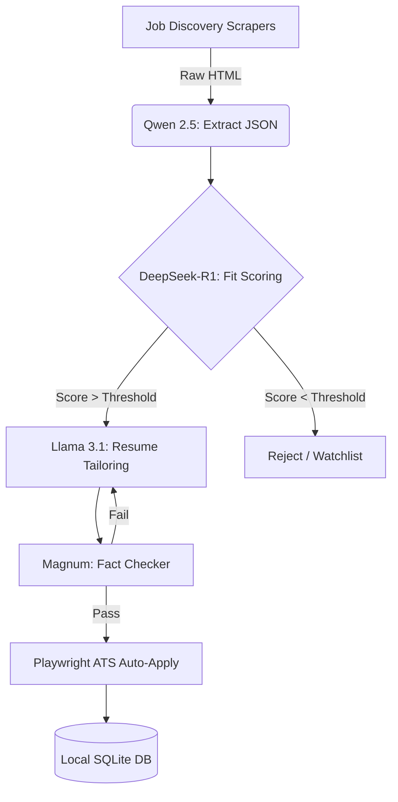

<p align="center">
  
</p>

<h1 align="center">
  SPrav Job AI
</h1>

<h4 align="center">The autonomous, offline-first AI agent for hyper-personalized job applications.</h4>

<p align="center">
  <a href="#-what-it-does">What</a> •
  <a href="#-how-it-works">How</a> •
  <a href="#-why-we-built-this">Why</a> •
  <a href="#-architecture">Architecture</a> •
  <a href="#-installation">Install</a>
</p>

<p align="center">
  <a href="https://github.com/SVSPraveen/SPrav-Job-AI/stargazers"></a>
  <a href="https://github.com/SVSPraveen/SPrav-Job-AI/network/members"></a>
  <a href="https://github.com/SVSPraveen/SPrav-Job-AI/issues"></a>
  
  
  
</p>

<br/>

> *Companies use AI to filter candidates. SPrav gives candidates AI to filter and apply to companies.*

---

## 🎯 What it does

Job hunting is a full-time job. **SPrav completely automates the most exhausting parts of the process.** 

Instead of mindlessly scrolling through job boards, SPrav acts as your personal, highly-coordinated AI workforce. It monitors the internet for new job postings, reads the requirements, decides if you are actually a good fit based on your background, custom-rewrites your resume for that specific job to bypass keyword filters, and then physically applies to the job for you.

## ⚙️ How it works

When you turn on the engine, this is the exact flow that happens on your machine:

1. **Discovery:** Headless bots silently wake up and scan platforms like LinkedIn and Naukri, identifying new job links and aggressively filtering out obvious spam, Ed-Tech courses disguised as jobs, and fake listings.
2. **Extraction:** The AI extracts the unstructured text of the job description and converts it into clean, structured data.
3. **Reasoning:** A deep-thinking logic model reads the job, cross-references your profile, and calculates a strict mathematical "Fit Score".
4. **Tailoring:** If the score is high enough, a generative model drafts a custom resume, perfectly highlighting why you are the best fit for that exact role.
5. **Execution:** A Playwright automation bot opens a hidden browser window, navigates to the ATS application page (like Greenhouse or Lever), fills in your details, uploads the custom resume, and submits it.

## 🛑 Why we built this

* **Absolute Privacy:** Because this runs 100% locally on your computer's GPU, your email, phone number, and employment history are never sent to OpenAI or Anthropic. Your data cannot be leaked.
* **Zero Cost:** No cloud API keys or subscription fees. Ever.
* **Beating the ATS:** Modern companies use AI Applicant Tracking Systems to automatically reject resumes that don't have the right keywords. We are fighting fire with fire—using AI to perfectly align your resume to their keyword filters before a human ever sees it.

---

## 🧠 Architecture (The "Brains")

Instead of using one massive model like ChatGPT, SPrav uses a targeted **Mixture-of-Experts (MoE)** approach orchestrated by `LangGraph`. 



We load different specialized, local open-source models via Ollama to handle distinct tasks:

| Subsystem | Model | Purpose |
|-----------|-------|---------|
| **Data Extraction** | `qwen2.5:7b-instruct` | **The Data Entry Clerk.** Reads messy HR text and extracts structured JSON. |
| **Logic & Evaluation** | `deepseek-r1:7b` | **The Recruiter.** Uses chain-of-thought `<think>` reasoning for holistic candidate-to-job fit scoring. |
| **Culture Forensics** | `magnum-v4:9b` | **The Fact Checker.** Parses corporate vernacular to detect toxic organizational patterns and prevents resume hallucination. |
| **Generative Prose** | `llama3.1:8b` | **The Copywriter.** Professional, AI-slop-free resume drafting and XYZ bullet engineering. |
| **Vector Memory** | `nomic-embed-text` | **The Librarian.** High-efficiency RAG retrieval against your local knowledge base. |

---

## 🚀 Installation

> [!IMPORTANT]
> To guarantee pipeline stability without Out-of-Memory (OOM) failures, a minimum of **8GB VRAM** (RTX 3060, RTX 4060, or Apple Silicon equivalent) and **16GB RAM** is required.

### 1. Environment Setup

```bash
# Clone the repository
git clone https://github.com/SVSPraveen/SPrav-Job-AI.git
cd SPrav-Job-AI

# Initialize virtual environment
python -m venv .venv
.venv\Scripts\activate

# Install core dependencies and ATS automation browsers
pip install -r requirements.txt
playwright install chromium
```

### 2. Model Initialization

Ensure [Ollama](https://ollama.com/) is installed and running in the background.

```bash
ollama pull qwen2.5:7b-instruct
ollama pull deepseek-r1:7b
ollama pull magnum-v4:9b
ollama pull llama3.1:8b
ollama pull nomic-embed-text
```

### 3. Dashboard Configuration

```bash
# Install frontend dependencies
cd frontend
npm install
cd ..

# Initialize configuration
copy .env.example .env
```

### 4. Launch

Execute the bootstrapper to spin up the LangGraph daemon, FastAPI backend, and React UI:

```bash
LaunchJobAssistant.bat
```

Alternatively, you can launch the native desktop application window:
```bash
python desktop_app.py
```

---

## 🛡️ Privacy & Data Guarantee

**SPrav operates on a strict single-source-of-truth paradigm.** Every generated bullet point and claim must trace back to a verifiable entry in your canonical Knowledge Base. The system is explicitly engineered to highlight your actual skill gaps rather than hallucinating false proficiencies. 

Your data never leaves your hard drive. 

<br/>
<div align="center">
  <p>Engineered for privacy, precision, and performance.</p>
</div>
