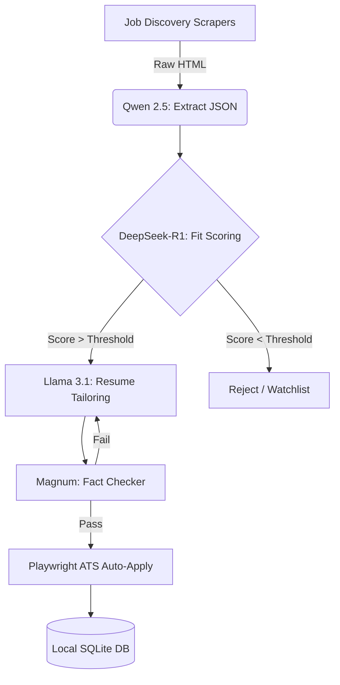

<p align="center">
  
</p>

<h1 align="center">
  SPrav Job AI
</h1>

<h4 align="center">The autonomous, offline-first AI agent for hyper-personalized job applications.</h4>

<p align="center">
  <a href="#-core-features">Features</a> •
  <a href="#-architecture">Architecture</a> •
  <a href="#-installation">Install</a> •
  <a href="#-privacy--data">Privacy</a> •
  <a href="ARCHITECTURE.md">Docs</a>
</p>

<p align="center">
  <a href="https://github.com/SVSPraveen/SPrav-Job-AI/stargazers"></a>
  <a href="https://github.com/SVSPraveen/SPrav-Job-AI/network/members"></a>
  <a href="https://github.com/SVSPraveen/SPrav-Job-AI/issues"></a>
  
  
  
</p>

<br/>

> *Companies use AI to filter candidates. SPrav gives candidates AI to filter and apply to companies.*

**SPrav** is an enterprise-grade, local-first AI pipeline designed to flip the power dynamic of the modern job hunt. It discovers job listings across 9+ platforms, evaluates your exact fit using deep reasoning models, tailors your resume flawlessly, and dispatches applications autonomously.

It runs **100% locally on your GPU**. Your personal data never leaves your machine. Zero cloud API costs, zero data leakage.

---

## ⚡ Core Features

* **Absolute Privacy (Offline Inference):** Powered entirely by local Ollama models. Your phone number, email, and employment history never touch OpenAI or Anthropic servers.
* **Mixture-of-Experts (MoE) Routing:** Automatically routes specialized tasks to domain-specific models (e.g., *Qwen* for JSON extraction, *DeepSeek-R1* for logical fit scoring, *Llama 3.1* for prose generation).
* **Zero-Tolerance Hallucination Check:** Employs an adversarial fact-checking layer. Any generated resume metric not explicitly supported by your canonical data triggers a forced regeneration.
* **Native ATS Bypassing:** Skips noisy aggregators by scraping and applying directly to native Applicant Tracking Systems (Greenhouse, Lever) using headless Playwright browsers.
* **Intelligent Auto-Apply Circuit Breakers:** Configurable daily limits and dynamic thresholds prevent you from spamming employers and protect your professional reputation.

---

## 🧠 Architecture

SPrav avoids monolithic LLM patterns. Instead, it utilizes a highly targeted MoE methodology orchestrated by `LangGraph`.



| Subsystem | Primary Model | Purpose |
|-----------|-------|---------|
| **Data Extraction** | `qwen2.5:7b-instruct` | High-fidelity structured JSON extraction from messy HR text. |
| **Logic & Evaluation** | `deepseek-r1:7b` | Chain-of-thought `<think>` reasoning for holistic candidate-to-job fit scoring. |
| **Culture Forensics** | `magnum-v4:9b` | Uncensored parsing of corporate vernacular to detect red flags and toxic patterns. |
| **Generative Prose** | `llama3.1:8b` | Professional, AI-slop-free resume drafting and XYZ bullet engineering. |
| **Vector Memory** | `nomic-embed-text` | High-efficiency 8192-token context window for localized RAG against your history. |

---

## 🚀 Installation

> [!IMPORTANT]
> To guarantee pipeline stability without Out-of-Memory (OOM) failures, a minimum of **8GB VRAM** (RTX 3060, RTX 4060, or Apple Silicon equivalent) and **16GB RAM** is required.

### 1. Environment Setup

```bash
# Clone the repository
git clone https://github.com/SVSPraveen/SPrav-Job-AI.git
cd SPrav-Job-AI

# Initialize virtual environment
python -m venv .venv
.venv\Scripts\activate

# Install core dependencies and ATS automation browsers
pip install -r requirements.txt
playwright install chromium
```

### 2. Model Initialization

Ensure [Ollama](https://ollama.com/) is installed and running in the background.

```bash
ollama pull qwen2.5:7b-instruct
ollama pull deepseek-r1:7b
ollama pull magnum-v4:9b
ollama pull llama3.1:8b
ollama pull nomic-embed-text
```

### 3. Dashboard Configuration

```bash
# Install frontend dependencies
cd frontend
npm install
cd ..

# Initialize configuration
copy .env.example .env
```

### 4. Launch

Execute the bootstrapper to spin up the LangGraph daemon, FastAPI backend, and React UI:

```bash
LaunchJobAssistant.bat
```

Alternatively, you can launch the native desktop application window:
```bash
python desktop_app.py
```

---

## 📖 Module Documentation

For deep dives into specific subsystems, refer to the module-level documentation:

- [Engine Orchestration (`/engine`)](engine/README.md)
- [Job Discovery (`/discovery`)](discovery/README.md)
- [ATS Automation (`/apply`)](apply/README.md)
- [System Architecture (`ARCHITECTURE.md`)](ARCHITECTURE.md)

---

## 🛡️ Privacy & Data Guarantee

**SPrav operates on a strict single-source-of-truth paradigm.** Every generated bullet point and claim must trace back to a verifiable entry in your canonical Knowledge Base. The system is explicitly engineered to highlight your actual skill gaps rather than hallucinating false proficiencies. 

Your data never leaves your hard drive. 

<br/>
<div align="center">
  <p>Engineered for privacy, precision, and performance.</p>
</div>
