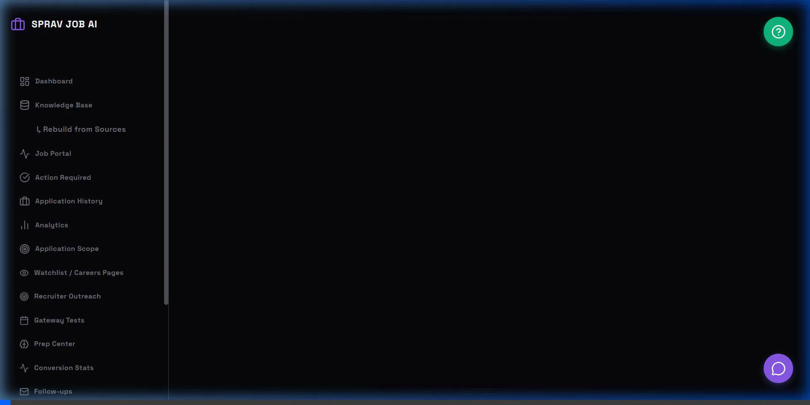
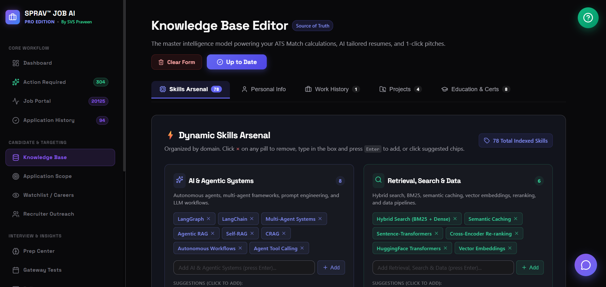
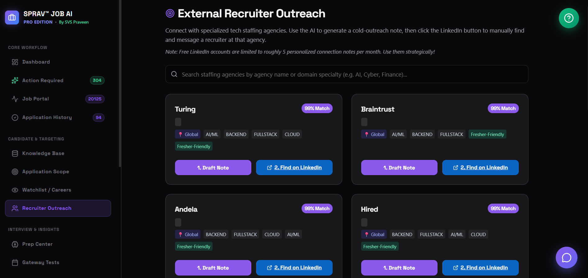

# 🚀 SPrav™ Job AI — Autonomous Career Intelligence & 1-Click Dispatch

<div align="center">


### The High-Precision, Privacy-First Career Automation Platform for Engineers

[](https://svspraveen.github.io/SPrav-Job-AI/)
[](https://drive.google.com/drive/folders/1JOm-Rth1HoB5xZqDva61JG9-aonj4jae?usp=sharing)
[-3b82f6?style=for-the-badge&logo=windows11)](https://drive.google.com/drive/folders/1JOm-Rth1HoB5xZqDva61JG9-aonj4jae?usp=sharing)
[](LICENSE)
[](docs/ARCHITECTURE.md)

**Autonomously scans 28,700+ verified tech career portals, calculates cosine embedding similarity against your master PDF resume, and surfaces high-match engineering opportunities for guided 1-click application dispatch.**

[📥 Download SPrav Job AI (v2.4 Pro Portable)](https://drive.google.com/drive/folders/1JOm-Rth1HoB5xZqDva61JG9-aonj4jae?usp=sharing) • [🌐 Live Web Demo](https://svspraveen.github.io/SPrav-Job-AI/) • [📖 Documentation](docs/DOCUMENTATION.md) • [🔄 Workflow](docs/WORKFLOW.md) • [📊 Case Study](docs/CASE_STUDY.md)

<br/>



</div>

---

## 📑 Repository Navigation & Documentation Hub

| Document | Description |
|---|---|
| 🌐 [**Live Web Showcase**](https://svspraveen.github.io/SPrav-Job-AI/) | Interactive GitHub Pages site featuring a live, in-browser ATS Matcher simulator. |
| 📘 [**Full Documentation**](docs/DOCUMENTATION.md) | Exhaustive reference manual for all 12 modules, subsystems, and settings. |
| 🔄 [**Operational Workflow**](docs/WORKFLOW.md) | Complete end-to-end architecture diagrams, ingestion pipelines, and state machines. |
| 📖 [**User Guide & Manual**](docs/USER_GUIDE.md) | Step-by-step practical guide: Installation, free AI setup, resume optimization, and cold outreach. |
| 📊 [**Technical Case Study**](docs/CASE_STUDY.md) | Deep engineering case study: 72ms SQLite benchmarks, memory footprint (<120MB), and topology. |
| ❓ [**Exhaustive FAQ**](docs/FAQ.md) | 13-point FAQ covering data privacy, ₹0 AI execution, Ollama GPU, and updates. |
| 🗺️ [**Product Roadmap**](docs/ROADMAP.md) | Release milestones, planned macOS/Linux ports, and upcoming features. |
| 🐍 [**ATS Benchmark Demo**](examples/quickstart_ats_benchmark.py) | Standalone Python script demonstrating the cosine skill extraction algorithm. |
| 🛠️ [**System Diagnostics**](examples/diagnose_system.py) | Standalone utility script to test local hardware, Python, and ATS network connectivity. |

---

## 🖼️ Application Interface & Feature Showcase

<div align="center">

### 1. Command Center & Autonomous Discovery Telemetry


### 2. Action Required (Guided 1-Click Dispatch Queue)
*Surfaces only high-fidelity opportunities ($\text{ATS} \ge 65\% - 80\%+$) with auto-generated cover notes and STAR achievement alignment.*


### 3. Knowledge Base & Master Resume Vault
*Extracts full project histories, quantifiable metrics, and semantic skill graphs from your uploaded Master PDF Resume.*


### 4. Application Scope Matrix & Seniority Targeting
*Calibrate target engineering titles, compensation bands, remote preferences, and negative keyword guardrails.*


### 5. Conversion Analytics & Funnel Telemetry
*Track screening conversion yields, match score correlation graphs, and application cadence.*


### 6. Recruiter Outreach Engine & Direct Contact Discovery
*Identifies technical recruiters and engineering managers with tailored LinkedIn connection notes and cold emails.*


</div>

---

## 🎯 What is SPrav™ Job AI?

In today's tech job market, candidates face a broken dilemma:
1. **Manual Search Burnout**: Spending 30+ hours weekly scrolling job boards and writing cover letters.
2. **Blind Spam Bots**: Low-quality auto-apply browser extensions that spam 1,000s of generic applications, causing immediate ATS heuristic disqualification and email blacklisting.

**SPrav™ Job AI solves this with a balanced, high-precision engineering approach:**
* **Continuous Background Ingestion**: Scans 28,700+ verified 1st-party career portals (Greenhouse, Lever, Ashby, Workday) and direct tech career feeds.
* **Hybrid ATS & Cosine Matcher**: Evaluates full job specs against your Master PDF resume using cosine embedding similarity and 120+ domain skill dictionaries.
* **Guided 1-Click Dispatch**: Automatically prepares tailored cover notes, targeted STAR achievement bullets, and recruiter outreach emails for your **explicit 1-click review and submission**.
* **100% Local Air-Gapped Privacy**: All your resumes, credentials, and application history stay strictly on your local PC in `%LOCALAPPDATA%\SPravJobAI`. Zero cloud exfiltration.
* **₹0 Cost AI Execution**: Operates locally on your GPU via **Ollama (Qwen 2.5 Coder)** or with **free Google Gemini 2.0 Flash / Groq API keys** with zero subscription fees.

---

## ⚡ System Performance & Benchmarks

```text
┌────────────────────────────────────────────────────────────────────────┐
│                      SPRAV™ ENGINE PERFORMANCE                        │
├────────────────────────────────────────────────────────────────────────┤
│  ⚡ Database Query Latency:    72 ms (across 13,090+ indexed jobs)     │
│  🧠 Memory Footprint (RAM):    ~120 MB (75% less than Electron apps)   │
│  🚀 Cold Launch Time:          <1.2 seconds                            │
│  🔒 Personal Data Leakage:     0.0% (100% Local SQLite WAL Storage)    │
│  💰 Lifetime Subscription Fee: ₹0 / $0 (Free Freeware)                 │
└────────────────────────────────────────────────────────────────────────┘
```

---

## 📥 Quick Start (3 Steps)

### 1. Download the Portable Application
Download the standalone portable release from Google Drive:
👉 **[Download SPrav_Job_AI_Pro_v2.4_Portable.zip](https://drive.google.com/drive/folders/1JOm-Rth1HoB5xZqDva61JG9-aonj4jae?usp=sharing)** *(385 MB • No installer required)*.

### 2. Extract & Launch
1. Right-click `SPrav_Job_AI_Pro_v2.4_Portable.zip` $\rightarrow$ **Extract All**.
2. Open the extracted folder `SPrav Job AI/` and double-click **`SPravJobAI.exe`**.
3. Click **Yes** when prompted to create a convenient Desktop Shortcut.

### 3. Upload Resume & Start Searching
1. In the **Command Center**, click **Choose File** under *Master Resume Fidelity* and upload your `.pdf` resume.
2. Connect a free Google Gemini or Groq API key in **Settings & Auth** for sub-second AI tailoring.
3. Open **Action Required (Guided Dispatch)** to review top matches and dispatch applications with 1 click!

---

## 🙏 Acknowledgements & Data Sources

SPrav is built on the shoulders of the global open-source community, AI researchers, and public hiring gateways:

* **Live Job Feeds & ATS Portals**: [Greenhouse.io](https://greenhouse.io), [Lever.co](https://lever.co), [AshbyHQ](https://ashbyhq.com), [Himalayas](https://himalayas.app), [Arbeitnow](https://arbeitnow.com), and [RemoteOK](https://remoteok.com).
* **AI & Inference Ecosystem**: [Google DeepMind](https://deepmind.google) (Gemini 2.0 Flash), [Groq Inc.](https://groq.com) (LPU Inference Engine), [Ollama](https://ollama.com), [Qwen Team](https://github.com/QwenLM) (Qwen 2.5 Coder), and [DeepSeek AI](https://deepseek.com) (DeepSeek-R1).
* **Core Open-Source Stack**: [FastAPI](https://fastapi.tiangolo.com), [SQLite](https://sqlite.org), [React 19](https://react.dev), [Vite](https://vitejs.dev), [PyMuPDF](https://pymupdf.readthedocs.io), [Lucide Icons](https://lucide.dev), and [PyInstaller](https://pyinstaller.org).
* **Methodological Frameworks**: The **STAR Method** and Google's **XYZ Resume Formula** (by Laszlo Bock).

👉 **[Read the Full Credits & In-Depth Inspirations Breakdown](docs/CREDITS_AND_INSPIRATIONS.md)**

---

## 👤 Creator & Vision

**SPrav™ Job AI** was conceptualized, architected, and engineered by **SVS Praveen** as an independent personal initiative to empower developers and technical job seekers worldwide.

* **Creator & Architect**: SVS Praveen
* **Brand Origin**: SVS Praveen (`S` + `Prav`)
* **Edition**: Free Personal Freeware
* **Direct Contact**: [svspraveens@gmail.com](mailto:svspraveens@gmail.com)
* **Private Repository Backup**: [SVSPraveen/SPrav-Job-AI-Private](https://github.com/SVSPraveen/SPrav-Job-AI-Private)

---

<div align="center">

Made with ❤️ by **SVS Praveen** • Free for all job seekers worldwide.

</div>
