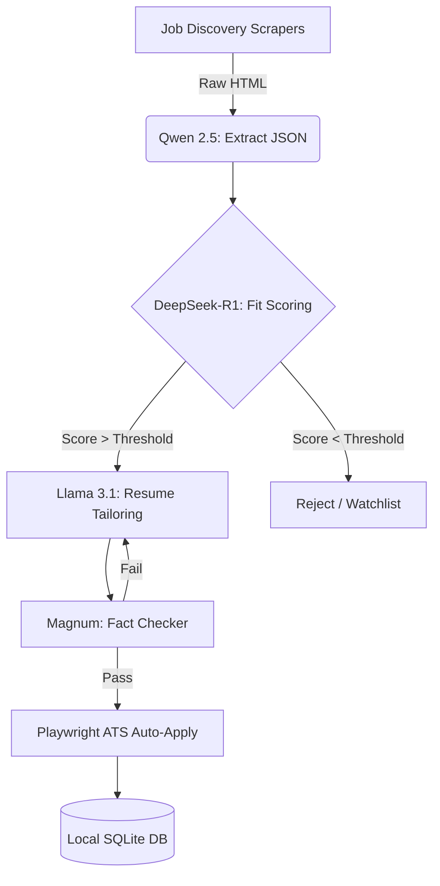

<p align="center">
  
</p>

<h1 align="center">
  SPrav Job AI
</h1>

<h4 align="center">The autonomous, offline-first AI agent for hyper-personalized job applications.</h4>

<p align="center">
  <a href="#-what-it-does">What</a> •
  <a href="#-how-it-works">How</a> •
  <a href="#-security--offline-auth">Security</a> •
  <a href="#-architecture">Architecture</a> •
  <a href="#-repository-structure">Structure</a> •
  <a href="#-configuration-env">Config</a> •
  <a href="#-installation">Install</a>
</p>

<p align="center">
  <a href="https://github.com/SVSPraveen/SPrav-Job-AI/stargazers"></a>
  <a href="https://github.com/SVSPraveen/SPrav-Job-AI/network/members"></a>
  <a href="https://github.com/SVSPraveen/SPrav-Job-AI/issues"></a>
  
  
  
  
</p>

<br/>

> *Companies use AI to filter candidates. SPrav gives candidates AI to filter and apply to companies.*

---

## 🎯 What it does

Job hunting is a full-time job. **SPrav completely automates the most exhausting parts of the process.** 

Instead of mindlessly scrolling through job boards, SPrav acts as your personal, highly-coordinated AI workforce. It monitors the internet for new job postings, reads the requirements, decides if you are actually a good fit based on your background, custom-rewrites your resume for that specific job to bypass keyword filters, and then physically applies to the job for you.

## ⚙️ How it works

When you turn on the engine, this is the exact flow that happens on your machine:

1. **Discovery:** Headless bots silently wake up and scan platforms like LinkedIn and Naukri, identifying new job links and aggressively filtering out obvious spam, Ed-Tech courses disguised as jobs, and fake listings.
2. **Extraction:** The AI extracts the unstructured text of the job description and converts it into clean, structured data.
3. **Reasoning:** A deep-thinking logic model reads the job, cross-references your profile, and calculates a strict mathematical "Fit Score".
4. **Tailoring:** If the score is high enough, a generative model drafts a custom resume, perfectly highlighting why you are the best fit for that exact role.
5. **Execution:** A Playwright automation bot opens a hidden browser window, navigates to the ATS application page (like Greenhouse or Lever), fills in your details, uploads the custom resume, and submits it.

## 🔒 Security & Offline Auth

Because SPrav operates independently of any central cloud, traditional password recovery mechanisms (like an external auth server sending you an email) pose a security risk. We built a zero-trust local authentication system:

* **Encrypted Credential Vault:** Your platform credentials (e.g., LinkedIn passwords used for Auto-Apply) are XOR-encrypted in a local SQLite database (`users.db`) using your private `.env` key. They are never stored in plain text.
* **Master Recovery Key:** Upon sign-up, the system generates a unique `SPRAV-XXXX-XXXX` Master Recovery Key. If you forget your local password, this physical key is your ultimate fallback to regain access to your encrypted vault.
* **Bring-Your-Own-SMTP (Optional):** If you prefer a modern Web 2.0 experience, you can hook up your own Gmail App Password to the `.env` file. The backend will natively generate and securely email you a 6-digit OTP for password recovery, completely bypassing the need for a paid, centralized email server like Twilio or SendGrid.
* **Themed UI:** A sleek, fully responsive React frontend with built-in Light/Dark mode toggles to manage your agents in comfort.

---

## 🧠 Architecture (The "Brains")

Instead of using one massive model like ChatGPT, SPrav uses a targeted **Mixture-of-Experts (MoE)** approach orchestrated by `LangGraph`. 


```mermaid
graph TD;
    A[Job Discovery Scrapers] -->|Raw HTML| B(Qwen 2.5: Extract JSON);
    B --> C{DeepSeek-R1: Fit Scoring};
    C -->|Score > Threshold| D[Llama 3.1: Resume Tailoring];
    C -->|Score < Threshold| E[Reject / Watchlist];
    D --> F[Magnum: Fact Checker];
    F -->|Pass| G[Playwright ATS Auto-Apply];
    F -->|Fail| D;
    G --> H[(Local SQLite DB)];
```

We load different specialized, local open-source models via Ollama to handle distinct tasks:

| Subsystem | Model | Purpose |
|-----------|-------|---------|
| **Data Extraction** | `qwen2.5:7b-instruct` | **The Data Entry Clerk.** Reads messy HR text and extracts structured JSON. |
| **Logic & Evaluation** | `deepseek-r1:7b` | **The Recruiter.** Uses chain-of-thought `<think>` reasoning for holistic candidate-to-job fit scoring. |
| **Culture Forensics** | `magnum-v4:9b` | **The Fact Checker.** Parses corporate vernacular to detect toxic organizational patterns and prevents resume hallucination. |
| **Generative Prose** | `llama3.1:8b` | **The Copywriter.** Professional, AI-slop-free resume drafting and XYZ bullet engineering. |
| **Vector Memory** | `nomic-embed-text` | **The Librarian.** High-efficiency RAG retrieval against your local knowledge base. |

---

## 📁 Repository Structure

SPrav is a monolithic repository containing three distinct stacks (Node.js, Python FastAPI, and React) that communicate with each other locally.

```text
SPrav-Job-AI/
├── engine/              # Python Backend (Core AI Logic)
│   ├── auth.py          # SQLite auth and credential encryption
│   ├── daemon.py        # LangGraph loop orchestrating the AI pipeline
│   ├── evaluator.py     # DeepSeek-R1 job scoring logic
│   └── resume_tailor.py # Llama 3.1 PDF generation
├── frontend/            # React UI (Dashboard & Auth)
│   ├── src/             # Vite application source code
│   └── package.json     # Node dependencies for UI
├── scraper_service/     # Node.js Microservice
│   ├── stealth_crawler.js # Playwright scraper bypassing Cloudflare
│   └── package.json     # Puppeteer/Playwright dependencies
├── knowledge_base/      # Your local RAG memory bank
│   └── master_resume.pdf # The ground-truth facts the AI pulls from
├── discovery/           # Python scripts for querying job boards API
├── apply/               # Form-filling automation scripts (Greenhouse/Lever)
├── api.py               # FastAPI server bridging Frontend, Engine, and Scraper
├── desktop_app.py       # PyWebview wrapper for native desktop experience
├── users.db             # Local SQLite (Auto-generated on first run)
└── jobs.db              # Local SQLite tracking applied/rejected jobs
```

---

## ⚙️ Configuration (`.env`)

To protect your privacy, all API keys and thresholds are stored strictly in a `.env` file at the root of the project.

```env
# -----------------------------
# Security
# -----------------------------
# Used to encrypt/decrypt your credentials in the local users.db
JWT_SECRET=super_secret_jwt_key_12345

# -----------------------------
# AI API Keys
# -----------------------------
# Configure your Groq and OpenRouter keys directly inside the application's Settings UI.
# They are securely encrypted in users.db and NO LONGER required in the .env file!

# -----------------------------
# SMTP Email Setup (Optional)
# -----------------------------
# Required if you want OTP Password Resets or daily job summary emails
EMAIL_SENDER=your-bot-email@gmail.com
EMAIL_PASSWORD=your_16_char_google_app_password
EMAIL_RECEIVER=your-personal-email@gmail.com

# -----------------------------
# AI Pipeline Tuning
# -----------------------------
# Minimum match score required to trigger an Auto-Apply (0.0 to 1.0)
ATS_AUTO_APPLY_THRESHOLD=0.88

# DeepSeek Fit Score required to consider a job a "Fit" (1.0 to 5.0)
FIT_AUTO_APPLY_THRESHOLD=4.0

# Max applications per company per day to prevent spam flags
COMPANY_DAILY_CAP=3

# Pause bot if it gets blocked/fails X times in a row
AUTO_APPLY_CIRCUIT_BREAKER_N=3
```

---

## 🚀 Installation

> [!IMPORTANT]
> To guarantee pipeline stability without Out-of-Memory (OOM) failures, a minimum of **8GB VRAM** (RTX 3060, RTX 4060, or Apple Silicon equivalent) and **16GB RAM** is required.

### 1. Environment Setup

```bash
# Clone the repository
git clone https://github.com/SVSPraveen/SPrav-Job-AI.git
cd SPrav-Job-AI

# Initialize virtual environment
python -m venv .venv
.venv\Scripts\activate

# Install core dependencies and ATS automation browsers
pip install -r requirements.txt
playwright install chromium
```

### 2. Model Initialization

Ensure [Ollama](https://ollama.com/) is installed and running in the background.

```bash
ollama pull qwen2.5:7b-instruct
ollama pull deepseek-r1:7b
ollama pull magnum-v4:9b
ollama pull llama3.1:8b
ollama pull nomic-embed-text
```

### 3. Dashboard Configuration

```bash
# Install frontend dependencies
cd frontend
npm install
cd ..

# Initialize configuration
copy .env.example .env
# Open .env and customize your thresholds and API keys
```

### 4. Launch

Execute the bootstrapper to spin up the LangGraph daemon, FastAPI backend, Node scrapers, and React UI:

```bash
LaunchJobAssistant.bat
```

Alternatively, you can launch the native desktop application window directly:
```bash
python desktop_app.py
```

---

## 🛡️ Privacy & Data Guarantee

**SPrav operates on a strict single-source-of-truth paradigm.** Every generated bullet point and claim must trace back to a verifiable entry in your canonical Knowledge Base. The system is explicitly engineered to highlight your actual skill gaps rather than hallucinating false proficiencies. 

Your data never leaves your hard drive. 

<br/>
<div align="center">
  <p>Engineered for privacy, precision, and performance.</p>
</div>
