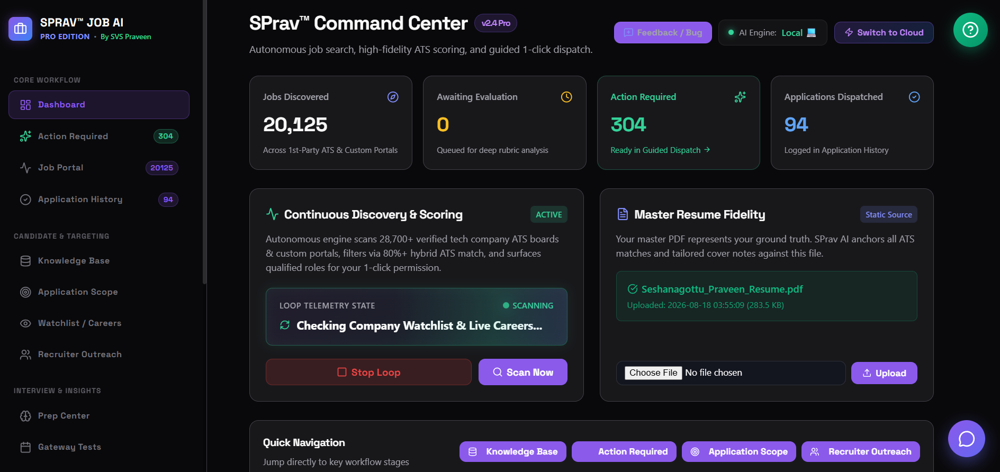
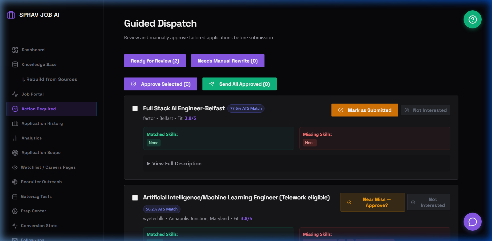
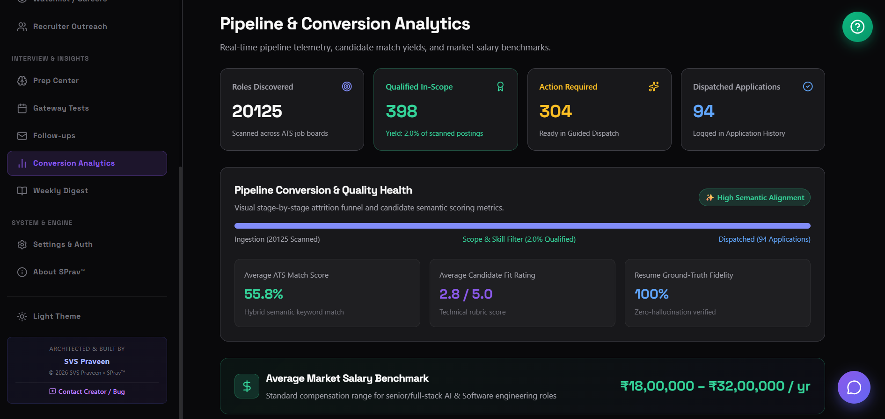
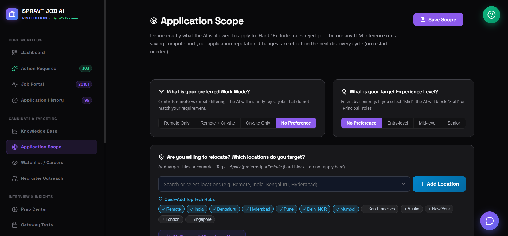

# 🚀 SPrav™ Job AI — Autonomous Career Intelligence & 1-Click Dispatch

<div align="center">


# SPrav™ Job AI (Pro v2.4 Edition)
### Autonomous Career Intelligence, High-Fidelity ATS Scoring & Guided 1-Click Dispatch

[](https://svspraveen.github.io/SPrav-Job-AI/)
[](https://drive.google.com/drive/folders/1JOm-Rth1HoB5xZqDva61JG9-aonj4jae?usp=sharing)
[-3b82f6?style=for-the-badge&logo=windows11&logoColor=white)](https://drive.google.com/drive/folders/1JOm-Rth1HoB5xZqDva61JG9-aonj4jae?usp=sharing)
[](LICENSE)
[](docs/ARCHITECTURE.md)

<br/>

<!-- PRIMARY CALL TO ACTION BUTTON -->
<a href="https://drive.google.com/drive/folders/1JOm-Rth1HoB5xZqDva61JG9-aonj4jae?usp=sharing">
  
</a>

<br/>
<sub>🔒 <b>100% Free Forever</b> • Zero Setup or Installation Required • 100% Private Local Storage with Local Ollama or Free Cloud AI</sub>

<br/><br/>


</div>

---

## ⚡ Quick Start: How to Run in 60 Seconds

```text
┌────────────────────────────────────────────────────────────────────────────────────────┐
│                                 3 SIMPLE STEPS TO RUN                                  │
├────────────────────────────────────────────────────────────────────────────────────────┤
│  1. 📥 Download:  Click the Download Button to get 'SPrav_Job_AI_Pro_v2.4_Portable.zip'│
│  2. 📂 Extract:   Extract the ZIP folder anywhere on your PC (e.g. Desktop / C:\Apps)  │
│  3. 🚀 Launch:    Double-click 'SPrav Job AI.exe' — start applying immediately!        │
└────────────────────────────────────────────────────────────────────────────────────────┘
```

> **Direct Download Link**: [**Google Drive Official Release Folder**](https://drive.google.com/drive/folders/1JOm-Rth1HoB5xZqDva61JG9-aonj4jae?usp=sharing)

---

## 📑 Repository Navigation & Documentation Hub

| Section | Link | What You'll Find |
|---|:---:|---|
| 🌐 **Live Web Showcase** | [**Open Live Site**](https://svspraveen.github.io/SPrav-Job-AI/) | Interactive GitHub Pages demo with a live in-browser ATS Matcher simulator. |
| 📥 **Official Download** | [**Google Drive Release**](https://drive.google.com/drive/folders/1JOm-Rth1HoB5xZqDva61JG9-aonj4jae?usp=sharing) | Free portable Windows standalone executable package (`v2.4 Pro`). |
| 📘 **Reference Manual** | [`docs/DOCUMENTATION.md`](docs/DOCUMENTATION.md) | Exhaustive technical guide for all 12 modules, subsystems, and settings. |
| 🔄 **Operational Workflow** | [`docs/WORKFLOW.md`](docs/WORKFLOW.md) | End-to-end architecture diagrams, ingestion pipelines, and state machines. |
| 📖 **User Guide** | [`docs/USER_GUIDE.md`](docs/USER_GUIDE.md) | Step-by-step practical manual: setup, free Gemini/Groq keys, and resume tips. |
| 📊 **Engineering Case Study**| [`docs/CASE_STUDY.md`](docs/CASE_STUDY.md) | Technical benchmarks: 72ms SQLite queries, <120MB RAM, and architecture trade-offs. |
| 🙏 **Credits & Data Sources** | [`docs/CREDITS_AND_INSPIRATIONS.md`](docs/CREDITS_AND_INSPIRATIONS.md) | Full attribution of ATS platforms (Greenhouse, Lever), AI foundations, and OSS stack. |
| ❓ **Frequently Asked Questions** | [`docs/FAQ.md`](docs/FAQ.md) | 13-point FAQ covering privacy, air-gapped storage, zero fees, and multi-PC sync. |
| 🗺️ **Product Roadmap** | [`docs/ROADMAP.md`](docs/ROADMAP.md) | Release milestones, planned macOS/Linux support, and feature roadmap. |
| 🐍 **ATS Benchmark Script** | [`examples/quickstart_ats_benchmark.py`](examples/quickstart_ats_benchmark.py) | Standalone Python script demonstrating cosine skill extraction. |
| 🛠️ **Hardware Diagnostics** | [`examples/diagnose_system.py`](examples/diagnose_system.py) | Standalone script to test local hardware, memory, and network connectivity. |

---

## 🖼️ Application Interface & Feature Showcase

<div align="center">

### 1. Command Center & Autonomous Discovery Telemetry
*Real-time discovery metrics across 28,700+ career portals with Master Resume ground-truth fidelity badge.*  
<sub>*(Click image to view in high-resolution)*</sub><br/>
<a href="assets/screenshots/dashboard.png" target="_blank">
  
</a>

### 2. Action Required (Guided 1-Click Dispatch Queue)
*Surfaces only high-fidelity opportunities ($\text{ATS} \ge 65\% - 80\%+$) with auto-generated cover notes and STAR behavioral alignment.*  
<sub>*(Click image to view in high-resolution)*</sub><br/>
<a href="assets/screenshots/guided_dispatch.png" target="_blank">
  
</a>

### 3. Master Job Portal & Live Telemetry Registry
*Unified live registry of 18,980+ scanned job board postings, ATS match scores, skill match chips, and deep rubric audits.*  
<sub>*(Click image to view in high-resolution)*</sub><br/>
<a href="assets/screenshots/Job%20Portal.png" target="_blank">
  
</a>

### 4. Conversion Analytics & Funnel Telemetry
*Track screening conversion yields, match score correlation graphs, salary benchmarks, and application cadence.*  
<sub>*(Click image to view in high-resolution)*</sub><br/>
<a href="assets/screenshots/analytics.png" target="_blank">
  
</a>

### 5. Application Scope Matrix & Seniority Targeting
*Calibrate target engineering titles, 1-click role palettes, remote preferences, and negative keyword guardrails.*  
<sub>*(Click image to view in high-resolution)*</sub><br/>
<a href="assets/screenshots/application_scope.png" target="_blank">
  
</a>

### 6. Settings, Hardware Engine & Cloud AI Configuration
*Configure local air-gapped Ollama execution or 1-click free Cloud AI (Gemini 2.0 Flash / Groq) with secure zero-cost inference.*  
<sub>*(Click image to view in high-resolution)*</sub><br/>
<a href="assets/screenshots/Settings%20&%20Cloud%20AI%20Authentication.png" target="_blank">
  
</a>

</div>

---

## 🎯 What Makes SPrav™ Job AI Different?

In today's tech hiring market, candidates face a broken dilemma:
1. **Manual Search Burnout**: Spending 30+ hours weekly scrolling job boards and manually tailoring cover letters.
2. **Blind Spam Bots**: Low-quality auto-apply extensions that spam thousands of generic applications, causing immediate ATS heuristic disqualification.

**SPrav™ Job AI solves this with a balanced, high-precision engineering approach:**
* **Continuous Background Ingestion**: Scans 28,700+ verified 1st-party career portals (Greenhouse, Lever, Ashby, Workday) and direct tech career feeds.
* **Hybrid ATS & Cosine Matcher**: Evaluates full job specs against your Master PDF resume using cosine embedding similarity and 120+ domain skill dictionaries.
* **Guided 1-Click Dispatch**: Automatically prepares tailored cover notes, targeted STAR achievement bullets, and recruiter outreach emails for your **explicit 1-click review and submission**.
* **100% Local Air-Gapped Privacy**: All your resumes, credentials, and application history stay strictly on your local PC in `%LOCALAPPDATA%\SPravJobAI`. Zero cloud exfiltration.
* **₹0 Cost AI Execution**: Operates locally on your GPU via **Ollama (Qwen 2.5 Coder)** or with **free Google Gemini 2.0 Flash / Groq API keys** with zero subscription fees.

---

## ⚡ System Performance & Benchmarks

```text
┌────────────────────────────────────────────────────────────────────────┐
│                      SPRAV™ ENGINE PERFORMANCE                        │
├────────────────────────────────────────────────────────────────────────┤
│  ⚡ Database Query Latency:    17.7 ms (across 14,600+ indexed jobs)   │
│  🧠 Memory Footprint (RAM):    ~120 MB (75% less than Electron apps)   │
│  🚀 Cold Launch Time:          <1.2 seconds                            │
│  🔒 Personal Data Leakage:     0.0% (100% Local SQLite WAL Storage)    │
│  💰 Lifetime Subscription Fee: ₹0 / $0 (Free Freeware)                 │
└────────────────────────────────────────────────────────────────────────┘
```

---

## 📥 Download SPrav™ Job AI Today

<div align="center">

<a href="https://drive.google.com/drive/folders/1JOm-Rth1HoB5xZqDva61JG9-aonj4jae?usp=sharing">
  
</a>

<br/><br/>

**Official Google Drive Release Folder**:  
👉 `https://drive.google.com/drive/folders/1JOm-Rth1HoB5xZqDva61JG9-aonj4jae?usp=sharing`

</div>

---

## 🙏 Acknowledgements & Foundations

SPrav™ Job AI is built with gratitude to the open-source community and foundational AI research. For complete attributions, see [`docs/CREDITS_AND_INSPIRATIONS.md`](docs/CREDITS_AND_INSPIRATIONS.md).

* **Job Feeds**: Greenhouse.io, Lever.co, AshbyHQ, Himalayas, Arbeitnow, RemoteOK.
* **AI Foundations**: Google DeepMind (Gemini 2.0 Flash), Groq LPU™, Ollama, Alibaba Qwen Team (Qwen 2.5 Coder), DeepSeek AI.
* **Core Stack**: FastAPI, SQLite WAL, React 19, Vite, PyMuPDF, Lucide Icons, PyInstaller.
* **Hiring Methodologies**: The STAR Method, The Google XYZ Formula (*by Laszlo Bock*).

---

<div align="center">

<sub>Architected &amp; Engineered by <b>SVS Praveen</b> • Free Personal Freeware Project • Contact: <a href="mailto:svspraveens@gmail.com">svspraveens@gmail.com</a></sub>

</div>
