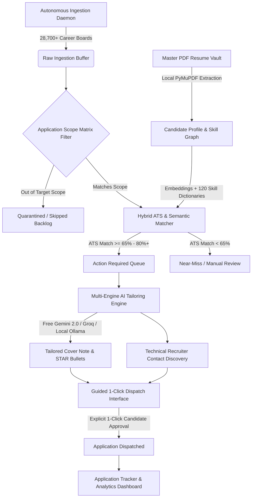
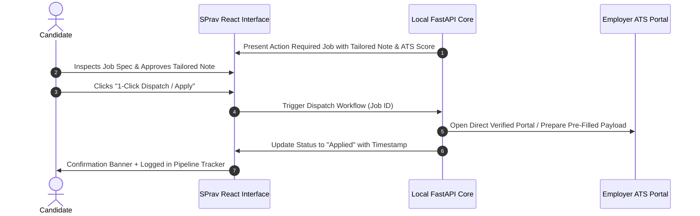

# 🔄 SPrav™ Job AI — End-to-End Architecture & Operational Workflow

This document details the complete end-to-end lifecycle of **SPrav™ Job AI**, illustrating how data flows from autonomous web discovery through semantic filtering, ATS scoring, tailored generation, and guided 1-click dispatch.

---

## 🗺️ High-Level System Architecture Topology

---

## 🔁 The 6-Stage Operational Lifecycle

### Stage 1: Autonomous Ingestion & Normalization
* **Daemon Execution**: The background daemon (`engine/daemon.py`) runs continuous, asynchronous polling across major 1st-party ATS endpoints:
  * **Greenhouse API** (`boards-api.greenhouse.io`)
  * **Lever Gateway** (`api.lever.co`)
  * **Ashby ATS** (`jobs.ashbyhq.com`)
  * **Workday & SmartRecruiters**
  * **Direct Tech Career Feeds & RSS Streams**
* **Deduplication**: Incoming opportunities are hashed by `(company_name, normalized_title, location)` to prevent duplicate entries in the SQLite database.
* **Canonical Sanitization**: HTML tags, tracking pixels, and boilerplate legal text are stripped to isolate the core technical requirements.

---

### Stage 2: Application Scope Matrix Enforcement
Before expensive LLM inference or vector calculations are invoked, each job must pass through the candidate's **Application Scope Matrix**:
1. **Target Role Filter**: Matches role titles against configured job titles (e.g. *Full Stack Engineer, AI/ML Engineer, Python Backend Developer*).
2. **Seniority Barrier**: Filters out roles that do not match the candidate's target seniority level (e.g. *Mid-Level, Senior, Lead*).
3. **Geographic & Remote Guardrails**: Ensures positions match the candidate's geographic requirements (*Remote, Hybrid, On-site in designated regions*).
4. **Disallowed Keywords & Negative Filters**: Discards roles containing excluded terms (e.g. *Unpaid, Security Clearance Required, PHP 5*).

---

### Stage 3: Hybrid ATS & Semantic Fit Scoring
Jobs that clear the Scope Matrix are processed by the **Hybrid ATS Matching Engine**:
* **Skill Dictionary Extraction**: Scans the job description against **120+ specialized domain skill dictionaries** (AI/ML, Backend, Distributed Systems, Cloud/DevOps, Databases, Frontend).
* **Cosine Embedding Similarity**: Measures high-dimensional vector similarity between the job description and the candidate's Master Resume text.
* **Fit Classification**:
  $$\text{ATS Score} = \left( 0.65 \times \text{Skill Coverage Ratio} \right) + \left( 0.35 \times \text{Cosine Embedding Similarity} \right)$$
  * **Score $\ge 80\%$**: High Match $\rightarrow$ Routed directly to **Action Required (Ready for Review)**.
  * **Score $65\% - 79\%$**: Strong Match $\rightarrow$ Routed to **Action Required (Near-Miss Review)**.
  * **Score $< 65\%$**: Low Match $\rightarrow$ Quarantined in SQLite backlog to keep candidate queue high-signal.

---

### Stage 4: Contextual Tailoring & Recruiter Intelligence
When a job enters the **Action Required** queue, SPrav's AI synthesis engine generates custom application assets:
1. **Targeted Cover Note**: A concise 3-paragraph outreach letter aligning the candidate's actual projects with the company's tech stack.
2. **STAR Bullet Alignment**: Highlights the candidate's most relevant quantifiable achievements for the specific tech stack required.
3. **Skill Gap Strategy**: Identifies any missing skills and provides talking points on adjacent candidate strengths.
4. **Recruiter Identification**: Identifies relevant engineering managers and technical talent partners for the company.

---

### Stage 5: Guided 1-Click Dispatch (Human-in-the-Loop)
Unlike black-box spam bots that blindly submit applications without candidate awareness, SPrav utilizes a **Guided 1-Click Dispatch Pipeline**:

---

### Stage 6: Post-Application Lifecycle & Interview Prep
* **Pipeline Status Tracking**: Track every application through stages: *Dispatched $\rightarrow$ Screening $\rightarrow$ Technical Interview $\rightarrow$ Offer / Closed*.
* **Interview Prep Center**: Automatically generates role-specific technical questions, system design prompts, and behavioral STAR stories based on the specific job description and candidate resume.
* **Follow-up Reminders**: Calculates optimal follow-up windows (5–7 business days) and drafts polite follow-up emails for recruiters.
